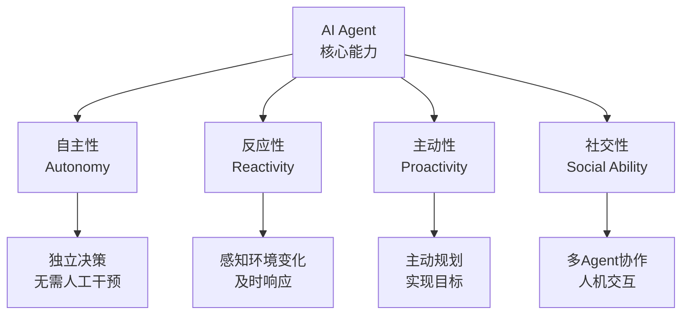
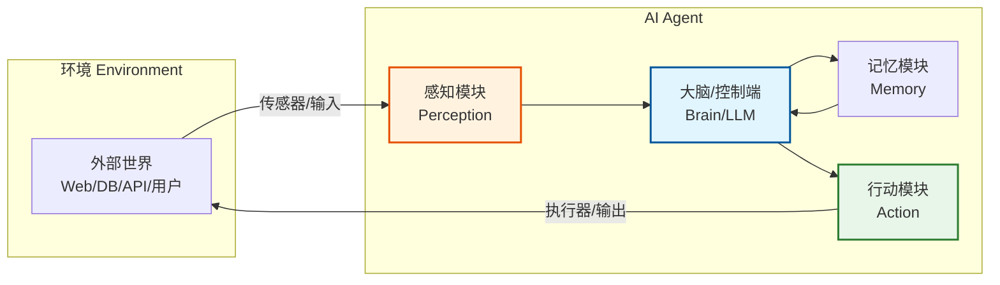
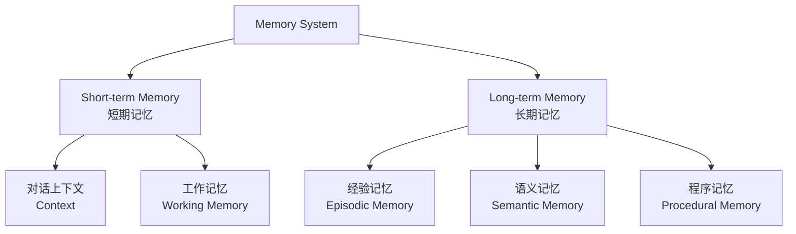
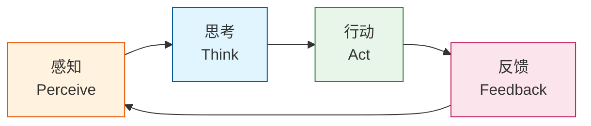
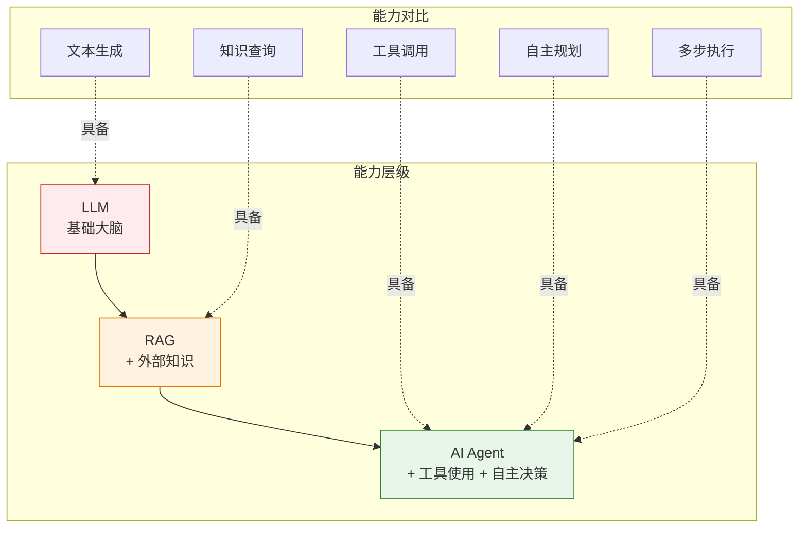
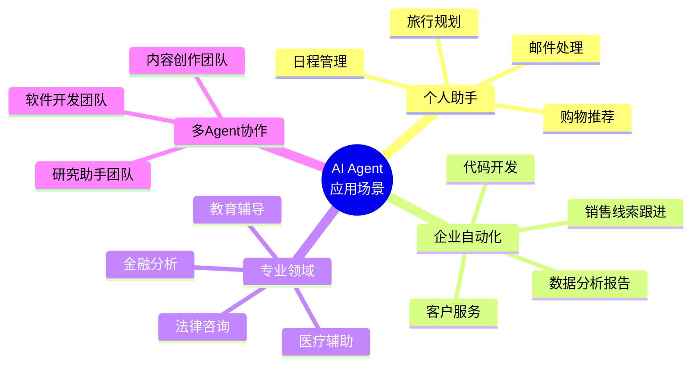
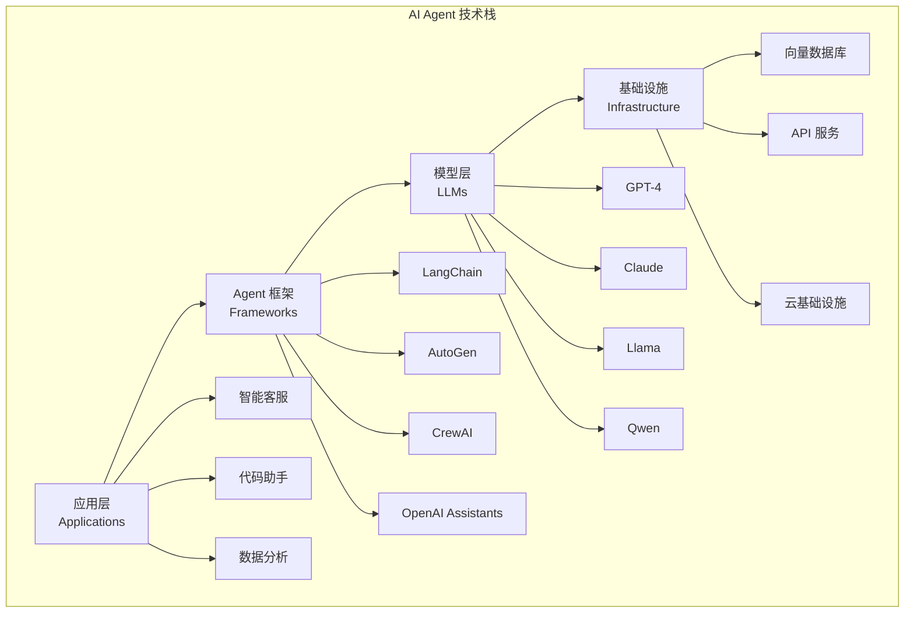
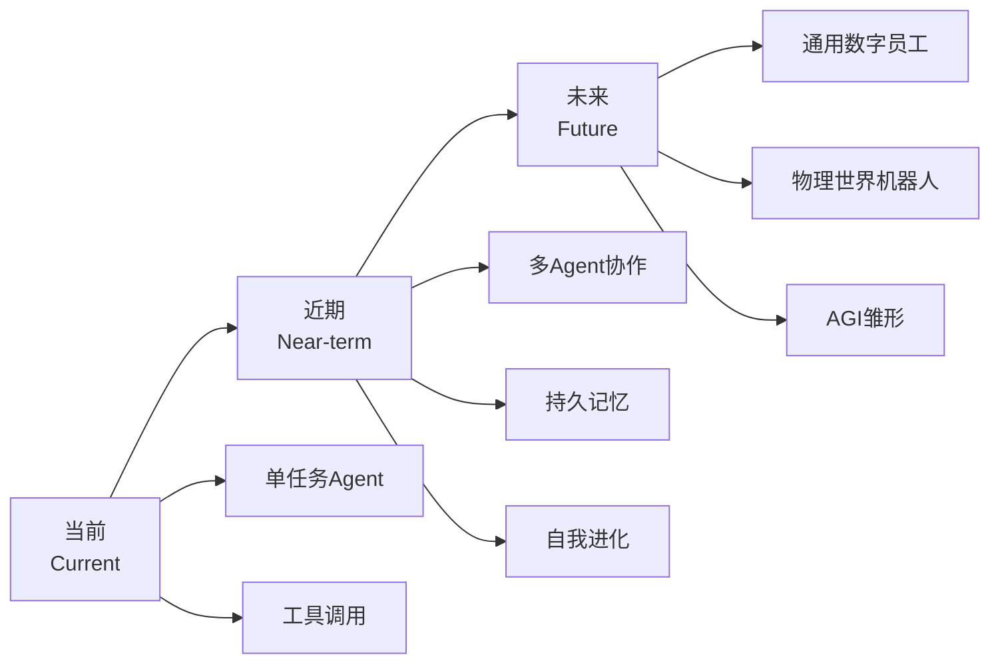

# Chapter 0: 什么是 AI Agent？

> 在深入探讨各种 Agent 设计模式之前，我们需要先理解一个根本性的问题：**什么是 AI Agent？**
>
> 本章将从概念、架构、工作原理到应用场景，全方位解析 AI Agent 的本质。

---

## 🎯 本章学习目标

- 理解 AI Agent 的核心定义与本质特征
- 掌握 AI Agent 与 LLM、RAG 的区别与联系
- 了解 AI Agent 的核心架构组成
- 理解 AI Agent 的工作循环与决策流程
- 认识 AI Agent 的典型应用场景

---

## 1. AI Agent 的定义

### 1.1 什么是 AI Agent？

**AI Agent（人工智能代理）** 是一种能够**自主感知环境、制定决策并执行行动**来实现特定目标的智能系统。

简单来说：

| 对比项 | 传统 AI / ChatGPT | AI Agent |
|--------|-------------------|----------|
| 工作方式 | 你问什么，它答什么 | 自主思考、规划并完成复杂任务 |
| 交互模式 | 被动响应 | 主动行动 |
| 能力范围 | 仅限于文本生成 | 可以使用工具、执行操作、与环境交互 |
| 类比 | 问答机器 | 智能助手/数字员工 |

### 1.2 权威定义

> **OpenAI 定义（Lilian Weng）**：
> ```
> Agent = LLM + 记忆能力 + 规划能力 + 工具使用能力
> ```

> **复旦大学 NLP 团队定义**：
> AI Agent 是由 **大脑（Brain）、感知（Perception）、行动（Action）** 三部分组成的智能实体，能够持续与环境交互并完成任务。

### 1.3 一个形象的比喻 🎭

想象一下：

- **LLM（大语言模型）** = 一个聪明绝顶但被困在玻璃罐里的大脑 🧠
  - 知识渊博，但无法看到、触摸或与外部世界交互
  
- **RAG（检索增强生成）** = 给大脑配了一个图书管理员 📚
  - 可以获取外部知识，但仍然不能采取行动
  
- **AI Agent** = 大脑有了完整的身体 🤖
  - 可以观察世界、使用工具、做出决策、执行行动

---

## 2. AI Agent 的核心特征

### 2.1 四大核心能力



### 2.2 与传统自动化的区别

| 特性 | RPA（机器人流程自动化） | AI Agent |
|------|------------------------|----------|
| 执行方式 | 按预定脚本执行 | 自主决策执行 |
| 灵活性 | 固定规则，无法适应变化 | 动态调整，适应变化 |
| 学习能力 | 无 | 能从经验中学习改进 |
| 适用场景 | 重复性、规则明确的任务 | 复杂、动态、需要决策的任务 |
| 人工干预 | 触发后自动运行 | 持续自主运行 |

---

## 3. AI Agent 的架构组成

### 3.1 经典架构：大脑-感知-行动



### 3.2 详细组件解析

#### 🧠 大脑（Brain / Control Center）

**核心组件**：大语言模型（LLM）

**主要职责**：
- **推理与决策**：分析问题、制定策略
- **规划能力**：将复杂任务分解为子任务
- **反思与改进**：从错误中学习，优化后续行动
- **自然语言交互**：理解指令、生成回复

**技术实现**：
- GPT-4、Claude、Llama 等大模型
- 提示工程（Prompt Engineering）
- 链式思维（Chain of Thought）

#### 👁️ 感知（Perception）

**功能**：收集和处理环境信息

**输入类型**：

| 类型 | 说明 | 示例 |
|------|------|------|
| 文本 | 自然语言指令 | 用户提问、文档内容 |
| 视觉 | 图像/视频信息 | 截图、照片、监控视频 |
| 音频 | 语音/声音 | 语音指令、环境音效 |
| 结构化数据 | 数据库/API | JSON、CSV、SQL 查询结果 |

#### 🛠️ 行动（Action）

**功能**：执行决策、与环境交互

**常见行动类型**：

```python
# 工具使用示例
tools = {
    "search": "搜索引擎查询",
    "calculator": "数学计算",
    "code_executor": "执行代码",
    "api_call": "调用外部API",
    "database_query": "数据库查询",
    "file_operation": "文件读写",
    "send_email": "发送邮件",
    "web_browser": "浏览器操作"
}
```

#### 💾 记忆（Memory）

**短期记忆（Short-term Memory）**：
- 当前对话上下文
- 正在执行的任务状态
- 临时工作记忆

**长期记忆（Long-term Memory）**：
- 用户偏好与历史交互
- 知识库与经验积累
- 向量数据库存储



---

## 4. AI Agent 的工作循环

### 4.1 核心循环：感知-思考-行动



### 4.2 详细工作流程

以一个**智能旅行规划 Agent** 为例：

```
用户指令："帮我规划一个去东京的3天旅行"

┌─────────────────────────────────────────────────────────────┐
│  Step 1: 感知 (Perception)                                  │
│  ─────────────────────────────────────────────────────────  │
│  • 接收用户指令                                             │
│  • 提取关键信息：目的地=东京，时长=3天                       │
│  • 识别隐含需求：住宿、交通、景点、餐饮                      │
└─────────────────────────────────────────────────────────────┘
                              ↓
┌─────────────────────────────────────────────────────────────┐
│  Step 2: 思考 (Thinking/Planning)                           │
│  ─────────────────────────────────────────────────────────  │
│  • 任务分解：                                               │
│    - 子任务1: 查询东京热门景点                              │
│    - 子任务2: 推荐住宿区域                                  │
│    - 子任务3: 规划每日行程                                  │
│    - 子任务4: 估算预算                                      │
│  • 制定执行计划                                             │
└─────────────────────────────────────────────────────────────┘
                              ↓
┌─────────────────────────────────────────────────────────────┐
│  Step 3: 行动 (Action)                                      │
│  ─────────────────────────────────────────────────────────  │
│  • 调用搜索工具获取景点信息                                 │
│  • 调用地图API查看位置分布                                  │
│  • 调用酒店预订网站查询价格                                 │
│  • 整合信息生成行程表                                       │
└─────────────────────────────────────────────────────────────┘
                              ↓
┌─────────────────────────────────────────────────────────────┐
│  Step 4: 反馈与学习 (Feedback)                              │
│  ─────────────────────────────────────────────────────────  │
│  • 用户反馈："太紧凑了，想轻松一点"                         │
│  • 调整计划：减少每日景点数量                               │
│  • 更新用户偏好：喜欢休闲游                                 │
└─────────────────────────────────────────────────────────────┘
```

### 4.3 ReAct 模式：推理与行动的融合

**ReAct（Reasoning + Acting）** 是 Agent 的核心工作模式：

```
Thought（思考）→ Action（行动）→ Observation（观察）→ Thought → ...
```

**示例**：

```markdown
用户问题："2024年奥斯卡最佳影片的导演是谁？"

Thought 1: 我需要搜索2024年奥斯卡最佳影片的信息。
Action 1: 使用搜索工具，查询"2024年奥斯卡最佳影片"
Observation 1: 2024年奥斯卡最佳影片是《奥本海默》(Oppenheimer)

Thought 2: 现在我需要查找《奥本海默》的导演信息。
Action 2: 使用搜索工具，查询"奥本海默 电影 导演"
Observation 2: 《奥本海默》的导演是克里斯托弗·诺兰(Christopher Nolan)

Thought 3: 我已经找到了答案，可以回复用户了。
Final Answer: 2024年奥斯卡最佳影片《奥本海默》的导演是克里斯托弗·诺兰。
```

---

## 5. AI Agent vs LLM vs RAG

### 5.1 三者关系图解



### 5.2 详细对比表

| 能力 | LLM | RAG | AI Agent |
|------|-----|-----|----------|
| 文本生成 | ✅ | ✅ | ✅ |
| 使用训练知识 | ✅ | ✅ | ✅ |
| 访问外部文档 | ❌ | ✅ | ✅ |
| 执行代码 | ❌ | ❌ | ✅ |
| 调用 API | ❌ | ❌ | ✅ |
| 浏览网页 | ❌ | ❌ | ✅ |
| 操作文件 | ❌ | ❌ | ✅ |
| 迭代推理 | 有限 | ❌ | ✅ |
| 自我纠错 | ❌ | ❌ | ✅ |
| 多步规划 | ❌ | ❌ | ✅ |
| 持久记忆 | ❌ | 部分 | ✅ |
| 自主运行 | ❌ | ❌ | ✅ |
| 实时信息 | ❌ | ✅（需更新） | ✅ |
| 来源追溯 | ❌ | ✅ | ✅ |

### 5.3 使用场景决策树

```
你的任务需要...
│
├─ 只需要内容生成/问答？
│  └─ YES → 使用纯 LLM
│
├─ 需要访问私有/实时数据？
│  ├─ 只需要检索信息？
│  │  └─ YES → 使用 RAG
│  │
│  └─ 需要执行操作/自动化流程？
│     └─ YES → 使用 AI Agent
│
└─ 需要多步骤/工具调用/自主决策？
   └─ YES → 使用 AI Agent
```

---

## 6. AI Agent 的典型应用场景

### 6.1 应用分类



### 6.2 典型案例

#### 🤖 案例 1：智能客服 Agent

**功能**：
- 理解客户问题和情绪
- 查询知识库获取解决方案
- 执行退款/修改订单等操作
- 必要时转接人工客服

**Agent 特性**：
- 记忆客户历史交互
- 使用多种工具（CRM、知识库、支付系统）
- 自主决策处理流程

---

#### 💻 案例 2：编程助手 Agent（如 Devin, Cursor）

**功能**：
- 理解需求并规划开发任务
- 编写、调试、测试代码
- 搜索文档和解决方案
- 提交代码到版本控制

**Agent 特性**：
- 多步骤任务执行
- 工具使用（代码编辑器、终端、浏览器）
- 错误处理和自动修复

---

#### 🔬 案例 3：研究助手 Agent

**功能**：
- 自主搜索和收集信息
- 阅读和分析多篇论文
- 总结关键发现
- 生成研究报告

**Agent 特性**：
- 持续多轮信息检索
- 批判性评估信息来源
- 结构化输出结果

---

## 7. AI Agent 的技术栈

### 7.1 核心组件栈



### 7.2 主流开发框架

| 框架 | 特点 | 适用场景 |
|------|------|----------|
| **LangChain** | 模块化、生态丰富 | 复杂 Agent 编排、生产环境 |
| **AutoGen** | 多 Agent 对话、微软出品 | 多 Agent 协作、研究原型 |
| **CrewAI** | 角色扮演、团队概念 | 多角色任务分配 |
| **LlamaIndex** | 数据连接强 | RAG + Agent 结合 |
| **Semantic Kernel** | 微软企业级 | 企业应用集成 |

---

## 8. AI Agent 的发展趋势

### 8.1 2024-2025 关键趋势

1. **从单 Agent 到多 Agent 协作**
   - 多个专业 Agent 组成团队
   - 模拟人类组织架构

2. **从工具使用到深度集成**
   - MCP（Model Context Protocol）标准化
   - Agent 与软件生态深度融合

3. **从通用到垂直领域**
   - 法律、医疗、金融等专业 Agent
   - 行业知识深度整合

4. **从云端到端侧部署**
   - 轻量级模型支持本地运行
   - 隐私保护和低延迟

### 8.2 未来展望



---

## 9. 本章小结

### 核心要点

1. **AI Agent 本质**：LLM + 记忆 + 规划 + 工具使用能力

2. **核心特征**：自主性、反应性、主动性、社交性

3. **架构组成**：感知 → 大脑（LLM） → 行动 + 记忆

4. **工作循环**：感知 → 思考 → 行动 → 反馈

5. **与 LLM/RAG 区别**：Agent 能够**思考并行动**

### 学习路径建议

```
第0章: 什么是Agent（本章）
    ↓
第1-21章: Agent 设计模式
    • Prompt Chaining    • Tool Use        • Multi-Agent
    • Routing           • Planning        • Memory
    • Parallelization   • Reflection      • RAG
    • ...更多模式
    ↓
实践项目: 构建自己的 Agent 应用
```

---

## 📚 延伸阅读

### 推荐论文

1. **《LLM Powered Autonomous Agents》** - Lilian Weng (OpenAI)
2. **《The Rise and Potential of LLM-based Agents: A Survey》** - 复旦大学
3. **《ReAct: Synergizing Reasoning and Acting in Language Models》** - Google Research

### 推荐资源

- [LangChain 官方文档](https://python.langchain.com/)
- [OpenAI Function Calling Guide](https://platform.openai.com/docs/guides/function-calling)
- [Anthropic Agent 构建指南](https://www.anthropic.com/research/building-effective-agents)

---

*下一章：[第1章：Prompt Chaining（提示链）](../chapter1_chaining/) - 学习如何将复杂任务分解为连续的步骤*
