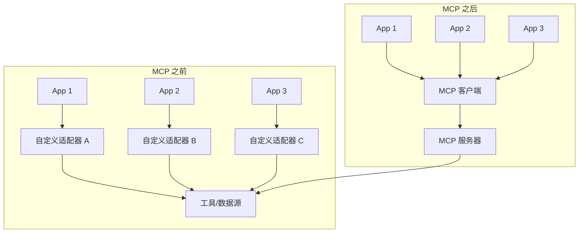
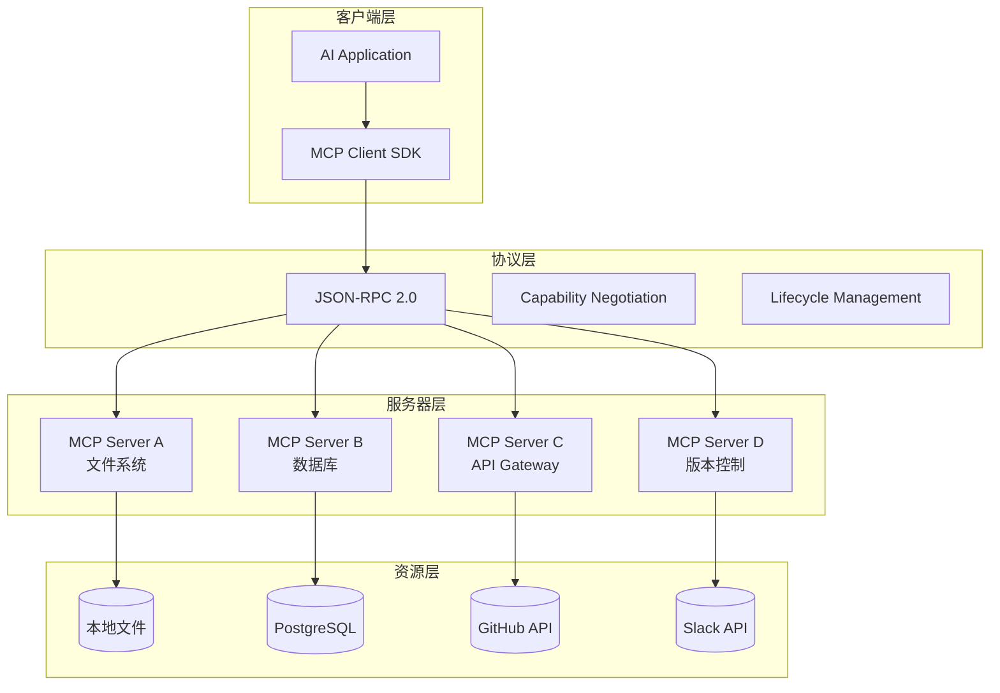
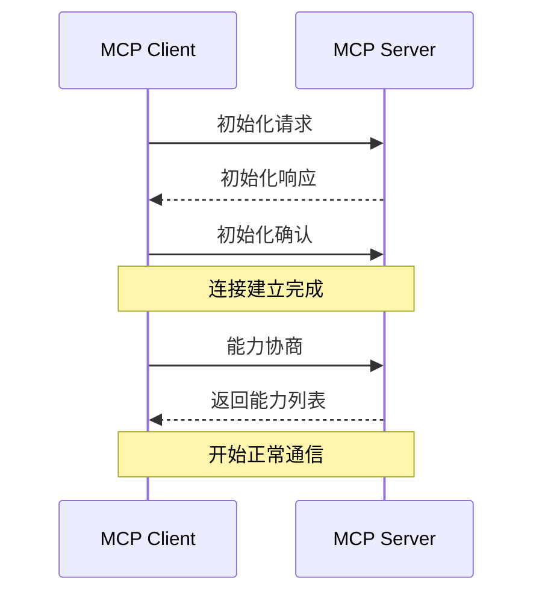
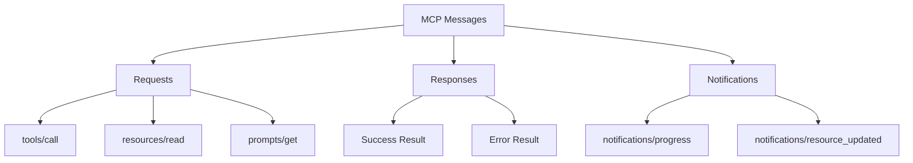
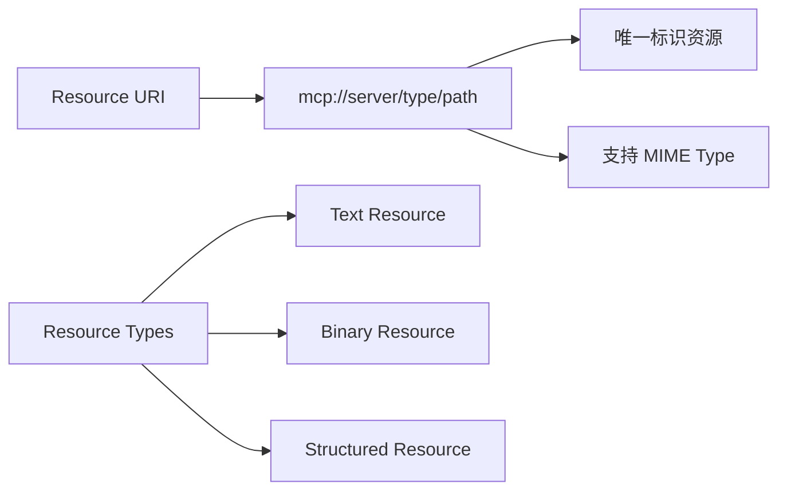
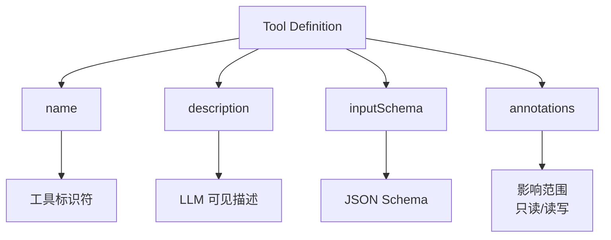
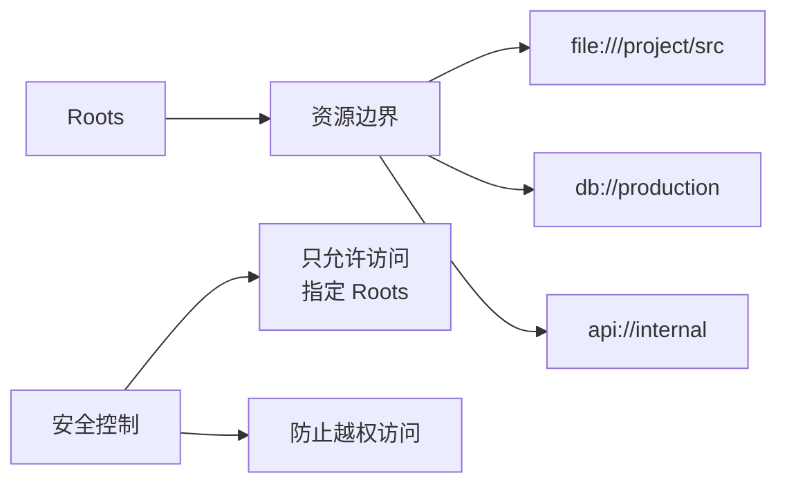
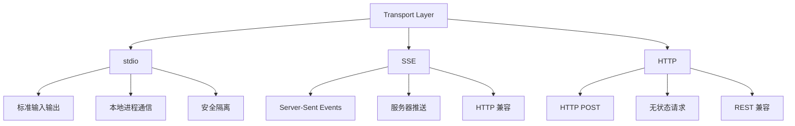
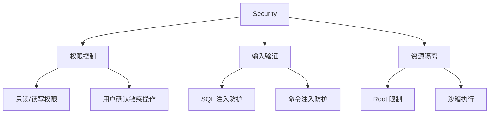

# Chapter 10: MCP (Model Context Protocol) 模型上下文协议

## 概述

MCP (Model Context Protocol) 是一种开放协议，用于标准化 AI 模型与外部数据源、工具之间的集成。它定义了统一的接口规范，使得不同的 AI 应用能够以一致的方式连接和使用各种外部资源。

---

## 背景原理

### 为什么需要 MCP？

**传统集成的问题**：
- 每个工具/数据源都需要自定义集成代码
- 重复开发相似的适配器
- 难以维护和扩展
- 厂商锁定



### MCP 的核心价值

1. **标准化接口**: 一次开发，到处使用
2. **生态互操作**: 不同厂商的组件可以协同工作
3. **降低门槛**: 开发者只需关注业务逻辑
4. **安全可控**: 统一的权限和访问控制模型

---

## 架构设计



### 核心组件

| 组件 | 功能 | 说明 |
|------|------|------|
| MCP Client | 协议客户端 | 维护与 Server 的连接 |
| MCP Server | 协议服务器 | 暴露资源和工具能力 |
| Transport | 传输层 | stdio / SSE / HTTP |
| Capabilities | 能力协商 | 动态发现可用功能 |
| Roots | 资源根 | 定义可访问的资源范围 |

---

## 协议规范

### 1. 连接建立



### 2. 消息类型



### 3. 能力模型 (Capabilities)

```python
# Server 能力声明示例
server_capabilities = {
    "tools": {
        "listChanged": True  # 支持动态工具列表变更
    },
    "resources": {
        "subscribe": True,   # 支持资源变更订阅
        "listChanged": True
    },
    "prompts": {
        "listChanged": True
    },
    "logging": {},  # 支持日志输出
    "experimental": {}  # 实验性功能
}

# Client 能力声明
client_capabilities = {
    "roots": {
        "listChanged": True
    },
    "sampling": {}  # 支持采样请求
}
```

---

## 核心原语

### 1. Resources (资源)

资源表示 MCP Server 暴露的数据源，可以被客户端读取。



```python
# 资源定义示例
resource_template = {
    "uri": "file:///{path}",
    "name": "Project Files",
    "mimeType": "text/plain",
    "description": "Access to project files",
    "annotations": {
        "title": "Project File",
        "audience": ["user", "assistant"]
    }
}

# 读取资源
read_request = {
    "jsonrpc": "2.0",
    "id": 1,
    "method": "resources/read",
    "params": {
        "uri": "file:///src/main.py"
    }
}
```

### 2. Tools (工具)

工具表示 MCP Server 提供的可执行功能。



```python
# 工具定义示例
tool_definition = {
    "name": "query_database",
    "description": "Execute a SQL query on the company database",
    "inputSchema": {
        "type": "object",
        "properties": {
            "query": {
                "type": "string",
                "description": "SQL query to execute"
            },
            "limit": {
                "type": "integer",
                "description": "Maximum rows to return",
                "default": 100
            }
        },
        "required": ["query"]
    },
    "annotations": {
        "title": "Query Database",
        "readOnlyHint": False,
        "destructiveHint": False,
        "idempotentHint": True,
        "openWorldHint": False
    }
}

# 调用工具
tool_call = {
    "jsonrpc": "2.0",
    "id": 2,
    "method": "tools/call",
    "params": {
        "name": "query_database",
        "arguments": {
            "query": "SELECT * FROM users LIMIT 10",
            "limit": 10
        }
    }
}
```

### 3. Prompts (提示词模板)

提示词模板是预定义的、可复用的对话模板。

```python
# 提示词模板定义
prompt_template = {
    "name": "code_review",
    "description": "Review code for best practices",
    "arguments": [
        {
            "name": "code",
            "description": "Code to review",
            "required": True
        },
        {
            "name": "language",
            "description": "Programming language",
            "required": False
        }
    ],
    "messages": [
        {
            "role": "user",
            "content": {
                "type": "text",
                "text": "Please review this {language} code:\n\n{code}"
            }
        }
    ]
}
```

### 4. Roots (资源根)

Roots 定义了客户端允许服务器访问的资源范围。



```python
# Roots 定义
roots = [
    {
        "uri": "file:///home/user/project",
        "name": "Current Project"
    },
    {
        "uri": "postgres://localhost/mydb",
        "name": "Local Database"
    }
]
```

---

## 传输方式



### stdio 传输

```python
# Server 实现 (stdio)
import asyncio
import sys
import json

class StdioServer:
    def __init__(self):
        self.capabilities = {
            "tools": {"listChanged": True},
            "resources": {"subscribe": True}
        }
    
    async def run(self):
        while True:
            line = await asyncio.get_event_loop().run_in_executor(
                None, sys.stdin.readline
            )
            if not line:
                break
            
            message = json.loads(line)
            response = await self.handle_message(message)
            
            if response:
                print(json.dumps(response), flush=True)
    
    async def handle_message(self, message):
        method = message.get("method")
        
        if method == "initialize":
            return {
                "jsonrpc": "2.0",
                "id": message["id"],
                "result": {
                    "protocolVersion": "2024-11-05",
                    "capabilities": self.capabilities,
                    "serverInfo": {"name": "example-server", "version": "1.0.0"}
                }
            }
        # ... 处理其他方法
```

### SSE 传输

```python
# Server 实现 (SSE)
from fastapi import FastAPI
from sse_starlette.sse import EventSourceResponse
import asyncio

app = FastAPI()

class SSEServer:
    def __init__(self):
        self.clients = []
    
    async def handle_client(self, request):
        queue = asyncio.Queue()
        self.clients.append(queue)
        
        try:
            while True:
                message = await queue.get()
                yield {"data": json.dumps(message)}
        finally:
            self.clients.remove(queue)
    
    async def send_to_client(self, client_id, message):
        # 发送消息给特定客户端
        pass

server = SSEServer()

@app.get("/sse")
async def sse_endpoint(request):
    return EventSourceResponse(server.handle_client(request))

@app.post("/messages")
async def message_endpoint(request):
    # 处理客户端消息
    data = await request.json()
    response = await server.handle_message(data)
    return response
```

---

## 实现示例

### MCP Server 实现

```python
from mcp.server import Server
from mcp.types import Tool, Resource, TextContent
import sqlite3

# 创建 MCP Server
app = Server("database-server")

# 定义工具
@app.list_tools()
async def list_tools() -> list[Tool]:
    return [
        Tool(
            name="query_sql",
            description="Execute SQL query",
            inputSchema={
                "type": "object",
                "properties": {
                    "query": {"type": "string"}
                },
                "required": ["query"]
            }
        ),
        Tool(
            name="list_tables",
            description="List all tables",
            inputSchema={
                "type": "object",
                "properties": {}
            }
        )
    ]

@app.call_tool()
async def call_tool(name: str, arguments: dict) -> list[TextContent]:
    """执行工具调用"""
    conn = sqlite3.connect("data.db")
    cursor = conn.cursor()
    
    try:
        if name == "query_sql":
            query = arguments["query"]
            cursor.execute(query)
            results = cursor.fetchall()
            return [TextContent(type="text", text=str(results))]
        
        elif name == "list_tables":
            cursor.execute("SELECT name FROM sqlite_master WHERE type='table'")
            tables = cursor.fetchall()
            return [TextContent(type="text", text=str(tables))]
        
    except Exception as e:
        return [TextContent(type="text", text=f"Error: {str(e)}")]
    finally:
        conn.close()

# 定义资源
@app.list_resources()
async def list_resources() -> list[Resource]:
    return [
        Resource(
            uri="schema://main",
            name="Database Schema",
            mimeType="application/json"
        )
    ]

@app.read_resource()
async def read_resource(uri: str) -> str:
    """读取资源"""
    if uri == "schema://main":
        conn = sqlite3.connect("data.db")
        cursor = conn.cursor()
        
        # 获取表结构
        cursor.execute("SELECT sql FROM sqlite_master WHERE type='table'")
        schemas = cursor.fetchall()
        conn.close()
        
        return json.dumps({"schemas": schemas})
    
    raise ValueError(f"Unknown resource: {uri}")

# 启动服务器
if __name__ == "__main__":
    from mcp.server.stdio import stdio_server
    
    async def main():
        async with stdio_server() as (read_stream, write_stream):
            await app.run(
                read_stream,
                write_stream,
                app.create_initialization_options()
            )
    
    asyncio.run(main())
```

### MCP Client 实现

```python
from mcp import ClientSession, StdioServerParameters
from mcp.client.stdio import stdio_client

class MCPClient:
    """MCP 协议客户端"""
    
    def __init__(self):
        self.session = None
        self.tools = []
        self.resources = []
    
    async def connect_to_server(self, command: str, args: list):
        """连接到 MCP Server"""
        server_params = StdioServerParameters(
            command=command,
            args=args,
            env=None
        )
        
        async with stdio_client(server_params) as (read, write):
            async with ClientSession(read, write) as session:
                self.session = session
                
                # 初始化
                await session.initialize()
                
                # 获取可用工具
                tools_result = await session.list_tools()
                self.tools = tools_result.tools
                print(f"Connected to server with {len(self.tools)} tools")
                
                # 获取可用资源
                resources_result = await session.list_resources()
                self.resources = resources_result.resources
    
    async def call_tool(self, tool_name: str, arguments: dict):
        """调用工具"""
        if not self.session:
            raise RuntimeError("Not connected to server")
        
        result = await self.session.call_tool(tool_name, arguments)
        return result
    
    async def read_resource(self, uri: str):
        """读取资源"""
        if not self.session:
            raise RuntimeError("Not connected to server")
        
        result = await self.session.read_resource(uri)
        return result
    
    async def chat_with_tools(self, user_message: str, llm_client):
        """使用工具增强的对话"""
        # 构建工具描述
        tools_description = "\n".join([
            f"- {tool.name}: {tool.description}"
            for tool in self.tools
        ])
        
        # 调用 LLM
        response = llm_client.complete(
            messages=[
                {"role": "system", "content": f"Available tools:\n{tools_description}"},
                {"role": "user", "content": user_message}
            ],
            tools=self.tools
        )
        
        # 如果 LLM 决定使用工具
        if response.tool_calls:
            for tool_call in response.tool_calls:
                # 执行工具
                result = await self.call_tool(
                    tool_call.name,
                    tool_call.arguments
                )
                
                # 将结果返回给 LLM
                response = llm_client.complete(
                    messages=[
                        {"role": "user", "content": user_message},
                        {"role": "assistant", "content": None, "tool_calls": [tool_call]},
                        {"role": "tool", "content": result.content}
                    ]
                )
        
        return response.content

# 使用示例
async def main():
    client = MCPClient()
    
    # 连接到数据库服务器
    await client.connect_to_server(
        "python",
        ["database_server.py"]
    )
    
    # 列出工具
    print("Available tools:", [t.name for t in client.tools])
    
    # 调用工具
    result = await client.call_tool("list_tables", {})
    print("Tables:", result)
    
    # 读取资源
    schema = await client.read_resource("schema://main")
    print("Schema:", schema)

if __name__ == "__main__":
    asyncio.run(main())
```

---

## 最佳实践

### 1. 安全考虑



```python
# 安全最佳实践
class SecureMCPServer:
    """安全的 MCP Server 实现"""
    
    def __init__(self, allowed_roots: list):
        self.allowed_roots = allowed_roots
    
    def validate_resource_uri(self, uri: str) -> bool:
        """验证资源 URI 是否在允许范围内"""
        for root in self.allowed_roots:
            if uri.startswith(root):
                return True
        return False
    
    def sanitize_sql_query(self, query: str) -> str:
        """简单的 SQL 注入防护"""
        dangerous = ["DROP", "DELETE", "UPDATE", "INSERT"]
        # 根据权限检查操作
        for keyword in dangerous:
            if keyword in query.upper():
                raise PermissionError(f"Operation not allowed: {keyword}")
        return query
```

### 2. 错误处理

```python
# MCP 错误码
MCP_ERROR_CODES = {
    "PARSE_ERROR": -32700,
    "INVALID_REQUEST": -32600,
    "METHOD_NOT_FOUND": -32601,
    "INVALID_PARAMS": -32602,
    "INTERNAL_ERROR": -32603,
    "SERVER_NOT_INITIALIZED": -32002,
    "UNKNOWN_METHOD": -32001,
    "RESOURCE_NOT_FOUND": -32000,
    "TOOL_NOT_FOUND": -32000,
}

class MCPError(Exception):
    """MCP 错误"""
    def __init__(self, code: int, message: str, data: dict = None):
        self.code = code
        self.message = message
        self.data = data
    
    def to_dict(self):
        error = {"code": self.code, "message": self.message}
        if self.data:
            error["data"] = self.data
        return error
```

---

## 适用场景

| 场景 | MCP 应用 | 说明 |
|------|----------|------|
| IDE 集成 | 代码分析工具 | AI 助手访问代码库 |
| 数据分析 | 数据库连接器 | 查询各种数据源 |
| 自动化 | 系统工具 | 文件操作、命令执行 |
| 协作 | 第三方 API | Slack、GitHub 集成 |
| 知识管理 | 文档系统 | 检索企业知识库 |

---

## 参考资源

- [MCP 官方文档](https://modelcontextprotocol.io/)
- [MCP Specification](https://spec.modelcontextprotocol.io/)
- [MCP Python SDK](https://github.com/modelcontextprotocol/python-sdk)
- [MCP TypeScript SDK](https://github.com/modelcontextprotocol/typescript-sdk)
- [Awesome MCP Servers](https://github.com/modelcontextprotocol/servers)
