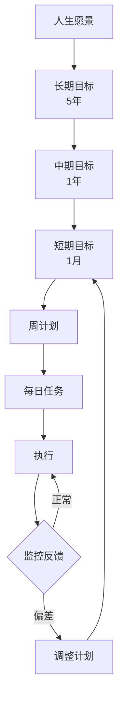
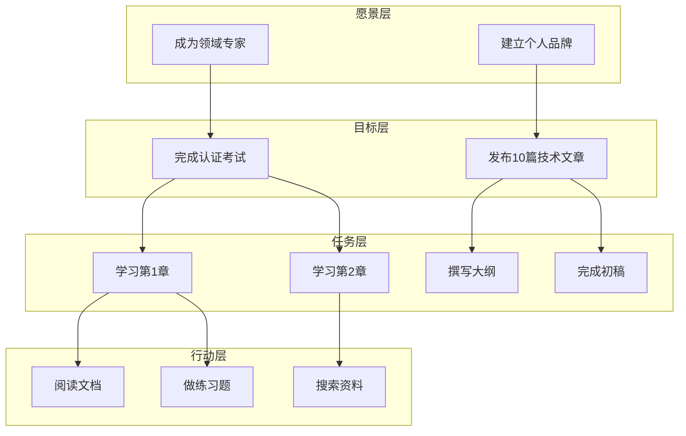
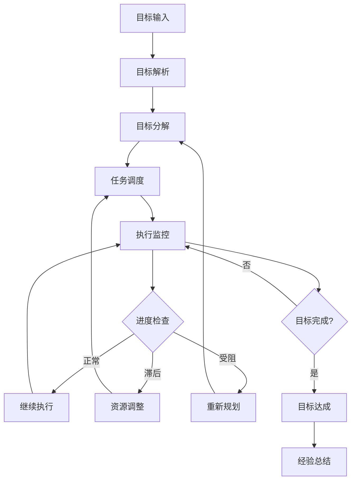
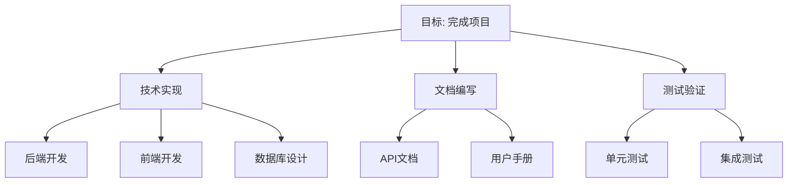
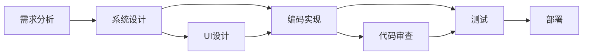
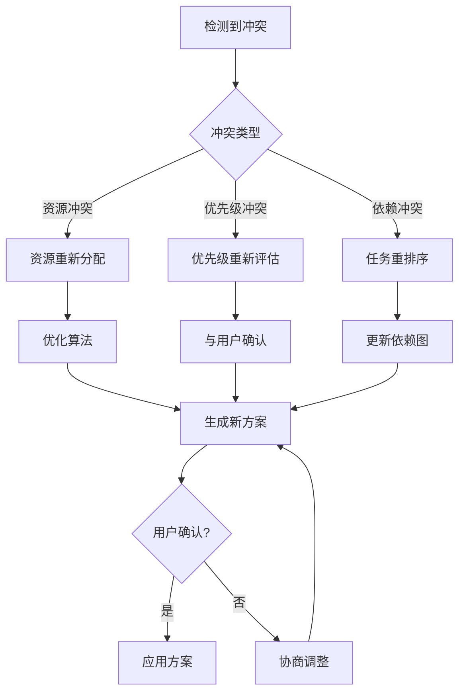

# Chapter 11: Goal Setting and Management 目标设定与管理

## 概述

目标设定与管理模式使 Agent 能够理解和分解用户的高层次目标，将其转化为可执行的任务，并在执行过程中跟踪进度、处理冲突和动态调整。

---

## 背景原理

### 为什么需要目标管理？

**传统 Agent 的局限**：
- 只响应当前输入，缺乏长期目标意识
- 无法理解用户的最终意图
- 多个任务之间缺乏协调
- 难以处理目标冲突

**人类目标管理**：



Agent 需要类似的目标层级结构。

---

## 目标层级



| 层级 | 时间跨度 | 粒度 | 示例 |
|------|----------|------|------|
| 愿景 | 长期 | 抽象 | "成为AI专家" |
| 目标 | 中期 | 具体 | "获得ML认证" |
| 任务 | 短期 | 可操作 | "完成课程第3章" |
| 行动 | 即时 | 原子 | "阅读第3.1节" |

---

## 目标管理流程



### 核心组件

| 组件 | 功能 |
|------|------|
| 目标解析器 | 理解用户意图，提取关键信息 |
| 分解引擎 | 将大目标拆分为子任务 |
| 调度器 | 分配优先级和资源 |
| 跟踪器 | 监控任务进度 |
| 协调器 | 处理任务依赖和冲突 |
| 适配器 | 根据实际情况调整计划 |

---

## 目标分解策略

### 1. MECE 分解原则



**MECE**: Mutually Exclusive, Collectively Exhaustive
- 相互独立，完全穷尽
- 确保无遗漏、无重复

### 2. 依赖分析



### 3. 关键路径

```python
class GoalDecomposer:
    """目标分解器"""
    
    def decompose(self, goal: str) -> dict:
        """分解目标为任务网络"""
        # 使用 LLM 进行智能分解
        decomposition_prompt = f"""
        Decompose the following goal into a task network:
        
        Goal: {goal}
        
        For each task, specify:
        1. Task name
        2. Description
        3. Estimated duration
        4. Dependencies (other tasks that must be completed first)
        5. Required resources
        
        Output as JSON with tasks array.
        """
        
        result = self.llm.generate(decomposition_prompt)
        task_network = json.loads(result)
        
        # 计算关键路径
        critical_path = self._calculate_critical_path(task_network)
        
        return {
            "tasks": task_network["tasks"],
            "critical_path": critical_path,
            "estimated_completion": self._calculate_duration(critical_path)
        }
    
    def _calculate_critical_path(self, tasks: list) -> list:
        """计算关键路径（CPM算法）"""
        # 构建任务图
        graph = self._build_task_graph(tasks)
        
        # 前向遍历计算最早开始时间
        for task in self._topological_sort(graph):
            if not task.dependencies:
                task.earliest_start = 0
            else:
                task.earliest_start = max(
                    dep.earliest_finish 
                    for dep in task.dependencies
                )
            task.earliest_finish = task.earliest_start + task.duration
        
        # 后向遍历计算最晚开始时间
        # ... 计算关键路径
        
        return critical_path
```

---

## 实现方案

### 基础目标管理

```python
from dataclasses import dataclass, field
from typing import List, Optional, Dict
from datetime import datetime, timedelta
from enum import Enum

class GoalStatus(Enum):
    PENDING = "pending"
    IN_PROGRESS = "in_progress"
    BLOCKED = "blocked"
    COMPLETED = "completed"
    CANCELLED = "cancelled"

class TaskPriority(Enum):
    CRITICAL = 1
    HIGH = 2
    MEDIUM = 3
    LOW = 4

@dataclass
class Task:
    """任务定义"""
    id: str
    name: str
    description: str
    status: GoalStatus = GoalStatus.PENDING
    priority: TaskPriority = TaskPriority.MEDIUM
    estimated_duration: int = 60  # 分钟
    dependencies: List[str] = field(default_factory=list)
    subtasks: List['Task'] = field(default_factory=list)
    assigned_to: Optional[str] = None
    deadline: Optional[datetime] = None
    completed_at: Optional[datetime] = None
    progress: float = 0.0  # 0-100
    
    def is_ready(self) -> bool:
        """检查任务是否可执行（依赖已完成）"""
        return self.status == GoalStatus.PENDING and len(self.dependencies) == 0
    
    def update_progress(self, progress: float):
        """更新进度"""
        self.progress = min(100, max(0, progress))
        if self.progress >= 100:
            self.status = GoalStatus.COMPLETED
            self.completed_at = datetime.now()

@dataclass
class Goal:
    """目标定义"""
    id: str
    title: str
    description: str
    vision: str  # 上层愿景
    tasks: List[Task] = field(default_factory=list)
    status: GoalStatus = GoalStatus.PENDING
    created_at: datetime = field(default_factory=datetime.now)
    target_date: Optional[datetime] = None
    completed_at: Optional[datetime] = None
    success_criteria: List[str] = field(default_factory=list)
    
    def get_progress(self) -> float:
        """计算整体进度"""
        if not self.tasks:
            return 0.0
        return sum(t.progress for t in self.tasks) / len(self.tasks)
    
    def get_next_tasks(self, limit: int = 5) -> List[Task]:
        """获取接下来可执行的任务"""
        ready_tasks = [t for t in self.tasks if t.is_ready()]
        ready_tasks.sort(key=lambda t: t.priority.value)
        return ready_tasks[:limit]
    
    def complete_task(self, task_id: str):
        """完成任务并更新依赖"""
        for task in self.tasks:
            if task.id == task_id:
                task.update_progress(100)
                
                # 解除其他任务的依赖
                for other_task in self.tasks:
                    if task_id in other_task.dependencies:
                        other_task.dependencies.remove(task_id)
                break
```

### 目标管理器

```python
class GoalManager:
    """目标管理器"""
    
    def __init__(self, llm):
        self.llm = llm
        self.goals: Dict[str, Goal] = {}
        self.active_goals: List[str] = []
    
    def create_goal(self, user_request: str) -> Goal:
        """从用户请求创建目标"""
        # 1. 解析用户意图
        goal_info = self._parse_goal(user_request)
        
        # 2. 分解为任务
        tasks = self._decompose_into_tasks(goal_info)
        
        # 3. 创建目标
        goal = Goal(
            id=self._generate_id(),
            title=goal_info["title"],
            description=goal_info["description"],
            vision=goal_info["vision"],
            tasks=tasks,
            target_date=goal_info.get("target_date")
        )
        
        self.goals[goal.id] = goal
        self.active_goals.append(goal.id)
        
        return goal
    
    def _parse_goal(self, request: str) -> dict:
        """解析目标信息"""
        prompt = f"""
        Analyze the following user request and extract goal information:
        
        Request: {request}
        
        Extract:
        1. Goal title (concise)
        2. Detailed description
        3. Underlying vision/motivation
        4. Target completion date (if mentioned)
        5. Success criteria (how to know it's done)
        
        Output as JSON.
        """
        
        result = self.llm.generate(prompt)
        return json.loads(result)
    
    def _decompose_into_tasks(self, goal_info: dict) -> List[Task]:
        """将目标分解为任务"""
        prompt = f"""
        Break down the following goal into specific tasks:
        
        Goal: {goal_info['title']}
        Description: {goal_info['description']}
        
        Create 5-10 concrete tasks that:
        1. Follow logical order
        2. Have clear deliverables
        3. Are estimable (in hours)
        4. Have appropriate dependencies
        
        For each task provide:
        - Name
        - Description
        - Estimated duration (minutes)
        - Priority (critical/high/medium/low)
        - Dependencies (task indices)
        
        Output as JSON array.
        """
        
        result = self.llm.generate(prompt)
        tasks_data = json.loads(result)
        
        tasks = []
        for i, td in enumerate(tasks_data):
            task = Task(
                id=f"task_{i}",
                name=td["name"],
                description=td["description"],
                estimated_duration=td["duration"],
                priority=TaskPriority[td["priority"].upper()],
                dependencies=[f"task_{d}" for d in td.get("dependencies", [])]
            )
            tasks.append(task)
        
        return tasks
    
    def get_daily_plan(self, goal_id: str) -> List[Task]:
        """生成每日计划"""
        goal = self.goals.get(goal_id)
        if not goal:
            return []
        
        # 获取可执行的任务
        ready_tasks = [t for t in goal.tasks if t.is_ready()]
        
        # 按优先级排序
        ready_tasks.sort(key=lambda t: t.priority.value)
        
        # 根据可用时间选择任务（假设每天8小时）
        available_time = 8 * 60  # 分钟
        daily_plan = []
        
        for task in ready_tasks:
            if task.estimated_duration <= available_time:
                daily_plan.append(task)
                available_time -= task.estimated_duration
            else:
                break
        
        return daily_plan
    
    def handle_blocker(self, goal_id: str, task_id: str, reason: str):
        """处理任务阻塞"""
        goal = self.goals.get(goal_id)
        if not goal:
            return
        
        task = next((t for t in goal.tasks if t.id == task_id), None)
        if task:
            task.status = GoalStatus.BLOCKED
            
            # 分析阻塞原因并生成解决方案
            solution = self._analyze_blocker(task, reason)
            
            return {
                "task": task,
                "blocker": reason,
                "suggested_solutions": solution
            }
    
    def _analyze_blocker(self, task: Task, reason: str) -> List[str]:
        """分析阻塞原因并建议解决方案"""
        prompt = f"""
        Task "{task.name}" is blocked.
        Reason: {reason}
        
        Suggest 3 specific solutions to unblock this task.
        Be actionable and specific.
        """
        
        result = self.llm.generate(prompt)
        return result.split("\n")
    
    def generate_progress_report(self, goal_id: str) -> str:
        """生成进度报告"""
        goal = self.goals.get(goal_id)
        if not goal:
            return "Goal not found"
        
        completed = len([t for t in goal.tasks if t.status == GoalStatus.COMPLETED])
        total = len(goal.tasks)
        progress = goal.get_progress()
        
        report = f"""
# Goal Progress Report: {goal.title}

**Overall Progress**: {progress:.1f}% ({completed}/{total} tasks)

**Status**: {goal.status.value}

## Completed Tasks
{self._format_tasks([t for t in goal.tasks if t.status == GoalStatus.COMPLETED])}

## In Progress
{self._format_tasks([t for t in goal.tasks if t.status == GoalStatus.IN_PROGRESS])}

## Blocked
{self._format_tasks([t for t in goal.tasks if t.status == GoalStatus.BLOCKED])}

## Up Next
{self._format_tasks(goal.get_next_tasks(3))}

## Next Steps
{self._generate_recommendations(goal)}
        """
        
        return report
    
    def _format_tasks(self, tasks: List[Task]) -> str:
        """格式化任务列表"""
        if not tasks:
            return "None"
        return "\n".join([f"- {t.name} ({t.progress:.0f}%)" for t in tasks])
    
    def _generate_recommendations(self, goal: Goal) -> str:
        """生成建议"""
        # 基于当前状态生成个性化建议
        if goal.get_progress() < 25:
            return "Focus on getting started. Break down the first task if it feels overwhelming."
        elif goal.get_progress() < 75:
            return "You're making good progress. Keep the momentum going!"
        else:
            return "Almost there! Focus on finishing the remaining tasks."
```

---

## 目标冲突处理



```python
class ConflictResolver:
    """目标冲突解决器"""
    
    def detect_conflicts(self, goals: List[Goal]) -> List[dict]:
        """检测目标间的冲突"""
        conflicts = []
        
        # 检查时间冲突
        for i, g1 in enumerate(goals):
            for g2 in goals[i+1:]:
                if self._has_time_conflict(g1, g2):
                    conflicts.append({
                        "type": "time",
                        "goals": [g1.id, g2.id],
                        "severity": "high"
                    })
                
                # 检查资源冲突
                if self._has_resource_conflict(g1, g2):
                    conflicts.append({
                        "type": "resource",
                        "goals": [g1.id, g2.id],
                        "severity": "medium"
                    })
        
        return conflicts
    
    def resolve_conflict(self, conflict: dict) -> dict:
        """解决冲突"""
        if conflict["type"] == "time":
            return self._resolve_time_conflict(conflict)
        elif conflict["type"] == "resource":
            return self._resolve_resource_conflict(conflict)
        
    def _resolve_time_conflict(self, conflict: dict) -> dict:
        """解决时间冲突"""
        # 策略：调整截止日期或重新排序
        return {
            "strategy": "reschedule",
            "proposal": "Move goal B to start after goal A completes",
            "impact": "Goal B delayed by 2 days"
        }
```

---

## 最佳实践

### 1. SMART 原则

```python
SMART_CRITERIA = {
    "S": "Specific - 具体明确的",
    "M": "Measurable - 可衡量的",
    "A": "Achievable - 可实现的",
    "R": "Relevant - 相关的",
    "T": "Time-bound - 有时限的"
}

def validate_smart_goal(goal_description: str) -> dict:
    """验证目标是否符合 SMART 原则"""
    prompt = f"""
    Evaluate if this goal meets SMART criteria:
    
    Goal: {goal_description}
    
    For each SMART criterion:
    - Is it met? (yes/no/partial)
    - Evidence or suggestion for improvement
    
    Overall score (0-100).
    """
    
    result = llm.generate(prompt)
    return json.loads(result)
```

### 2. 动态调整

```python
class AdaptiveGoalManager(GoalManager):
    """自适应目标管理器"""
    
    def review_and_adjust(self, goal_id: str):
        """定期审查并调整目标"""
        goal = self.goals.get(goal_id)
        
        # 分析执行情况
        velocity = self._calculate_velocity(goal)  # 完成速度
        forecast = self._forecast_completion(goal, velocity)
        
        # 如果预测延期
        if forecast > goal.target_date:
            adjustment = self._suggest_adjustment(goal, velocity)
            
            return {
                "current_forecast": forecast,
                "target_date": goal.target_date,
                "suggested_adjustment": adjustment,
                "options": [
                    "Extend deadline",
                    "Reduce scope",
                    "Add resources",
                    "Split into phases"
                ]
            }
```

---

## 适用场景

| 场景 | 应用 | 说明 |
|------|------|------|
| 项目管理 | 任务分解与跟踪 | 自动拆解项目目标 |
| 个人成长 | 学习计划制定 | 从愿景到每日任务 |
| 销售管理 | 业绩目标达成 | 销售漏斗分解 |
| 产品开发 | 产品路线图 | 功能优先级排序 |
| 团队协作 | OKR 管理 | 目标对齐与跟踪 |

---

## 完整示例

```python
from src.utils.model_loader import model_loader

class GoalSettingAgent:
    """
    目标设定与管理 Agent
    帮助用户制定和跟踪目标
    """
    
    def __init__(self, model_id: str = None):
        self.llm = model_loader.load_llm(model_id)
        self.manager = GoalManager(self.llm)
    
    def assist_goal_setting(self, user_input: str) -> str:
        """协助用户设定目标"""
        # 创建目标
        goal = self.manager.create_goal(user_input)
        
        # 生成目标概览
        overview = f"""
# 🎯 目标已创建: {goal.title}

**愿景**: {goal.vision}

**描述**: {goal.description}

## 📋 任务分解 ({len(goal.tasks)} 个任务)
"""
        
        for i, task in enumerate(goal.tasks, 1):
            deps = f" (依赖: {', '.join(task.dependencies)})" if task.dependencies else ""
            overview += f"{i}. {task.name} - {task.estimated_duration}分钟 - {task.priority.name}{deps}\n"
        
        overview += f"""
## 📅 建议日程

基于任务依赖和优先级，建议按以下顺序执行：
"""
        
        daily_plan = self.manager.get_daily_plan(goal.id)
        for task in daily_plan:
            overview += f"- [ ] {task.name}\n"
        
        return overview
    
    def track_progress(self, goal_id: str, task_updates: dict):
        """跟踪进度"""
        for task_id, progress in task_updates.items():
            self.manager.goals[goal_id].complete_task(task_id)
        
        # 生成进度报告
        return self.manager.generate_progress_report(goal_id)

# 使用示例
if __name__ == "__main__":
    agent = GoalSettingAgent()
    
    # 设定目标
    response = agent.assist_goal_setting(
        "我想在3个月内学会Python编程，能够开发Web应用"
    )
    print(response)
```

---

## 运行示例

```bash
python src/agents/patterns/goal_setting.py
```

---

## 参考资源

- [OKR 方法论](https://www.okr.com/)
- [SMART Goals](https://www.mindtools.com/page6.html)
- [Project Management Institute](https://www.pmi.org/)
- [Getting Things Done](https://gettingthingsdone.com/)
- [Agile Goal Setting](https://www.agilealliance.org/)
