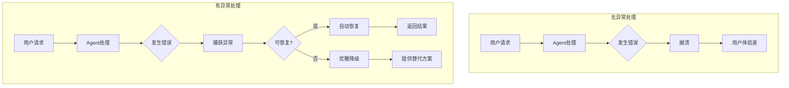
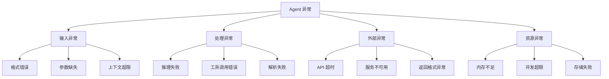
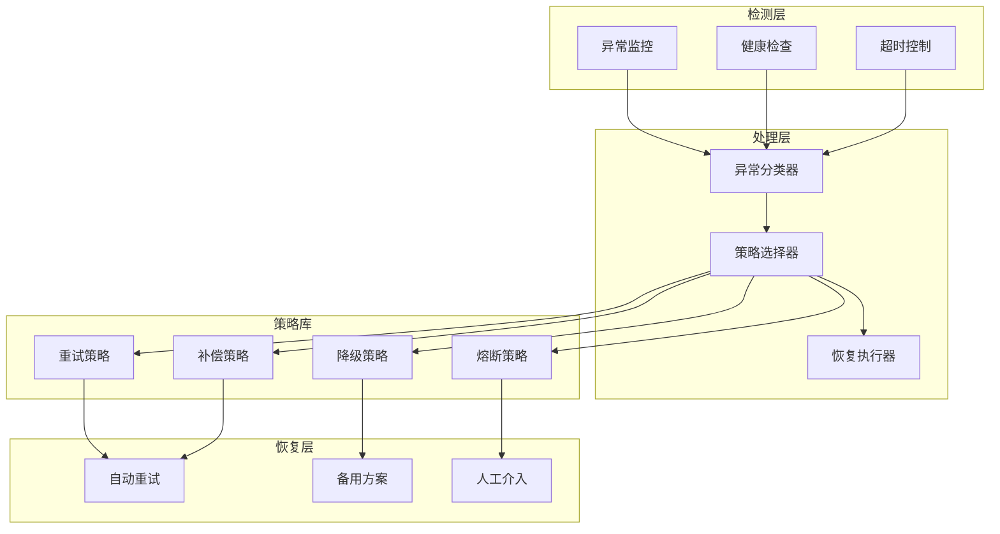
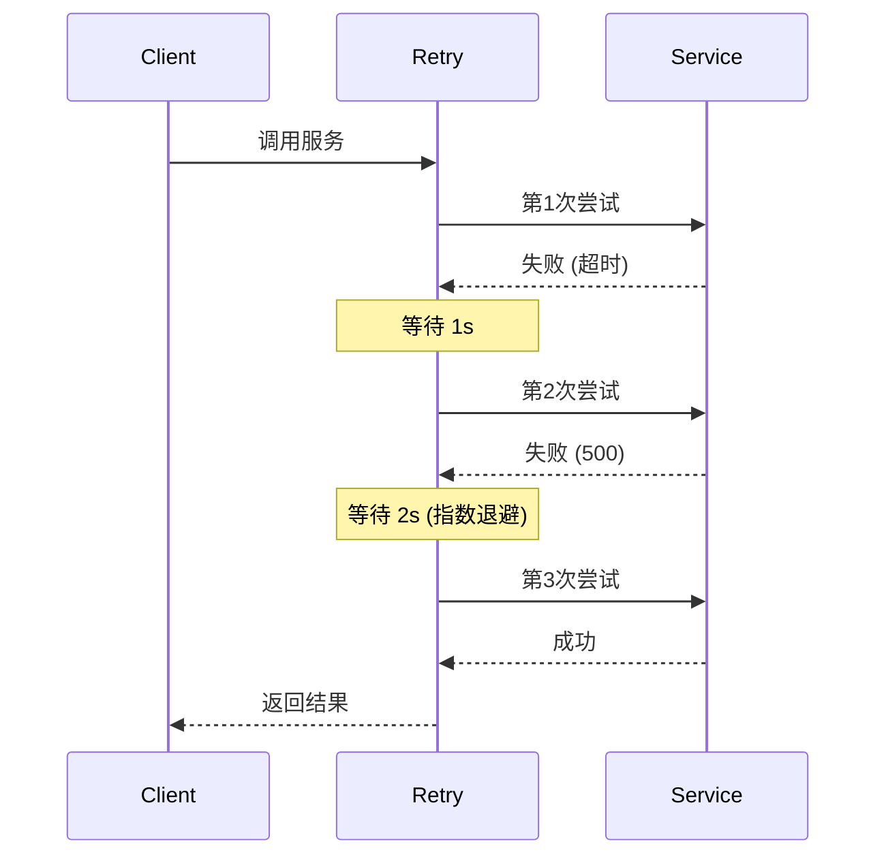
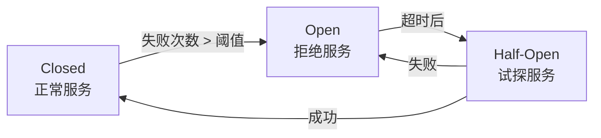

# Chapter 12: Exception Handling and Resilience 异常处理与弹性

## 概述

异常处理与弹性模式确保 Agent 在遇到错误、故障或意外情况时能够优雅地降级、恢复或提供替代方案，而不是完全失败。这是构建可靠生产级 Agent 系统的关键。

---

## 背景原理

### 为什么需要异常处理？

**无防护 Agent 的风险**：
- 单次失败导致整个对话崩溃
- 错误信息暴露给终端用户
- 无法从错误中恢复
- 级联故障影响其他功能



### 弹性设计原则

1. **快速失败 (Fail Fast)**: 尽早发现问题
2. **优雅降级 (Graceful Degradation)**: 降低服务质量而非完全停止
3. **自动恢复 (Auto Recovery)**: 自我修正和重试
4. **熔断保护 (Circuit Breaker)**: 防止级联故障

---

## 异常分类



| 异常类型 | 示例 | 处理策略 |
|----------|------|----------|
| 输入异常 | 用户输入过长 | 截断、拒绝、请求澄清 |
| 处理异常 | LLM 生成无效 JSON | 重试、模板修复 |
| 外部异常 | API 超时 | 重试、缓存、降级 |
| 资源异常 | 内存不足 | 限流、排队、扩容 |

---

## 异常处理架构



---

## 核心策略

### 1. 重试策略 (Retry)



```python
import asyncio
from functools import wraps
from typing import Callable, TypeVar
import random

T = TypeVar('T')

class RetryConfig:
    """重试配置"""
    def __init__(
        self,
        max_attempts: int = 3,
        base_delay: float = 1.0,
        max_delay: float = 60.0,
        exponential_base: float = 2.0,
        retryable_exceptions: tuple = (Exception,),
        on_retry: Callable = None
    ):
        self.max_attempts = max_attempts
        self.base_delay = base_delay
        self.max_delay = max_delay
        self.exponential_base = exponential_base
        self.retryable_exceptions = retryable_exceptions
        self.on_retry = on_retry

def with_retry(config: RetryConfig = None):
    """重试装饰器"""
    if config is None:
        config = RetryConfig()
    
    def decorator(func: Callable[..., T]) -> Callable[..., T]:
        @wraps(func)
        async def async_wrapper(*args, **kwargs) -> T:
            last_exception = None
            
            for attempt in range(1, config.max_attempts + 1):
                try:
                    return await func(*args, **kwargs)
                except config.retryable_exceptions as e:
                    last_exception = e
                    
                    if attempt == config.max_attempts:
                        break
                    
                    # 计算退避时间
                    delay = min(
                        config.base_delay * (config.exponential_base ** (attempt - 1)),
                        config.max_delay
                    )
                    # 添加抖动
                    delay += random.uniform(0, delay * 0.1)
                    
                    if config.on_retry:
                        config.on_retry(attempt, e, delay)
                    
                    await asyncio.sleep(delay)
            
            raise last_exception
        
        @wraps(func)
        def sync_wrapper(*args, **kwargs) -> T:
            last_exception = None
            
            for attempt in range(1, config.max_attempts + 1):
                try:
                    return func(*args, **kwargs)
                except config.retryable_exceptions as e:
                    last_exception = e
                    
                    if attempt == config.max_attempts:
                        break
                    
                    delay = min(
                        config.base_delay * (config.exponential_base ** (attempt - 1)),
                        config.max_delay
                    )
                    
                    if config.on_retry:
                        config.on_retry(attempt, e, delay)
                    
                    import time
                    time.sleep(delay)
            
            raise last_exception
        
        return async_wrapper if asyncio.iscoroutinefunction(func) else sync_wrapper
    return decorator

# 使用示例
retry_config = RetryConfig(
    max_attempts=3,
    base_delay=1.0,
    retryable_exceptions=(TimeoutError, ConnectionError),
    on_retry=lambda attempt, error, delay: print(
        f"Attempt {attempt} failed: {error}. Retrying in {delay:.1f}s..."
    )
)

@with_retry(retry_config)
async def call_external_api(query: str) -> dict:
    """调用外部 API（带重试）"""
    import aiohttp
    async with aiohttp.ClientSession() as session:
        async with session.post(
            "https://api.example.com/search",
            json={"query": query},
            timeout=10
        ) as response:
            response.raise_for_status()
            return await response.json()
```

### 2. 熔断策略 (Circuit Breaker)



```python
from enum import Enum, auto
import time
from threading import Lock

class CircuitState(Enum):
    CLOSED = auto()      # 正常
    OPEN = auto()        # 熔断
    HALF_OPEN = auto()   # 半开

class CircuitBreaker:
    """熔断器实现"""
    
    def __init__(
        self,
        failure_threshold: int = 5,
        recovery_timeout: float = 30.0,
        half_open_max_calls: int = 3
    ):
        self.failure_threshold = failure_threshold
        self.recovery_timeout = recovery_timeout
        self.half_open_max_calls = half_open_max_calls
        
        self.state = CircuitState.CLOSED
        self.failure_count = 0
        self.success_count = 0
        self.last_failure_time = None
        self._lock = Lock()
    
    def call(self, func, *args, **kwargs):
        """执行带熔断保护的调用"""
        with self._lock:
            if self.state == CircuitState.OPEN:
                if self._should_attempt_reset():
                    self.state = CircuitState.HALF_OPEN
                    self.success_count = 0
                else:
                    raise CircuitBreakerOpenError(
                        "Circuit breaker is OPEN"
                    )
            
            elif self.state == CircuitState.HALF_OPEN:
                if self.success_count >= self.half_open_max_calls:
                    raise CircuitBreakerOpenError(
                        "Half-open limit reached"
                    )
        
        try:
            result = func(*args, **kwargs)
            self._on_success()
            return result
        except Exception as e:
            self._on_failure()
            raise
    
    def _on_success(self):
        """成功回调"""
        with self._lock:
            if self.state == CircuitState.HALF_OPEN:
                self.success_count += 1
                if self.success_count >= self.half_open_max_calls:
                    self._reset()
            else:
                self.failure_count = 0
    
    def _on_failure(self):
        """失败回调"""
        with self._lock:
            self.failure_count += 1
            self.last_failure_time = time.time()
            
            if self.state == CircuitState.HALF_OPEN:
                self.state = CircuitState.OPEN
            elif self.failure_count >= self.failure_threshold:
                self.state = CircuitState.OPEN
    
    def _should_attempt_reset(self) -> bool:
        """检查是否应该尝试重置"""
        if self.last_failure_time is None:
            return True
        return time.time() - self.last_failure_time >= self.recovery_timeout
    
    def _reset(self):
        """重置熔断器"""
        self.state = CircuitState.CLOSED
        self.failure_count = 0
        self.success_count = 0
        self.last_failure_time = None

class CircuitBreakerOpenError(Exception):
    pass

# 使用示例
breaker = CircuitBreaker(
    failure_threshold=3,
    recovery_timeout=10.0
)

def unreliable_service():
    """不可靠的服务"""
    import random
    if random.random() < 0.7:  # 70% 失败率
        raise ConnectionError("Service unavailable")
    return "Success"

# 带熔断保护的调用
try:
    result = breaker.call(unreliable_service)
    print(f"Result: {result}")
except CircuitBreakerOpenError:
    print("Service temporarily unavailable. Please try later.")
```

### 3. 降级策略 (Fallback)

```python
class FallbackStrategy:
    """降级策略"""
    
    def __init__(self, primary_func, fallback_chain: list):
        """
        Args:
            primary_func: 主功能
            fallback_chain: 降级链 [(func, condition), ...]
        """
        self.primary_func = primary_func
        self.fallback_chain = fallback_chain
    
    def execute(self, *args, **kwargs):
        """执行带降级的调用"""
        try:
            # 尝试主功能
            return self.primary_func(*args, **kwargs)
        except Exception as primary_error:
            # 尝试降级链
            for fallback_func, condition in self.fallback_chain:
                try:
                    if condition is None or condition(primary_error):
                        result = fallback_func(*args, **kwargs)
                        return {
                            "result": result,
                            "degraded": True,
                            "reason": str(primary_error)
                        }
                except Exception:
                    continue
            
            # 所有降级都失败
            raise primary_error

# 使用示例
def generate_with_gpt4(prompt: str) -> str:
    """使用 GPT-4 生成"""
    # 调用 GPT-4 API
    pass

def generate_with_gpt3(prompt: str) -> str:
    """降级到 GPT-3.5"""
    # 调用 GPT-3.5 API
    pass

def generate_cached_response(prompt: str) -> str:
    """使用缓存响应"""
    # 返回通用响应
    return "I'm experiencing high load. Here's a general response..."

# 构建降级链
content_generator = FallbackStrategy(
    primary_func=generate_with_gpt4,
    fallback_chain=[
        (generate_with_gpt3, lambda e: "rate limit" in str(e).lower()),
        (generate_cached_response, None)  # 无条件降级
    ]
)

result = content_generator.execute("Write a poem")
```

---

## Agent 级异常处理

### 输入验证与清理

```python
from pydantic import BaseModel, validator, ValidationError
from typing import Optional

class UserInput(BaseModel):
    """用户输入模型"""
    query: str
    max_length: int = 4000
    context: Optional[str] = None
    
    @validator('query')
    def validate_query(cls, v):
        if not v or not v.strip():
            raise ValueError("Query cannot be empty")
        if len(v) > 10000:
            raise ValueError("Query too long (max 10000 chars)")
        return v.strip()
    
    @validator('context')
    def validate_context(cls, v):
        if v and len(v) > 50000:
            # 截断而非报错
            return v[:50000] + "\n[Context truncated]"
        return v

class InputProcessor:
    """输入处理器"""
    
    def process(self, raw_input: dict) -> tuple[bool, UserInput | str]:
        """处理并验证输入"""
        try:
            validated = UserInput(**raw_input)
            return True, validated
        except ValidationError as e:
            # 友好的错误信息
            error_msg = self._format_validation_error(e)
            return False, error_msg
    
    def _format_validation_error(self, error: ValidationError) -> str:
        """格式化验证错误"""
        errors = error.errors()
        messages = []
        for err in errors:
            field = err['loc'][0]
            msg = err['msg']
            messages.append(f"- {field}: {msg}")
        return "Input validation failed:\n" + "\n".join(messages)
```

### LLM 输出解析容错

```python
import json
import re

class RobustParser:
    """健壮的解析器"""
    
    @staticmethod
    def parse_json(text: str, max_retries: int = 3) -> dict:
        """尝试多种方式解析 JSON"""
        
        # 尝试 1: 直接解析
        try:
            return json.loads(text)
        except json.JSONDecodeError:
            pass
        
        # 尝试 2: 提取 JSON 代码块
        try:
            json_match = re.search(r'```(?:json)?\s*(.*?)\s*```', text, re.DOTALL)
            if json_match:
                return json.loads(json_match.group(1))
        except json.JSONDecodeError:
            pass
        
        # 尝试 3: 提取花括号内容
        try:
            json_match = re.search(r'\{.*\}', text, re.DOTALL)
            if json_match:
                return json.loads(json_match.group(0))
        except json.JSONDecodeError:
            pass
        
        # 尝试 4: 使用 LLM 修复
        if max_retries > 0:
            fixed = RobustParser._fix_json_with_llm(text)
            return RobustParser.parse_json(fixed, max_retries - 1)
        
        raise ValueError(f"Unable to parse JSON from: {text[:200]}...")
    
    @staticmethod
    def _fix_json_with_llm(broken_json: str) -> str:
        """使用 LLM 修复损坏的 JSON"""
        prompt = f"""
        The following text should be valid JSON but has errors.
        Please fix it and return only the corrected JSON:
        
        {broken_json}
        """
        # 调用 LLM 修复
        return llm.generate(prompt)
```

---

## 监控与告警

```python
from dataclasses import dataclass
from datetime import datetime
from collections import deque
import statistics

@dataclass
class ErrorEvent:
    """错误事件"""
    timestamp: datetime
    error_type: str
    error_message: str
    context: dict
    recovered: bool = False

class ErrorMonitor:
    """错误监控器"""
    
    def __init__(self, window_size: int = 100):
        self.errors: deque[ErrorEvent] = deque(maxlen=window_size)
        self.error_counts: dict[str, int] = {}
        self.recovery_counts: dict[str, int] = {}
    
    def record_error(self, error: Exception, context: dict):
        """记录错误"""
        event = ErrorEvent(
            timestamp=datetime.now(),
            error_type=type(error).__name__,
            error_message=str(error),
            context=context
        )
        self.errors.append(event)
        
        error_type = type(error).__name__
        self.error_counts[error_type] = self.error_counts.get(error_type, 0) + 1
        
        # 检查是否需要告警
        self._check_alerts(error_type)
    
    def record_recovery(self, error_type: str):
        """记录恢复"""
        self.recovery_counts[error_type] = self.recovery_counts.get(error_type, 0) + 1
        
        # 更新最近的错误事件
        for error in reversed(self.errors):
            if error.error_type == error_type and not error.recovered:
                error.recovered = True
                break
    
    def _check_alerts(self, error_type: str):
        """检查告警条件"""
        recent_count = sum(
            1 for e in self.errors
            if e.error_type == error_type
            and (datetime.now() - e.timestamp).seconds < 300  # 5分钟内
        )
        
        if recent_count > 10:
            self._send_alert(f"High error rate for {error_type}: {recent_count} in 5min")
    
    def _send_alert(self, message: str):
        """发送告警"""
        # 集成告警系统（邮件、短信、Slack等）
        print(f"[ALERT] {message}")
    
    def get_metrics(self) -> dict:
        """获取错误指标"""
        total_errors = len(self.errors)
        recovered_errors = sum(1 for e in self.errors if e.recovered)
        
        return {
            "total_errors": total_errors,
            "recovered_errors": recovered_errors,
            "recovery_rate": recovered_errors / total_errors if total_errors > 0 else 0,
            "error_types": dict(self.error_counts),
            "error_rate_5min": len([
                e for e in self.errors
                if (datetime.now() - e.timestamp).seconds < 300
            ])
        }
```

---

## 完整示例

```python
from src.utils.model_loader import model_loader

class ResilientAgent:
    """
    具备弹性和异常处理能力的 Agent
    """
    
    def __init__(self, model_id: str = None):
        self.llm = model_loader.load_llm(model_id)
        self.circuit_breaker = CircuitBreaker(failure_threshold=3)
        self.error_monitor = ErrorMonitor()
        self.input_processor = InputProcessor()
    
    async def safe_process(self, user_input: dict) -> dict:
        """安全地处理用户请求"""
        
        # 1. 输入验证
        valid, input_or_error = self.input_processor.process(user_input)
        if not valid:
            return {
                "success": False,
                "error": "input_validation",
                "message": input_or_error,
                "fallback_suggestion": "Please check your input and try again."
            }
        
        validated_input = input_or_error
        
        # 2. 带熔断的 LLM 调用
        try:
            result = await self.circuit_breaker.call(
                self._process_with_llm,
                validated_input
            )
            return {"success": True, "result": result}
            
        except CircuitBreakerOpenError:
            return await self._handle_circuit_open(validated_input)
            
        except Exception as e:
            self.error_monitor.record_error(e, {"input": user_input})
            return await self._handle_error(e, validated_input)
    
    @with_retry(RetryConfig(max_attempts=3, base_delay=1.0))
    async def _process_with_llm(self, input_data: UserInput) -> str:
        """使用 LLM 处理（带重试）"""
        response = await self.llm.ainvoke(input_data.query)
        return response.content
    
    async def _handle_circuit_open(self, input_data: UserInput) -> dict:
        """处理熔断器打开"""
        # 使用本地缓存或简化响应
        return {
            "success": False,
            "error": "service_unavailable",
            "message": "The service is temporarily overloaded.",
            "fallback_response": "I'm experiencing high load. Please try again in a moment."
        }
    
    async def _handle_error(self, error: Exception, input_data: UserInput) -> dict:
        """处理一般错误"""
        # 根据错误类型选择降级策略
        if isinstance(error, TimeoutError):
            return {
                "success": False,
                "error": "timeout",
                "message": "The request took too long to process.",
                "fallback_response": "This is taking longer than expected. Let me provide a preliminary answer..."
            }
        
        elif isinstance(error, ConnectionError):
            return {
                "success": False,
                "error": "connection",
                "message": "Unable to connect to the service.",
                "fallback_response": "I'm having trouble connecting. Here's what I can tell you from my training data..."
            }
        
        else:
            return {
                "success": False,
                "error": "unknown",
                "message": "An unexpected error occurred.",
                "fallback_response": "I encountered an issue. Please try rephrasing your request."
            }

# 使用示例
if __name__ == "__main__":
    agent = ResilientAgent()
    
    # 模拟各种异常情况
    import asyncio
    
    async def test():
        # 正常输入
        result = await agent.safe_process({"query": "Hello"})
        print(result)
        
        # 无效输入
        result = await agent.safe_process({"query": ""})
        print(result)
    
    asyncio.run(test())
```

---

## 运行示例

```bash
python src/agents/patterns/exception_handling.py
```

---

## 参考资源

- [Patterns of Resilient Architecture](https://www.oreilly.com/library/view/release-it-2nd/9781680502391/)
- [Circuit Breaker Pattern](https://martinfowler.com/bliki/CircuitBreaker.html)
- [Retry Pattern](https://docs.microsoft.com/en-us/azure/architecture/patterns/retry)
- [Bulkhead Pattern](https://docs.microsoft.com/en-us/azure/architecture/patterns/bulkhead)
- [Chaos Engineering](https://principlesofchaos.org/)
