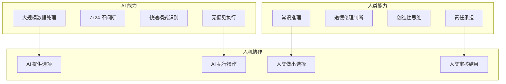
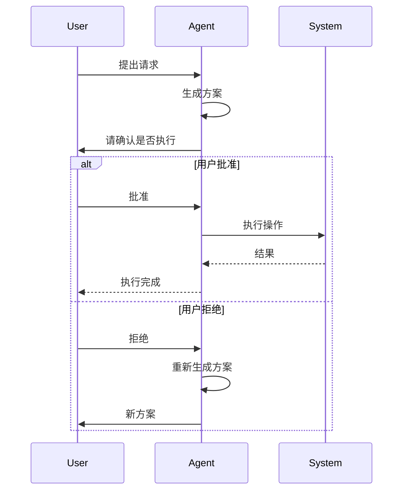
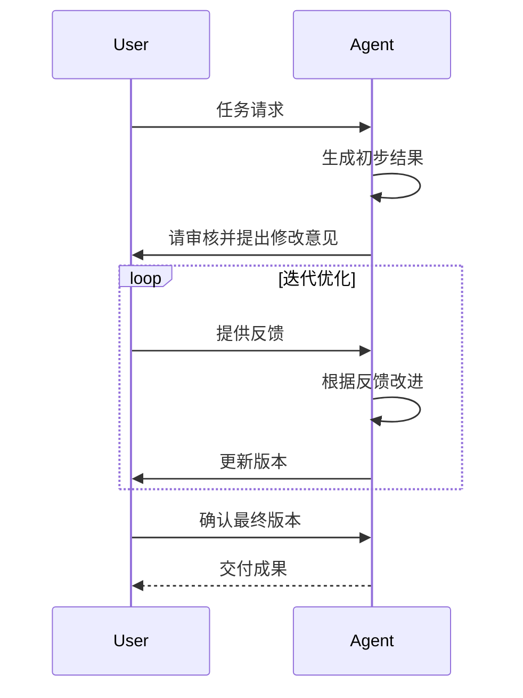
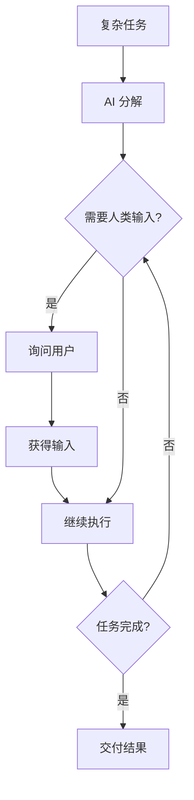
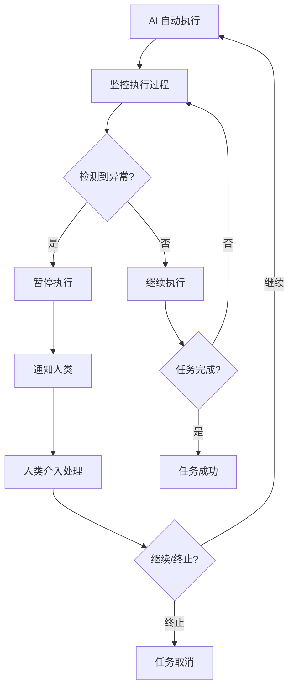
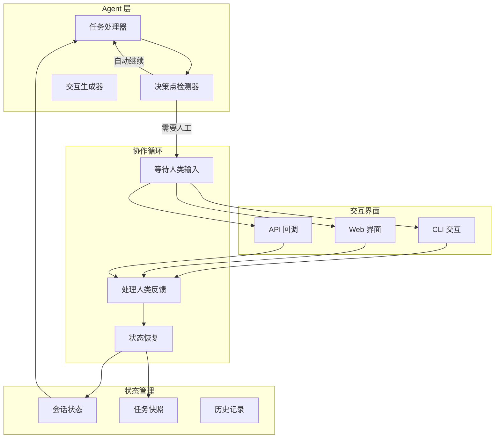

# Chapter 13: Human-in-the-Loop 人机协作

## 概述

Human-in-the-Loop (HITL) 模式在自动化流程的关键节点引入人工审核、决策或输入，结合人类智慧和 AI 效率，确保关键决策的准确性和可控性。

---

## 背景原理

### 为什么需要人机协作？

**全自动化的问题**：
- 高风险决策缺乏监督
- 无法处理未知场景
- 缺乏人类的常识判断
- 责任和问责模糊

**人机协作的优势**：



---

## 协作模式

### 1. 审批模式 (Approval)



**适用场景**：
- 金融交易审批
- 重要文档发布
- 敏感信息删除

### 2. 修正模式 (Correction)



**适用场景**：
- 内容创作
- 代码审查
- 设计稿修改

### 3. 引导模式 (Guidance)



**适用场景**：
- 需求不明确时
- 多步骤复杂任务
- 需要实时反馈

### 4. 监督模式 (Supervision)



**适用场景**：
- 生产环境自动化
- 批量数据处理
- 持续监控任务

---

## 架构设计



---

## 实现方案

### 基础 HITL 实现

```python
from enum import Enum, auto
from typing import Callable, Optional, Any
from dataclasses import dataclass
import asyncio
from datetime import datetime

class HumanResponse(Enum):
    """人类响应类型"""
    APPROVE = auto()
    REJECT = auto()
    MODIFY = auto()
    ASK = auto()
    TIMEOUT = auto()

@dataclass
class HumanInput:
    """人类输入"""
    response_type: HumanResponse
    content: str
    timestamp: datetime
    metadata: dict = None

class HumanInTheLoop:
    """人机协作处理器"""
    
    def __init__(
        self,
        input_callback: Callable[[str, dict], HumanInput],
        timeout: float = 300.0  # 5分钟超时
    ):
        self.input_callback = input_callback
        self.timeout = timeout
        self.interaction_history = []
    
    async def request_approval(
        self,
        action_description: str,
        context: dict = None
    ) -> tuple[bool, Optional[str]]:
        """
        请求用户批准
        
        Returns:
            (是否批准, 修改意见或原因)
        """
        prompt = self._build_approval_prompt(action_description, context)
        
        # 调用回调获取用户输入
        try:
            user_input = await asyncio.wait_for(
                self._get_input_async(prompt, context),
                timeout=self.timeout
            )
        except asyncio.TimeoutError:
            user_input = HumanInput(
                response_type=HumanResponse.TIMEOUT,
                content="Timeout waiting for user response",
                timestamp=datetime.now()
            )
        
        self._record_interaction("approval", action_description, user_input)
        
        if user_input.response_type == HumanResponse.APPROVE:
            return True, None
        elif user_input.response_type == HumanResponse.MODIFY:
            return True, user_input.content  # 批准但需修改
        else:
            return False, user_input.content
    
    async def request_input(
        self,
        question: str,
        options: list = None,
        context: dict = None
    ) -> str:
        """
        请求用户输入
        
        Args:
            question: 问题描述
            options: 可选答案列表
            context: 上下文信息
        """
        prompt = self._build_input_prompt(question, options, context)
        
        user_input = await self._get_input_async(prompt, context)
        
        self._record_interaction("input", question, user_input)
        
        return user_input.content
    
    async def request_correction(
        self,
        current_result: Any,
        correction_guidance: str,
        context: dict = None
    ) -> tuple[Any, bool]:
        """
        请求用户修正
        
        Returns:
            (修正后的结果, 是否接受)
        """
        prompt = self._build_correction_prompt(current_result, correction_guidance, context)
        
        user_input = await self._get_input_async(prompt, context)
        
        self._record_interaction("correction", correction_guidance, user_input)
        
        if user_input.response_type == HumanResponse.APPROVE:
            return current_result, True
        elif user_input.response_type == HumanResponse.MODIFY:
            return user_input.content, True
        else:
            return None, False
    
    async def _get_input_async(self, prompt: str, context: dict) -> HumanInput:
        """异步获取用户输入"""
        loop = asyncio.get_event_loop()
        result = await loop.run_in_executor(
            None, self.input_callback, prompt, context
        )
        return result
    
    def _build_approval_prompt(self, action: str, context: dict) -> str:
        """构建批准提示"""
        prompt = f"""
╔══════════════════════════════════════════════════════════════╗
║                    需要您的批准                                ║
╠══════════════════════════════════════════════════════════════╣
操作: {action}
"""
        if context:
            prompt += f"\n上下文: {context}\n"
        
        prompt += """
请选择:
  [Y] 批准执行
  [N] 拒绝
  [M] 修改后执行
  [?] 询问详情
"""
        return prompt
    
    def _build_input_prompt(self, question: str, options: list, context: dict) -> str:
        """构建输入提示"""
        prompt = f"\n❓ {question}\n"
        
        if options:
            prompt += "\n选项:\n"
            for i, option in enumerate(options, 1):
                prompt += f"  [{i}] {option}\n"
            prompt += "\n请输入选项编号或您的回答: "
        else:
            prompt += "\n请输入: "
        
        return prompt
    
    def _record_interaction(self, interaction_type: str, content: str, response: HumanInput):
        """记录交互历史"""
        self.interaction_history.append({
            "type": interaction_type,
            "content": content,
            "response": response,
            "timestamp": datetime.now()
        })
```

### 不同交互方式实现

#### CLI 交互

```python
class CLIInteractor:
    """命令行交互实现"""
    
    @staticmethod
    def get_input(prompt: str, context: dict) -> HumanInput:
        """CLI 输入处理"""
        print(prompt)
        
        user_input = input("> ").strip()
        
        # 解析响应
        if user_input.upper() in ["Y", "YES", "是"]:
            return HumanInput(HumanResponse.APPROVE, user_input, datetime.now())
        elif user_input.upper() in ["N", "NO", "否"]:
            return HumanInput(HumanResponse.REJECT, user_input, datetime.now())
        elif user_input.upper() in ["M", "MODIFY", "修改"]:
            modification = input("请输入修改意见: ")
            return HumanInput(HumanResponse.MODIFY, modification, datetime.now())
        elif user_input.upper() in ["?", "ASK", "问"]:
            question = input("您想了解什么: ")
            return HumanInput(HumanResponse.ASK, question, datetime.now())
        else:
            return HumanInput(HumanResponse.MODIFY, user_input, datetime.now())
```

#### Web 界面交互

```python
import asyncio
from fastapi import FastAPI, WebSocket
from typing import Dict

class WebInteractor:
    """Web 界面交互实现"""
    
    def __init__(self):
        self.pending_requests: Dict[str, asyncio.Future] = {}
        self.app = FastAPI()
        self._setup_routes()
    
    def _setup_routes(self):
        @self.app.websocket("/ws/hitl")
        async def websocket_endpoint(websocket: WebSocket):
            await websocket.accept()
            
            try:
                while True:
                    # 接收客户端消息
                    data = await websocket.receive_json()
                    request_id = data.get("request_id")
                    
                    if request_id in self.pending_requests:
                        # 解析响应
                        response_type = HumanResponse[data.get("response_type").upper()]
                        content = data.get("content", "")
                        
                        # 完成等待中的请求
                        future = self.pending_requests.pop(request_id)
                        future.set_result(HumanInput(
                            response_type=response_type,
                            content=content,
                            timestamp=datetime.now()
                        ))
            
            except Exception as e:
                print(f"WebSocket error: {e}")
    
    async def get_input(self, prompt: str, context: dict) -> HumanInput:
        """发送请求并等待 Web 响应"""
        import uuid
        
        request_id = str(uuid.uuid4())
        future = asyncio.Future()
        self.pending_requests[request_id] = future
        
        # 这里应该通过 WebSocket 发送给客户端
        # 简化示例：实际需要通过某种方式通知前端
        
        try:
            return await asyncio.wait_for(future, timeout=300)
        except asyncio.TimeoutError:
            if request_id in self.pending_requests:
                del self.pending_requests[request_id]
            raise
```

---

## 完整 HITL Agent 示例

```python
from src.utils.model_loader import model_loader

class HITLAgent:
    """
    支持人机协作的 Agent
    在关键决策点引入人工审核
    """
    
    def __init__(self, model_id: str = None, interactor=None):
        self.llm = model_loader.load_llm(model_id)
        self.hitl = HumanInTheLoop(interactor or CLIInteractor.get_input)
        self.high_risk_keywords = ["删除", "转账", "发布", "修改权限"]
    
    async def execute_task(self, task_description: str, auto_mode: bool = False) -> dict:
        """
        执行任务，必要时引入人工协作
        
        Args:
            task_description: 任务描述
            auto_mode: 是否全自动模式（跳过人工）
        """
        results = []
        
        # 1. 任务分解
        steps = await self._decompose_task(task_description)
        
        for i, step in enumerate(steps, 1):
            print(f"\n步骤 {i}/{len(steps)}: {step['description']}")
            
            # 2. 风险评估
            risk_level = self._assess_risk(step)
            
            # 3. 决定是否需要人工介入
            if not auto_mode and risk_level in ["high", "medium"]:
                # 生成详细方案
                plan = await self._generate_plan(step)
                
                # 请求批准
                approved, modification = await self.hitl.request_approval(
                    action_description=plan,
                    context={
                        "step": i,
                        "total_steps": len(steps),
                        "risk_level": risk_level
                    }
                )
                
                if not approved:
                    results.append({
                        "step": i,
                        "status": "rejected",
                        "reason": modification
                    })
                    continue
                
                if modification:
                    step["modification"] = modification
            
            # 4. 执行步骤
            try:
                result = await self._execute_step(step)
                results.append({
                    "step": i,
                    "status": "completed",
                    "result": result
                })
            except Exception as e:
                # 5. 执行失败，请求人类介入
                correction = await self.hitl.request_correction(
                    current_result=str(e),
                    correction_guidance="执行过程中出现错误，请指导如何处理",
                    context={"step": step, "error": str(e)}
                )
                
                if correction[1]:  # 用户接受修正
                    results.append({
                        "step": i,
                        "status": "corrected",
                        "result": correction[0]
                    })
                else:
                    results.append({
                        "step": i,
                        "status": "failed",
                        "error": str(e)
                    })
        
        return {
            "task": task_description,
            "steps_completed": len([r for r in results if r["status"] in ["completed", "corrected"]]),
            "results": results
        }
    
    async def _decompose_task(self, task: str) -> list:
        """分解任务"""
        prompt = f"将以下任务分解为具体步骤: {task}"
        response = self.llm.invoke(prompt)
        # 解析响应
        return [{"description": line.strip()} for line in response.content.split("\n") if line.strip()]
    
    def _assess_risk(self, step: dict) -> str:
        """评估步骤风险"""
        desc = step["description"].lower()
        
        for keyword in self.high_risk_keywords:
            if keyword in desc:
                return "high"
        
        # 其他风险评估逻辑
        return "low"
    
    async def _generate_plan(self, step: dict) -> str:
        """生成详细执行计划"""
        prompt = f"请详细说明如何执行以下步骤: {step['description']}"
        response = self.llm.invoke(prompt)
        return response.content
    
    async def _execute_step(self, step: dict) -> str:
        """执行单个步骤"""
        # 实际执行逻辑
        return f"Executed: {step['description']}"

# 使用示例
async def main():
    agent = HITLAgent()
    
    # 执行任务（会在关键步骤暂停等待用户输入）
    result = await agent.execute_task(
        "删除旧的日志文件并生成新的分析报告"
    )
    
    print(result)

if __name__ == "__main__":
    import asyncio
    asyncio.run(main())
```

---

## 最佳实践

### 1. 智能决策点

```python
class DecisionPointAnalyzer:
    """智能决策点分析器"""
    
    def should_request_human(self, context: dict) -> tuple[bool, str, str]:
        """
        决定是否需要人工介入
        
        Returns:
            (是否需要人工, 原因, 建议的操作)
        """
        # 基于规则的判断
        if context.get("financial_impact", 0) > 10000:
            return True, "High financial impact", "Request approval"
        
        if context.get("safety_critical", False):
            return True, "Safety critical operation", "Mandatory review"
        
        # 基于置信度的判断
        confidence = context.get("model_confidence", 1.0)
        if confidence < 0.7:
            return True, f"Low confidence ({confidence:.2f})", "Request confirmation"
        
        # 异常情况
        if context.get("anomaly_detected", False):
            return True, "Anomaly detected", "Human review required"
        
        return False, "Pass automatic check", "Proceed automatically"
```

### 2. 渐进式自动化


### 3. 反馈学习

```python
class HITLFeedbackLearner:
    """从人工反馈中学习"""
    
    def __init__(self):
        self.correction_patterns = []
    
    def record_correction(self, original: str, corrected: str, context: dict):
        """记录人工修正"""
        self.correction_patterns.append({
            "original": original,
            "corrected": corrected,
            "context": context,
            "timestamp": datetime.now()
        })
    
    def improve_model(self):
        """基于反馈改进模型"""
        # 分析常见错误模式
        common_errors = self._analyze_error_patterns()
        
        # 生成微调数据
        training_data = self._generate_training_data()
        
        # 更新模型（或调整提示词）
        self._update_prompts(common_errors)
```

---

## 适用场景

| 场景 | 协作模式 | 说明 |
|------|----------|------|
| 医疗诊断 | 监督模式 | AI 辅助，医生最终确认 |
| 金融风控 | 审批模式 | 高风险交易人工审核 |
| 内容审核 | 修正模式 | AI 初筛，人工复审 |
| 客户服务 | 引导模式 | 复杂问题转人工 |
| 自动驾驶 | 紧急接管 | 异常情况人类接管 |

---

## 运行示例

```bash
python src/agents/patterns/human_in_loop.py
```

---

## 参考资源

- [Human-in-the-Loop Machine Learning](https://www.manning.com/books/human-in-the-loop-machine-learning)
- [Active Learning](https://en.wikipedia.org/wiki/Active_learning_(machine_learning))
- [Human-AI Interaction Guidelines](https://www.microsoft.com/en-us/research/publication/guidelines-for-human-ai-interaction/)
- [AI Alignment](https://www.alignmentforum.org/)
- [Constitutional AI](https://www.anthropic.com/news/constitutional-ai)
