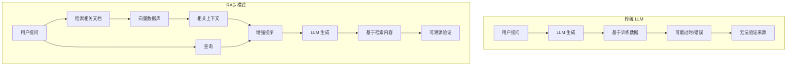
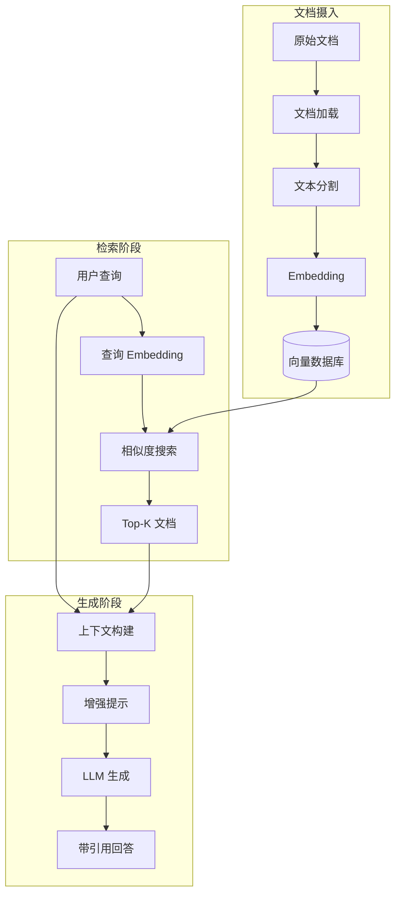
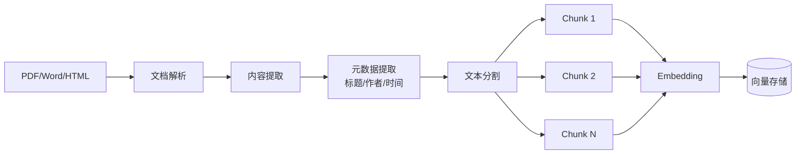
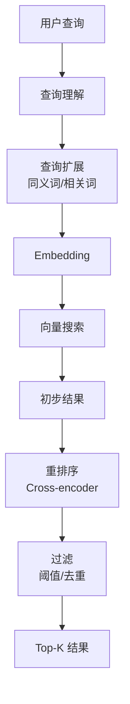
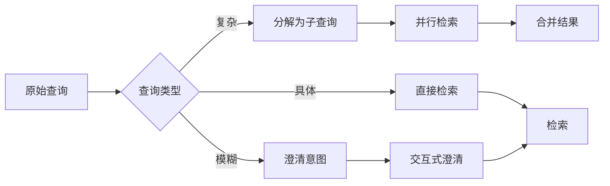

# Chapter 14: RAG (Retrieval-Augmented Generation) 检索增强生成

## 概述

RAG (Retrieval-Augmented Generation) 是一种将外部知识检索与语言模型生成能力相结合的技术。通过动态检索相关文档，RAG 能够显著提高 LLM 回答的准确性、时效性和可验证性，同时减少幻觉。

---

## 背景原理

### 为什么需要 RAG？

**纯 LLM 的局限**：
- **知识截止**: 训练数据有时间限制
- **幻觉问题**: 生成看似合理但实际错误的信息
- **领域知识不足**: 缺乏专业领域的深度知识
- **无法溯源**: 无法验证信息来源



### RAG 的核心价值

1. **知识扩展**: 访问外部知识库
2. **时效性**: 使用最新文档
3. **准确性**: 基于真实文档生成
4. **可溯源**: 提供参考来源

---

## 架构设计



### 核心组件

| 组件 | 功能 | 技术选择 |
|------|------|----------|
| 文档加载器 | 加载各种格式文档 | LangChain Loaders |
| 文本分割器 | 将长文档切分 | Recursive, Character |
| Embedding 模型 | 文本向量化 | OpenAI, BGE, M3E |
| 向量数据库 | 存储和检索 | Chroma, Pinecone, Milvus |
| 重排序器 | 优化检索结果 | Cross-encoder |
| LLM | 生成回答 | GPT-4, Claude, Llama |

---

## 工作流程详解

### 1. 索引阶段 (Indexing)



```python
from langchain.document_loaders import PyPDFLoader, TextLoader
from langchain.text_splitter import RecursiveCharacterTextSplitter
from langchain.embeddings import OpenAIEmbeddings
from langchain.vectorstores import Chroma

class DocumentIndexer:
    """文档索引器"""
    
    def __init__(self, embedding_model=None):
        self.embedding_model = embedding_model or OpenAIEmbeddings()
        self.text_splitter = RecursiveCharacterTextSplitter(
            chunk_size=1000,
            chunk_overlap=200,
            length_function=len,
            separators=["\n\n", "\n", "。", " ", ""]
        )
    
    def index_documents(self, file_paths: list, persist_dir: str = "./chroma_db"):
        """索引文档"""
        documents = []
        
        for file_path in file_paths:
            # 加载文档
            loader = self._get_loader(file_path)
            docs = loader.load()
            documents.extend(docs)
        
        # 分割文档
        chunks = self.text_splitter.split_documents(documents)
        
        # 创建向量存储
        vectorstore = Chroma.from_documents(
            documents=chunks,
            embedding=self.embedding_model,
            persist_directory=persist_dir
        )
        
        vectorstore.persist()
        return vectorstore
    
    def _get_loader(self, file_path: str):
        """根据文件类型选择加载器"""
        if file_path.endswith(".pdf"):
            return PyPDFLoader(file_path)
        elif file_path.endswith(".txt"):
            return TextLoader(file_path)
        # ... 其他格式
```

### 2. 检索阶段 (Retrieval)



```python
from langchain.retrievers import ContextualCompressionRetriever
from langchain.retrievers.document_compressors import CrossEncoderReranker
from langchain_community.cross_encoders import HuggingFaceCrossEncoder

class AdvancedRetriever:
    """高级检索器"""
    
    def __init__(self, vectorstore):
        self.base_retriever = vectorstore.as_retriever(
            search_type="mmr",  # 最大边际相关性
            search_kwargs={"k": 10, "fetch_k": 20}
        )
        
        # 重排序器
        model = HuggingFaceCrossEncoder(model_name="BAAI/bge-reranker-base")
        compressor = CrossEncoderReranker(model=model, top_n=5)
        
        self.retriever = ContextualCompressionRetriever(
            base_compressor=compressor,
            base_retriever=self.base_retriever
        )
    
    def retrieve(self, query: str, filters: dict = None) -> list:
        """检索相关文档"""
        # 查询扩展
        expanded_queries = self._expand_query(query)
        
        all_results = []
        for q in expanded_queries:
            results = self.retriever.get_relevant_documents(q)
            all_results.extend(results)
        
        # 去重和排序
        unique_results = self._deduplicate(all_results)
        
        return unique_results[:5]
    
    def _expand_query(self, query: str) -> list:
        """查询扩展"""
        # 使用 LLM 生成相关查询
        prompt = f"""
        Generate 3 variations of the following query for better search:
        Query: {query}
        
        Variations:"""
        
        response = llm.predict(prompt)
        variations = [line.strip("- ") for line in response.split("\n") if line.strip()]
        variations.insert(0, query)  # 保留原始查询
        
        return variations
```

### 3. 生成阶段 (Generation)

```python
from langchain.chains import RetrievalQA
from langchain.prompts import PromptTemplate

class RAGGenerator:
    """RAG 生成器"""
    
    def __init__(self, llm, retriever):
        self.llm = llm
        self.retriever = retriever
        
        # 自定义提示词模板
        self.qa_prompt = PromptTemplate(
            template="""You are a helpful assistant. Use the following context to answer the question.
If you cannot find the answer in the context, say "I don't have enough information to answer this question."

Context:
{context}

Question: {question}

Please provide a detailed answer and cite the relevant sources.

Answer:""",
            input_variables=["context", "question"]
        )
    
    def generate(self, query: str) -> dict:
        """生成回答"""
        # 检索相关文档
        docs = self.retriever.retrieve(query)
        
        # 构建上下文
        context = self._build_context(docs)
        
        # 生成回答
        chain = RetrievalQA.from_chain_type(
            llm=self.llm,
            chain_type="stuff",
            retriever=self.retriever,
            return_source_documents=True,
            chain_type_kwargs={"prompt": self.qa_prompt}
        )
        
        result = chain({"query": query})
        
        return {
            "answer": result["result"],
            "sources": [doc.metadata for doc in result["source_documents"]],
            "context": context
        }
    
    def _build_context(self, docs: list) -> str:
        """构建上下文字符串"""
        contexts = []
        for i, doc in enumerate(docs, 1):
            source = doc.metadata.get("source", "Unknown")
            contexts.append(f"[Source {i}] From {source}:\n{doc.page_content}\n")
        
        return "\n---\n".join(contexts)
```

---

## 高级 RAG 技术

### 1. 查询转换 (Query Transformation)



```python
class QueryTransformer:
    """查询转换器"""
    
    def __init__(self, llm):
        self.llm = llm
    
    def transform(self, query: str) -> list:
        """转换查询"""
        # 分析查询类型
        analysis = self._analyze_query(query)
        
        if analysis["type"] == "complex":
            # 分解为子查询
            return self._decompose_query(query)
        elif analysis["type"] == "ambiguous":
            # 生成澄清问题
            return self._generate_clarifications(query)
        else:
            return [query]
    
    def _decompose_query(self, query: str) -> list:
        """分解复杂查询"""
        prompt = f"""
        Decompose the following complex query into 2-3 simpler sub-queries:
        
        Complex Query: {query}
        
        Sub-queries:"""
        
        response = self.llm.predict(prompt)
        sub_queries = [q.strip("- ") for q in response.split("\n") if q.strip()]
        
        return sub_queries
```

### 2. 上下文压缩 (Context Compression)

```python
from langchain.retrievers.document_compressors import LLMChainExtractor

class ContextCompressor:
    """上下文压缩器"""
    
    def __init__(self, llm):
        self.extractor = LLMChainExtractor.from_llm(llm)
    
    def compress(self, documents: list, query: str) -> list:
        """压缩文档，只保留相关内容"""
        compressed = []
        
        for doc in documents:
            # 提取与查询相关的句子
            relevant_content = self.extractor.compress_documents(
                [doc],
                query
            )
            
            if relevant_content:
                compressed.extend(relevant_content)
        
        return compressed
```

### 3. 混合检索 (Hybrid Retrieval)

```python
class HybridRetriever:
    """混合检索器（向量 + 关键词）"""
    
    def __init__(self, vectorstore, keyword_retriever):
        self.vector_retriever = vectorstore.as_retriever()
        self.keyword_retriever = keyword_retriever
        self.fusion_algorithm = ReciprocalRankFusion()
    
    def retrieve(self, query: str, k: int = 5) -> list:
        """混合检索"""
        # 向量检索
        vector_results = self.vector_retriever.get_relevant_documents(query)
        
        # 关键词检索
        keyword_results = self.keyword_retriever.get_relevant_documents(query)
        
        # 结果融合
        fused_results = self.fusion_algorithm.fuse(
            [vector_results, keyword_results],
            k=k
        )
        
        return fused_results

class ReciprocalRankFusion:
    """倒数排序融合算法"""
    
    def fuse(self, result_lists: list, k: int = 60) -> list:
        """融合多个检索结果列表"""
        scores = {}
        
        for results in result_lists:
            for rank, doc in enumerate(results, 1):
                doc_id = doc.metadata.get("doc_id")
                score = 1 / (k + rank)
                scores[doc_id] = scores.get(doc_id, 0) + score
        
        # 按分数排序
        sorted_docs = sorted(scores.items(), key=lambda x: x[1], reverse=True)
        
        return [doc for doc_id, score in sorted_docs[:k]]
```

---

## 完整 RAG 系统

```python
from src.utils.model_loader import model_loader

class RAGSystem:
    """
    完整的 RAG 系统实现
    """
    
    def __init__(self, model_id: str = None, vectorstore_path: str = "./chroma_db"):
        self.llm = model_loader.load_llm(model_id)
        self.embeddings = OpenAIEmbeddings()
        
        # 加载或创建向量存储
        self.vectorstore = Chroma(
            persist_directory=vectorstore_path,
            embedding_function=self.embeddings
        )
        
        # 初始化检索器
        self.retriever = AdvancedRetriever(self.vectorstore)
        
        # 初始化生成器
        self.generator = RAGGenerator(self.llm, self.retriever)
    
    def add_documents(self, file_paths: list):
        """添加文档到知识库"""
        indexer = DocumentIndexer(self.embeddings)
        indexer.index_documents(file_paths, persist_dir=self.vectorstore._persist_directory)
        print(f"Indexed {len(file_paths)} documents")
    
    def query(self, question: str) -> dict:
        """查询知识库"""
        # 查询转换
        transformer = QueryTransformer(self.llm)
        sub_queries = transformer.transform(question)
        
        all_results = []
        for sub_query in sub_queries:
            result = self.generator.generate(sub_query)
            all_results.append(result)
        
        # 合并结果（如果有子查询）
        if len(all_results) > 1:
            return self._merge_results(all_results, question)
        
        return all_results[0]
    
    def _merge_results(self, results: list, original_query: str) -> dict:
        """合并多个子查询的结果"""
        # 使用 LLM 综合多个答案
        combined_prompt = f"""
        Based on the following partial answers to different aspects of the question,
        provide a comprehensive answer.
        
        Question: {original_query}
        
        Partial Answers:
        """
        
        for i, result in enumerate(results, 1):
            combined_prompt += f"\n{i}. {result['answer']}\n"
        
        final_answer = self.llm.predict(combined_prompt)
        
        # 合并来源
        all_sources = []
        for result in results:
            all_sources.extend(result["sources"])
        
        return {
            "answer": final_answer,
            "sources": all_sources
        }

# 使用示例
if __name__ == "__main__":
    rag = RAGSystem()
    
    # 添加文档
    rag.add_documents(["document1.pdf", "document2.txt"])
    
    # 查询
    result = rag.query("什么是RAG技术？")
    print(f"Answer: {result['answer']}")
    print(f"Sources: {result['sources']}")
```

---

## 评估与优化

### RAG 评估指标

| 指标 | 说明 | 目标值 |
|------|------|--------|
| 检索准确率 | 检索文档的相关性 | >80% |
| 回答准确率 | 生成答案的正确性 | >85% |
| 覆盖率 | 问题可被回答的比例 | >90% |
| 延迟 | 端到端响应时间 | <3s |

```python
class RAGEvaluator:
    """RAG 评估器"""
    
    def evaluate(self, test_questions: list, ground_truths: list) -> dict:
        """评估 RAG 系统性能"""
        metrics = {
            "retrieval_accuracy": [],
            "answer_relevance": [],
            "faithfulness": []
        }
        
        for question, truth in zip(test_questions, ground_truths):
            result = self.rag.query(question)
            
            # 评估检索质量
            retrieved_docs = result.get("context", "")
            metrics["retrieval_accuracy"].append(
                self._evaluate_retrieval(question, retrieved_docs, truth)
            )
            
            # 评估答案质量
            answer = result["answer"]
            metrics["answer_relevance"].append(
                self._evaluate_relevance(question, answer)
            )
            
            metrics["faithfulness"].append(
                self._evaluate_faithfulness(answer, retrieved_docs)
            )
        
        return {
            k: sum(v) / len(v) for k, v in metrics.items()
        }
```

---

## 适用场景

| 场景 | 应用 | 说明 |
|------|------|------|
| 企业知识库 | 内部文档问答 | 产品手册、技术文档 |
| 客服系统 | 智能客服 | 基于 FAQ 回答问题 |
| 法律咨询 | 法律助手 | 检索法规、案例 |
| 医疗辅助 | 医学问答 | 基于医学文献 |
| 教育辅导 | 学习助手 | 基于教材内容 |

---

## 运行示例

```bash
python src/agents/patterns/rag.py
```

---

## 参考资源

- [LangChain RAG Tutorial](https://python.langchain.com/docs/use_cases/question_answering/)
- [Retrieval-Augmented Generation for NLP](https://arxiv.org/abs/2005.11401)
- [Advanced RAG Techniques](https://www.pinecone.io/learn/advanced-rag/)
- [RAG Evaluation](https://github.com/explodinggradients/ragas)
- [Vector Databases Comparison](https://www.databricks.com/blog/2023/06/01/vector-databases-what-exactly-are-they.html)
