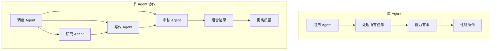
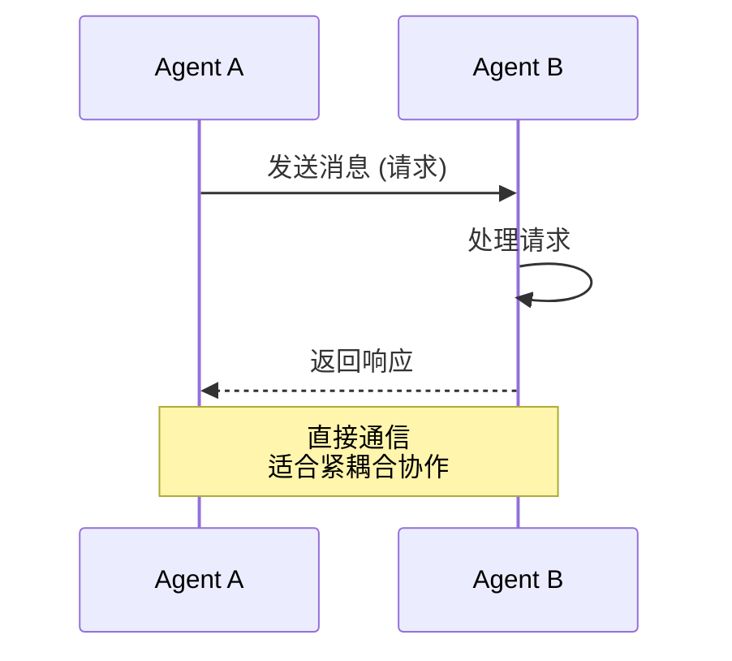
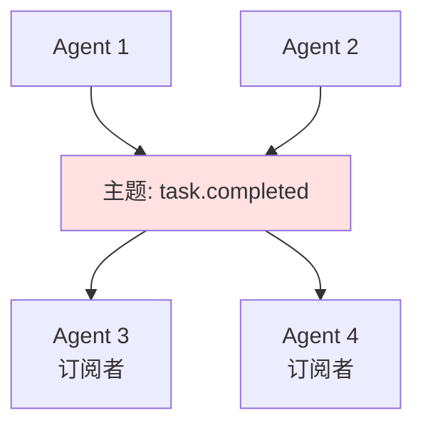
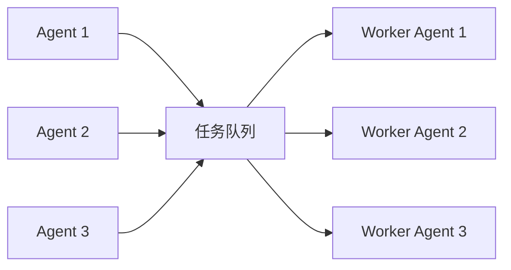
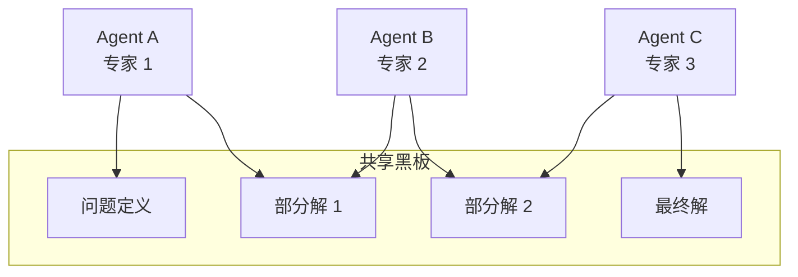
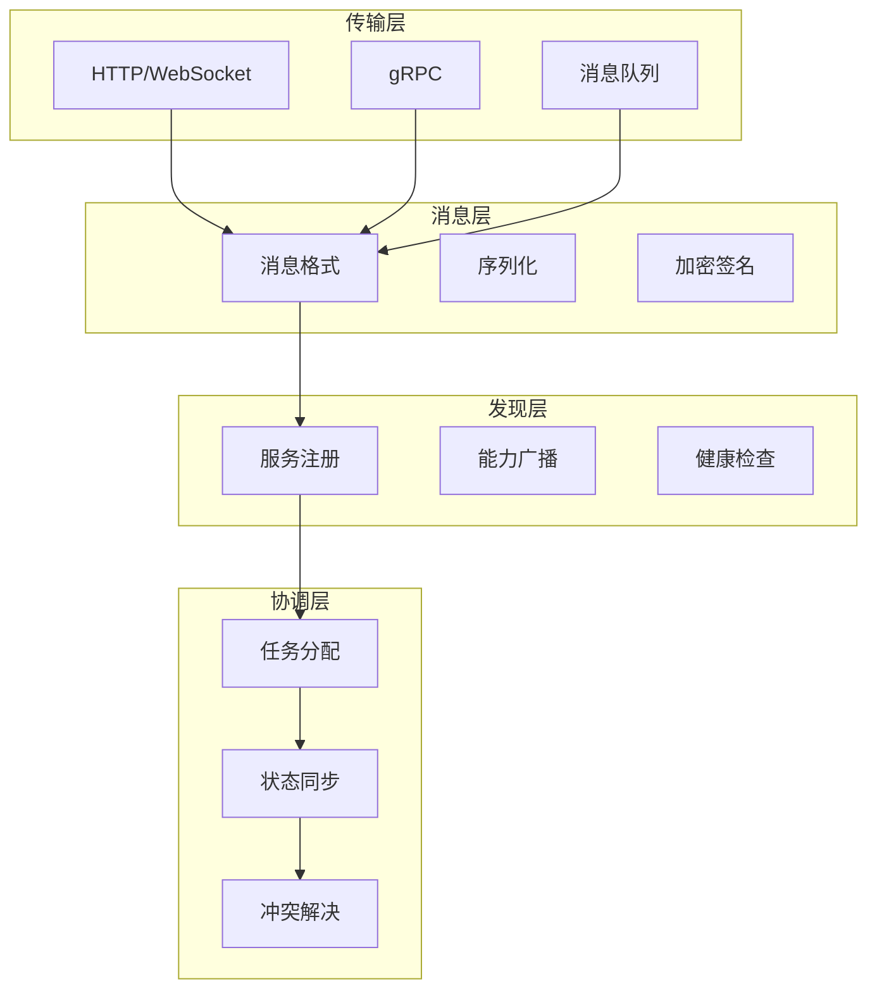

# Chapter 15: A2A (Agent-to-Agent) Agent间通信

## 概述

A2A (Agent-to-Agent) 模式定义了多个独立 Agent 之间的通信协议和协作机制。通过标准化的消息传递、能力发现和任务委托，A2A 使 Agent 能够形成有机的生态系统，共同解决复杂问题。

---

## 背景原理

### 为什么需要 Agent 间通信？

**单 Agent 的局限**：
- 无法同时处理多个独立任务
- 缺乏专业分工
- 单点故障风险
- 难以扩展能力边界

**多 Agent 协作的优势**：



---

## 通信模式

### 1. 点对点通信 (Point-to-Point)



### 2. 发布订阅 (Pub-Sub)



### 3. 消息队列 (Message Queue)



### 4. 黑板模式 (Blackboard)



---

## A2A 协议架构



### 消息格式

```python
from dataclasses import dataclass
from typing import Dict, Any, Optional
from datetime import datetime
from enum import Enum

class MessageType(Enum):
    REQUEST = "request"
    RESPONSE = "response"
    EVENT = "event"
    BROADCAST = "broadcast"

class TaskStatus(Enum):
    PENDING = "pending"
    IN_PROGRESS = "in_progress"
    COMPLETED = "completed"
    FAILED = "failed"

@dataclass
class A2AMessage:
    """A2A 标准消息格式"""
    # 头部信息
    message_id: str
    correlation_id: str  # 关联消息 ID
    timestamp: datetime
    
    # 路由信息
    sender_id: str
    receiver_id: Optional[str]  # None 表示广播
    message_type: MessageType
    
    # 内容
    action: str  # 动作类型
    payload: Dict[str, Any]
    
    # 元数据
    priority: int = 5  # 1-10
    ttl: int = 300  # 生存时间（秒）
    
    # 签名（安全）
    signature: Optional[str] = None

@dataclass
class Task:
    """任务定义"""
    task_id: str
    task_type: str
    description: str
    parameters: Dict[str, Any]
    status: TaskStatus
    created_by: str
    assigned_to: Optional[str]
    created_at: datetime
    deadline: Optional[datetime]
    dependencies: list
```

---

## 核心能力

### 1. 能力发现 (Capability Discovery)

```python
class CapabilityRegistry:
    """能力注册中心"""
    
    def __init__(self):
        self.agents: Dict[str, AgentInfo] = {}
        self.capabilities: Dict[str, List[str]] = {}  # capability -> agents
    
    def register_agent(self, agent_info: AgentInfo):
        """注册 Agent"""
        self.agents[agent_info.agent_id] = agent_info
        
        # 索引能力
        for cap in agent_info.capabilities:
            if cap not in self.capabilities:
                self.capabilities[cap] = []
            self.capabilities[cap].append(agent_info.agent_id)
    
    def find_agents(self, capability: str, criteria: dict = None) -> List[AgentInfo]:
        """查找具备特定能力的 Agent"""
        agent_ids = self.capabilities.get(capability, [])
        agents = [self.agents[aid] for aid in agent_ids]
        
        # 应用筛选条件
        if criteria:
            agents = self._filter_agents(agents, criteria)
        
        # 按负载排序
        agents.sort(key=lambda a: a.current_load)
        
        return agents
    
    def _filter_agents(self, agents: List[AgentInfo], criteria: dict) -> List[AgentInfo]:
        """筛选 Agent"""
        filtered = agents
        
        if "max_load" in criteria:
            filtered = [a for a in filtered if a.current_load < criteria["max_load"]]
        
        if "min_rating" in criteria:
            filtered = [a for a in filtered if a.rating >= criteria["min_rating"]]
        
        return filtered

@dataclass
class AgentInfo:
    """Agent 信息"""
    agent_id: str
    name: str
    capabilities: List[str]
    endpoint: str
    current_load: float  # 0-1
    rating: float  # 0-5
    metadata: Dict[str, Any]
```

### 2. 任务委托 (Task Delegation)

```python
class TaskDelegator:
    """任务委托器"""
    
    def __init__(self, registry: CapabilityRegistry):
        self.registry = registry
        self.active_tasks: Dict[str, Task] = {}
    
    async def delegate_task(self, task: Task, strategy: str = "best_fit") -> str:
        """
        委托任务给合适的 Agent
        
        Args:
            task: 任务定义
            strategy: 委托策略 (best_fit, round_robin, load_balanced)
        """
        # 查找具备所需能力的 Agent
        candidates = self.registry.find_agents(
            task.task_type,
            criteria={"max_load": 0.8}
        )
        
        if not candidates:
            raise NoAgentAvailableError(f"No agent available for {task.task_type}")
        
        # 根据策略选择 Agent
        if strategy == "best_fit":
            selected = self._select_best_fit(candidates, task)
        elif strategy == "round_robin":
            selected = self._select_round_robin(candidates)
        elif strategy == "load_balanced":
            selected = self._select_least_loaded(candidates)
        else:
            selected = candidates[0]
        
        # 分配任务
        task.assigned_to = selected.agent_id
        self.active_tasks[task.task_id] = task
        
        # 发送任务消息
        await self._send_task_to_agent(task, selected)
        
        return task.task_id
    
    def _select_best_fit(self, candidates: List[AgentInfo], task: Task) -> AgentInfo:
        """选择最适合的 Agent"""
        # 综合考虑负载、评分、历史表现
        def score(agent):
            load_score = 1 - agent.current_load
            rating_score = agent.rating / 5
            return load_score * 0.6 + rating_score * 0.4
        
        return max(candidates, key=score)
    
    async def _send_task_to_agent(self, task: Task, agent: AgentInfo):
        """发送任务到 Agent"""
        message = A2AMessage(
            message_id=generate_id(),
            correlation_id=task.task_id,
            timestamp=datetime.now(),
            sender_id="orchestrator",
            receiver_id=agent.agent_id,
            message_type=MessageType.REQUEST,
            action="execute_task",
            payload={
                "task_id": task.task_id,
                "task_type": task.task_type,
                "parameters": task.parameters,
                "deadline": task.deadline.isoformat() if task.deadline else None
            }
        )
        
        await self._send_message(message, agent.endpoint)
```

### 3. 消息路由 (Message Routing)

```python
class MessageRouter:
    """消息路由器"""
    
    def __init__(self):
        self.routes: Dict[str, Callable] = {}
        self.middlewares: List[Callable] = []
    
    def register_route(self, action: str, handler: Callable):
        """注册路由处理器"""
        self.routes[action] = handler
    
    def add_middleware(self, middleware: Callable):
        """添加中间件"""
        self.middlewares.append(middleware)
    
    async def route(self, message: A2AMessage) -> Optional[A2AMessage]:
        """路由消息到处理器"""
        # 执行中间件
        for middleware in self.middlewares:
            message = await middleware(message)
            if message is None:
                return None  # 中间件拦截
        
        # 查找处理器
        handler = self.routes.get(message.action)
        if not handler:
            return self._create_error_response(
                message, 
                f"Unknown action: {message.action}"
            )
        
        # 执行处理器
        try:
            response = await handler(message)
            return response
        except Exception as e:
            return self._create_error_response(message, str(e))
    
    def _create_error_response(self, original: A2AMessage, error: str) -> A2AMessage:
        """创建错误响应"""
        return A2AMessage(
            message_id=generate_id(),
            correlation_id=original.message_id,
            timestamp=datetime.now(),
            sender_id=original.receiver_id,
            receiver_id=original.sender_id,
            message_type=MessageType.RESPONSE,
            action="error",
            payload={"error": error}
        )
```

---

## 实现示例

### 基础 A2A Agent

```python
from src.utils.model_loader import model_loader
import asyncio
import aiohttp

class A2AAgent:
    """
    支持 A2A 通信的 Agent
    """
    
    def __init__(
        self, 
        agent_id: str,
        capabilities: List[str],
        model_id: str = None,
        endpoint: str = None
    ):
        self.agent_id = agent_id
        self.capabilities = capabilities
        self.endpoint = endpoint or f"http://localhost:{self._find_free_port()}"
        self.llm = model_loader.load_llm(model_id)
        
        self.router = MessageRouter()
        self.task_handlers: Dict[str, Callable] = {}
        
        self._setup_routes()
    
    def _setup_routes(self):
        """设置消息路由"""
        self.router.register_route("execute_task", self._handle_execute_task)
        self.router.register_route("query_capability", self._handle_query_capability)
        self.router.register_route("ping", self._handle_ping)
    
    async def start(self, registry_url: str = None):
        """启动 Agent"""
        # 注册到能力中心
        if registry_url:
            await self._register_to_registry(registry_url)
        
        # 启动 HTTP 服务接收消息
        await self._start_server()
    
    async def send_message(self, message: A2AMessage, target_endpoint: str):
        """发送消息到另一个 Agent"""
        async with aiohttp.ClientSession() as session:
            async with session.post(
                f"{target_endpoint}/a2a/message",
                json=self._message_to_dict(message)
            ) as response:
                return await response.json()
    
    async def request_help(
        self, 
        capability: str, 
        task_data: dict,
        registry: CapabilityRegistry
    ) -> dict:
        """请求其他 Agent 协助"""
        # 查找具备能力的 Agent
        candidates = registry.find_agents(capability)
        
        if not candidates:
            raise NoAgentAvailableError(f"No agent found for {capability}")
        
        # 选择最佳 Agent
        helper = candidates[0]
        
        # 构建请求消息
        request = A2AMessage(
            message_id=generate_id(),
            correlation_id=generate_id(),
            timestamp=datetime.now(),
            sender_id=self.agent_id,
            receiver_id=helper.agent_id,
            message_type=MessageType.REQUEST,
            action="execute_task",
            payload=task_data
        )
        
        # 发送并等待响应
        response = await self.send_message(request, helper.endpoint)
        return response
    
    async def _handle_execute_task(self, message: A2AMessage) -> A2AMessage:
        """处理执行任务请求"""
        task_type = message.payload.get("task_type")
        parameters = message.payload.get("parameters", {})
        
        # 查找任务处理器
        handler = self.task_handlers.get(task_type)
        
        if not handler:
            return self.router._create_error_response(
                message, 
                f"Task type not supported: {task_type}"
            )
        
        # 执行任务
        try:
            result = await handler(parameters)
            
            return A2AMessage(
                message_id=generate_id(),
                correlation_id=message.message_id,
                timestamp=datetime.now(),
                sender_id=self.agent_id,
                receiver_id=message.sender_id,
                message_type=MessageType.RESPONSE,
                action="task_completed",
                payload={"result": result, "status": "success"}
            )
        except Exception as e:
            return self.router._create_error_response(message, str(e))
    
    def register_task_handler(self, task_type: str, handler: Callable):
        """注册任务处理器"""
        self.task_handlers[task_type] = handler
    
    async def _handle_query_capability(self, message: A2AMessage) -> A2AMessage:
        """处理能力查询"""
        return A2AMessage(
            message_id=generate_id(),
            correlation_id=message.message_id,
            timestamp=datetime.now(),
            sender_id=self.agent_id,
            receiver_id=message.sender_id,
            message_type=MessageType.RESPONSE,
            action="capability_info",
            payload={
                "agent_id": self.agent_id,
                "capabilities": self.capabilities,
                "current_load": self._get_current_load()
            }
        )
    
    def _get_current_load(self) -> float:
        """获取当前负载"""
        # 基于当前任务数量计算
        return 0.0
    
    async def _start_server(self):
        """启动 HTTP 服务器"""
        from aiohttp import web
        
        app = web.Application()
        app.router.add_post('/a2a/message', self._http_handler)
        
        runner = web.AppRunner(app)
        await runner.setup()
        site = web.TCPSite(runner, 'localhost', self._get_port())
        await site.start()
    
    async def _http_handler(self, request):
        """HTTP 请求处理器"""
        data = await request.json()
        message = self._dict_to_message(data)
        
        response = await self.router.route(message)
        
        return web.json_response(self._message_to_dict(response))
```

### 多 Agent 协作示例

```python
async def collaborative_task():
    """多 Agent 协作示例"""
    
    # 创建专业 Agent
    research_agent = A2AAgent(
        agent_id="researcher_001",
        capabilities=["research", "data_analysis"]
    )
    
    writer_agent = A2AAgent(
        agent_id="writer_001",
        capabilities=["writing", "editing"]
    )
    
    reviewer_agent = A2AAgent(
        agent_id="reviewer_001",
        capabilities=["review", "fact_check"]
    )
    
    # 注册任务处理器
    research_agent.register_task_handler("research", research_task)
    writer_agent.register_task_handler("write", write_task)
    reviewer_agent.register_task_handler("review", review_task)
    
    # 启动所有 Agent
    await asyncio.gather(
        research_agent.start(),
        writer_agent.start(),
        reviewer_agent.start()
    )
    
    # 执行协作任务：撰写报告
    topic = "AI发展趋势"
    
    # 1. 研究 Agent 收集信息
    research_result = await research_agent.request_help(
        "research",
        {"topic": topic, "depth": "comprehensive"},
        registry
    )
    
    # 2. 写作 Agent 撰写报告
    write_result = await writer_agent.request_help(
        "writing",
        {
            "topic": topic,
            "research_data": research_result["result"],
            "style": "professional"
        },
        registry
    )
    
    # 3. 审核 Agent 检查质量
    review_result = await reviewer_agent.request_help(
        "review",
        {"content": write_result["result"]},
        registry
    )
    
    return review_result
```

---

## 最佳实践

### 1. 错误处理与超时

```python
class ReliableCommunication:
    """可靠通信"""
    
    async def send_with_retry(
        self, 
        message: A2AMessage, 
        target: str,
        max_retries: int = 3,
        timeout: float = 30.0
    ) -> Optional[A2AMessage]:
        """带重试的发送"""
        for attempt in range(max_retries):
            try:
                response = await asyncio.wait_for(
                    self.send(message, target),
                    timeout=timeout
                )
                return response
            except asyncio.TimeoutError:
                if attempt < max_retries - 1:
                    await asyncio.sleep(2 ** attempt)  # 指数退避
                continue
            except Exception as e:
                if attempt < max_retries - 1:
                    continue
                raise
        
        return None
```

### 2. 安全考虑

```python
class SecureA2A:
    """安全 A2A 通信"""
    
    def __init__(self, private_key: str, trusted_agents: List[str]):
        self.private_key = private_key
        self.trusted_agents = set(trusted_agents)
    
    def sign_message(self, message: A2AMessage) -> str:
        """签名消息"""
        import hashlib
        import hmac
        
        message_str = f"{message.sender_id}:{message.timestamp}:{message.action}"
        signature = hmac.new(
            self.private_key.encode(),
            message_str.encode(),
            hashlib.sha256
        ).hexdigest()
        
        return signature
    
    def verify_message(self, message: A2AMessage) -> bool:
        """验证消息"""
        # 验证发送者身份
        if message.sender_id not in self.trusted_agents:
            return False
        
        # 验证签名
        expected_sig = self.sign_message(message)
        return hmac.compare_digest(expected_sig, message.signature)
```

---

## 适用场景

| 场景 | 协作模式 | 说明 |
|------|----------|------|
| 软件开发 | 流水线 | 需求→设计→编码→测试→部署 |
| 内容创作 | 审核流程 | 创作→编辑→审核→发布 |
| 数据分析 | 并行处理 | 多 Agent 并行处理不同维度 |
| 客服系统 | 专家咨询 | 一线客服→专家→解决方案 |
| 科研协作 | 黑板模式 | 多领域专家共同解决问题 |

---

## 运行示例

```bash
python src/agents/patterns/a2a.py
```

---

## 参考资源

- [A2A Protocol Specification](https://github.com/a2a-protocol/spec)
- [Multi-Agent Systems](https://www.masfoundations.org/)
- [FIPA ACL](http://www.fipa.org/specs/fipa00061/)
- [Agent Communication Languages](https://en.wikipedia.org/wiki/Agent_Communication_Language)
- [Distributed AI](https://distai.org/)
