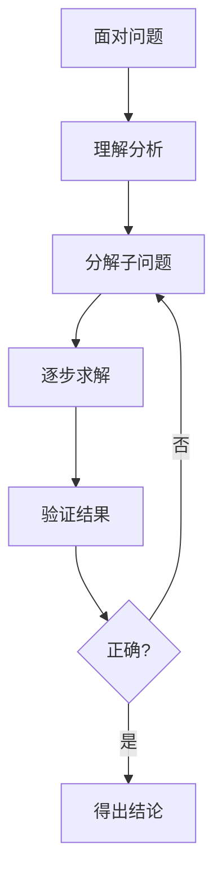
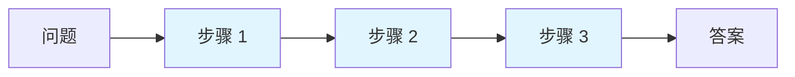
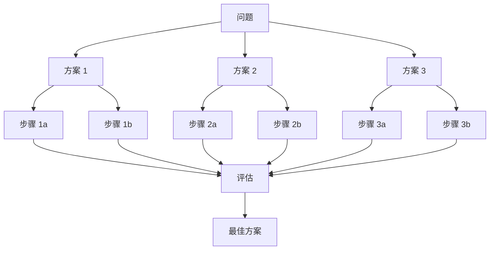
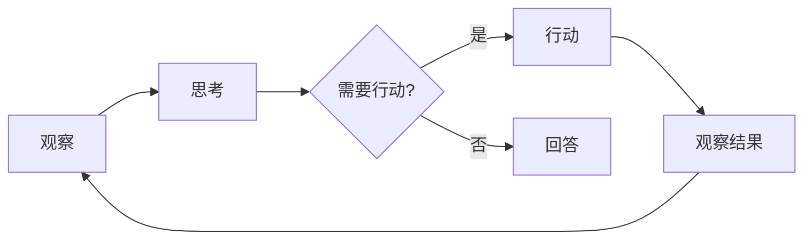
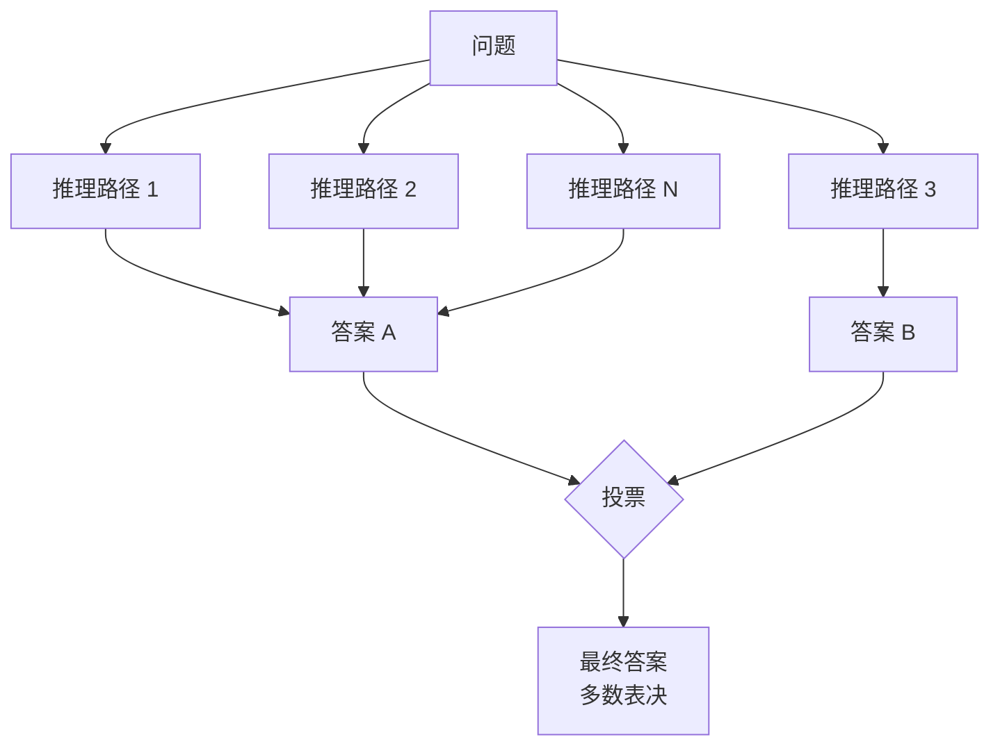
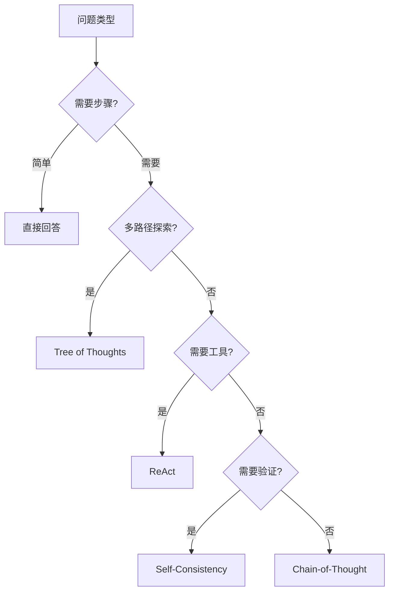

# Chapter 17: Reasoning Techniques 推理技术

## 概述

推理技术使 Agent 能够进行复杂的多步逻辑推理，解决需要深度思考的难题。通过系统化的推理方法，Agent 可以处理数学问题、逻辑谜题、因果分析和复杂决策。

---

## 背景原理

### LLM 推理的局限

**直接生成的不足**：
- 容易跳过中间步骤
- 复杂问题容易出错
- 缺乏系统性思维
- 难以验证推理过程

**人类推理过程**：



---

## 推理方法

### 1. Chain-of-Thought (思维链)



**核心思想**：
- 显式展示中间推理步骤
- "让我们一步步思考"
- 提高复杂问题准确率

```python
class ChainOfThoughtReasoner:
    """思维链推理器"""
    
    def __init__(self, llm):
        self.llm = llm
        self.cot_prompt = """
Question: {question}

Let's think through this step by step:
"""
    
    def reason(self, question: str) -> dict:
        """使用思维链推理"""
        prompt = self.cot_prompt.format(question=question)
        
        # 生成推理过程
        reasoning = self.llm.predict(prompt)
        
        # 提取最终答案
        answer = self._extract_answer(reasoning)
        
        return {
            "reasoning": reasoning,
            "answer": answer
        }
```

### 2. Tree of Thoughts (思维树)



**核心思想**：
- 维护多个推理路径
- 评估各路径前景
- 剪枝 + 扩展最优路径

```python
class TreeOfThoughts:
    """思维树推理"""
    
    def __init__(self, llm, breadth=3, depth=3):
        self.llm = llm
        self.breadth = breadth  # 每层分支数
        self.depth = depth      # 最大深度
    
    def solve(self, problem: str) -> dict:
        """解决问题"""
        # 初始化根节点
        root = ThoughtNode(content=problem, score=0.0)
        
        current_level = [root]
        
        for depth in range(self.depth):
            next_level = []
            
            for node in current_level:
                # 生成候选步骤
                candidates = self._generate_candidates(node)
                
                # 评估每个候选
                for candidate in candidates[:self.breadth]:
                    score = self._evaluate(candidate)
                    child = ThoughtNode(
                        content=candidate,
                        parent=node,
                        score=score,
                        depth=depth + 1
                    )
                    node.children.append(child)
                    next_level.append(child)
            
            current_level = next_level
        
        # 回溯最佳路径
        best_leaf = max(current_level, key=lambda x: x.score)
        path = self._backtrack(best_leaf)
        
        return {
            "reasoning_path": path,
            "final_answer": best_leaf.content
        }
    
    def _generate_candidates(self, node: ThoughtNode) -> list:
        """生成候选步骤"""
        prompt = f"""
Given the current state:
{node.content}

Generate 3 possible next steps to solve this problem.
Each step should be concrete and actionable.

Steps:"""
        
        response = self.llm.predict(prompt)
        # 解析响应
        steps = [s.strip("- ") for s in response.split("\n") if s.strip()]
        return steps
    
    def _evaluate(self, candidate: str) -> float:
        """评估候选步骤的前景"""
        prompt = f"""
Rate the potential of this approach to solve the problem (0-10):
{candidate}

Rating (0-10):"""
        
        response = self.llm.predict(prompt)
        try:
            score = float(response.strip())
            return score / 10.0
        except:
            return 0.5
```

### 3. ReAct (Reasoning + Acting)



```python
class ReActReasoner:
    """ReAct 推理"""
    
    def __init__(self, llm, tools: dict):
        self.llm = llm
        self.tools = tools
        self.max_iterations = 10
    
    def solve(self, question: str) -> dict:
        """使用 ReAct 解决问题"""
        context = []
        
        for i in range(self.max_iterations):
            # Thought
            thought = self._generate_thought(question, context)
            
            # Action
            action = self._decide_action(thought)
            
            if action["type"] == "answer":
                return {
                    "answer": action["content"],
                    "reasoning": context
                }
            
            # Observation
            observation = self._execute_action(action)
            
            context.append({
                "thought": thought,
                "action": action,
                "observation": observation
            })
        
        return {"answer": "Max iterations reached", "reasoning": context}
    
    def _generate_thought(self, question: str, context: list) -> str:
        """生成思考"""
        prompt = f"""
Question: {question}

Previous context:
{self._format_context(context)}

What should I think about next?"""
        
        return self.llm.predict(prompt)
    
    def _decide_action(self, thought: str) -> dict:
        """决定下一步行动"""
        prompt = f"""
Given the thought: {thought}

Decide the next action:
1. Use a tool (specify which one and parameters)
2. Provide final answer

Action:"""
        
        response = self.llm.predict(prompt)
        # 解析响应为结构化动作
        return self._parse_action(response)
    
    def _execute_action(self, action: dict) -> str:
        """执行动作"""
        if action["type"] == "tool":
            tool = self.tools.get(action["tool_name"])
            if tool:
                return tool(**action["parameters"])
            return f"Tool {action['tool_name']} not found"
        return "Unknown action"
```

### 4. Self-Consistency (自一致性)



```python
class SelfConsistency:
    """自一致性推理"""
    
    def __init__(self, llm, num_paths: int = 5):
        self.llm = llm
        self.num_paths = num_paths
    
    def solve(self, question: str) -> dict:
        """通过多条路径推理并投票"""
        paths = []
        
        # 生成多条推理路径
        for _ in range(self.num_paths):
            # 使用较高的 temperature 增加多样性
            response = self.llm.predict(
                question,
                temperature=0.7
            )
            paths.append(response)
        
        # 提取答案
        answers = [self._extract_answer(p) for p in paths]
        
        # 投票选择最常见答案
        from collections import Counter
        answer_counts = Counter(answers)
        best_answer = answer_counts.most_common(1)[0][0]
        confidence = answer_counts[best_answer] / len(answers)
        
        return {
            "answer": best_answer,
            "confidence": confidence,
            "all_paths": paths,
            "vote_distribution": dict(answer_counts)
        }
```

---

## 推理模式选择



---

## 数学推理示例

```python
class MathReasoner:
    """数学推理器"""
    
    def __init__(self, llm):
        self.llm = llm
        self.reasoner = ChainOfThoughtReasoner(llm)
    
    def solve_math(self, problem: str) -> dict:
        """解决数学问题"""
        # 增强的 CoT 提示
        math_prompt = f"""
Solve this math problem step by step. Show all your work:

Problem: {problem}

Step-by-step solution:
1. Identify what we need to find
2. List the given information
3. Formulate the approach
4. Execute calculations
5. Verify the answer

Solution:"""
        
        response = self.llm.predict(math_prompt)
        
        # 提取数值答案
        answer = self._extract_number(response)
        
        return {
            "reasoning": response,
            "answer": answer
        }
    
    def verify_solution(self, problem: str, solution: str, answer: float) -> bool:
        """验证解决方案"""
        verify_prompt = f"""
Verify if this solution is correct:

Problem: {problem}
Proposed Solution: {solution}
Answer: {answer}

Check:
1. Are the calculations correct?
2. Is the logic sound?
3. Does the answer make sense?

Verification result (correct/incorrect):"""
        
        result = self.llm.predict(verify_prompt)
        return "correct" in result.lower()
```

---

## 逻辑推理示例

```python
class LogicReasoner:
    """逻辑推理器"""
    
    def __init__(self, llm):
        self.llm = llm
    
    def solve_logic_puzzle(self, puzzle: str) -> dict:
        """解决逻辑谜题"""
        # 使用表格法或排除法
        prompt = f"""
Solve this logic puzzle using systematic reasoning:

{puzzle}

Approach:
1. Identify all entities and attributes
2. Create a constraint table
3. Apply each clue systematically
4. Use elimination to narrow down possibilities
5. Derive the final answer

Solution:"""
        
        response = self.llm.predict(prompt)
        
        return {
            "reasoning": response,
            "solution": self._extract_solution(response)
        }
    
    def check_consistency(self, statements: list) -> dict:
        """检查陈述一致性"""
        prompt = f"""
Check if these statements are logically consistent:

{chr(10).join(f"{i+1}. {s}" for i, s in enumerate(statements))}

Analyze:
- Are there any contradictions?
- What can we deduce?
- Is the set consistent?

Analysis:"""
        
        return self.llm.predict(prompt)
```

---

## 因果推理

```python
class CausalReasoner:
    """因果推理器"""
    
    def __init__(self, llm):
        self.llm = llm
    
    def analyze_causality(self, event_a: str, event_b: str) -> dict:
        """分析两个事件的因果关系"""
        prompt = f"""
Analyze the causal relationship between these events:

Event A: {event_a}
Event B: {event_b}

Consider:
1. Does A cause B? (strong/weak/no)
2. Does B cause A? (strong/weak/no)
3. Is there a common cause?
4. Is it coincidental correlation?
5. What evidence supports each view?

Causal analysis:"""
        
        return self.llm.predict(prompt)
    
    def counterfactual_reasoning(self, scenario: str, change: str) -> str:
        """反事实推理"""
        prompt = f"""
Counterfactual analysis:

Original scenario: {scenario}
Hypothetical change: {change}

What would likely happen if this change occurred?
Consider direct effects, indirect effects, and potential unintended consequences.

Analysis:"""
        
        return self.llm.predict(prompt)
```

---

## 完整示例

```python
from src.utils.model_loader import model_loader

class ReasoningAgent:
    """
    具备高级推理能力的 Agent
    """
    
    def __init__(self, model_id: str = None):
        self.llm = model_loader.load_llm(model_id)
        self.reasoners = {
            "cot": ChainOfThoughtReasoner(self.llm),
            "tot": TreeOfThoughts(self.llm),
            "react": ReActReasoner(self.llm, tools={}),
            "sc": SelfConsistency(self.llm)
        }
    
    def solve(self, problem: str, method: str = "auto") -> dict:
        """
        使用指定方法解决问题
        
        Args:
            problem: 问题描述
            method: 推理方法 (cot, tot, react, sc, auto)
        """
        if method == "auto":
            method = self._select_method(problem)
        
        reasoner = self.reasoners.get(method)
        if not reasoner:
            raise ValueError(f"Unknown reasoning method: {method}")
        
        result = reasoner.solve(problem)
        result["method_used"] = method
        
        return result
    
    def _select_method(self, problem: str) -> str:
        """自动选择推理方法"""
        # 简单启发式选择
        if "步骤" in problem or "how to" in problem.lower():
            return "cot"
        elif "multiple" in problem.lower() or "different ways" in problem.lower():
            return "tot"
        elif "search" in problem.lower() or "find" in problem.lower():
            return "react"
        elif "verify" in problem.lower() or "check" in problem.lower():
            return "sc"
        else:
            return "cot"
    
    def compare_methods(self, problem: str) -> dict:
        """比较不同推理方法的结果"""
        results = {}
        
        for method_name, reasoner in self.reasoners.items():
            try:
                result = reasoner.solve(problem)
                results[method_name] = {
                    "success": True,
                    "answer": result.get("answer"),
                    "confidence": result.get("confidence", "N/A")
                }
            except Exception as e:
                results[method_name] = {
                    "success": False,
                    "error": str(e)
                }
        
        return results

# 使用示例
if __name__ == "__main__":
    agent = ReasoningAgent()
    
    # 数学问题
    result = agent.solve(
        "一个水池有两个进水管，A管单独注满需要3小时，B管单独注满需要5小时。两管同时打开，需要多久注满？",
        method="cot"
    )
    print(result)
```

---

## 运行示例

```bash
python src/agents/patterns/reasoning.py
```

---

## 参考资源

- [Chain-of-Thought Paper](https://arxiv.org/abs/2201.11903)
- [Tree of Thoughts](https://arxiv.org/abs/2305.10601)
- [ReAct Paper](https://arxiv.org/abs/2210.03629)
- [Self-Consistency](https://arxiv.org/abs/2203.11171)
- [Logical Reasoning in LLMs](https://arxiv.org/abs/2212.09597)
