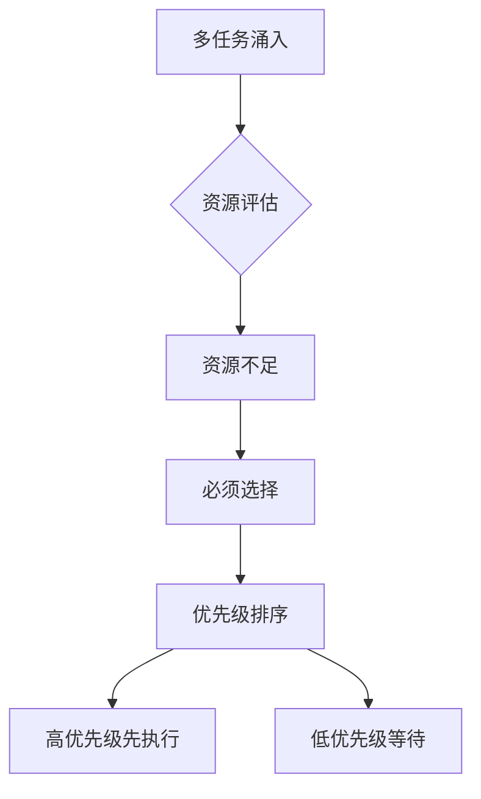
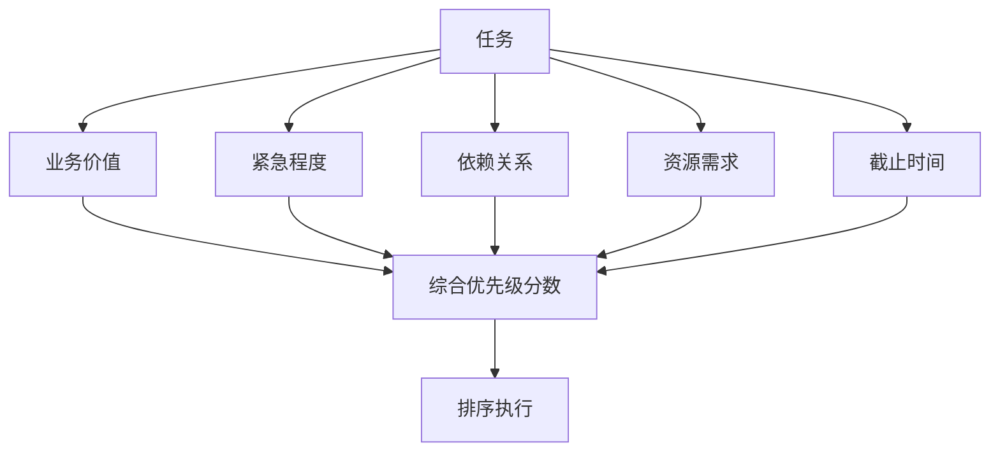

# Chapter 20: Prioritization and Scheduling 优先级管理与调度

## 概述

优先级管理与调度模式使 Agent 能够有效地分配有限资源，在多个任务、请求或目标之间做出最优选择，确保高价值工作优先完成，系统整体效率最大化。

---

## 背景原理

### 为什么需要优先级管理？

**资源约束现实**：
- 计算资源有限
- 时间窗口有限
- 并发能力有限
- 无法同时处理所有请求



---

## 优先级模型

### 1. 多维度优先级评估



```python
from dataclasses import dataclass
from datetime import datetime, timedelta
from typing import List, Optional
from enum import Enum

class PriorityLevel(Enum):
    CRITICAL = 1
    HIGH = 2
    MEDIUM = 3
    LOW = 4
    BACKGROUND = 5

@dataclass
class Task:
    """任务定义"""
    id: str
    name: str
    description: str
    
    # 优先级属性
    business_value: float  # 0-10
    urgency: float         # 0-10
    deadline: Optional[datetime]
    
    # 资源需求
    estimated_duration: int  # 分钟
    required_resources: List[str]
    
    # 依赖关系
    dependencies: List[str]
    
    # 状态
    priority_score: float = 0.0
    status: str = "pending"

class PriorityCalculator:
    """优先级计算器"""
    
    def __init__(self, weights: dict = None):
        default_weights = {
            "business_value": 0.3,
            "urgency": 0.3,
            "time_pressure": 0.2,
            "dependency_weight": 0.2
        }
        self.weights = weights or default_weights
    
    def calculate_priority(self, task: Task) -> float:
        """计算任务优先级分数"""
        # 业务价值 (0-10)
        value_score = task.business_value
        
        # 紧急程度 (0-10)
        urgency_score = task.urgency
        
        # 时间压力 (基于截止时间)
        time_score = self._calculate_time_pressure(task.deadline)
        
        # 依赖权重 (被依赖的任务优先级更高)
        dep_score = task.dependency_weight if hasattr(task, 'dependency_weight') else 5
        
        # 加权计算
        priority = (
            value_score * self.weights["business_value"] +
            urgency_score * self.weights["urgency"] +
            time_score * self.weights["time_pressure"] +
            dep_score * self.weights["dependency_weight"]
        )
        
        return priority
    
    def _calculate_time_pressure(self, deadline: Optional[datetime]) -> float:
        """计算时间压力"""
        if not deadline:
            return 5.0  # 无截止时间为中等压力
        
        time_remaining = (deadline - datetime.now()).total_seconds() / 3600  # 小时
        
        if time_remaining < 0:
            return 10.0  # 已逾期
        elif time_remaining < 2:
            return 9.0   # 2小时内
        elif time_remaining < 8:
            return 8.0   # 今天内
        elif time_remaining < 24:
            return 7.0   # 明天前
        elif time_remaining < 72:
            return 6.0   # 3天内
        else:
            return 3.0   # 宽松
```

### 2. 动态优先级调整


```python
class DynamicPriorityManager:
    """动态优先级管理器"""
    
    def __init__(self):
        self.tasks = {}
        self.waiting_times = {}
    
    def update_priorities(self):
        """定期更新所有任务优先级"""
        current_time = datetime.now()
        
        for task_id, task in self.tasks.items():
            if task.status != "pending":
                continue
            
            # 基础优先级
            base_priority = task.priority_score
            
            # 等待时间加成（防止饥饿）
            waiting_time = self.waiting_times.get(task_id, 0)
            starvation_boost = min(waiting_time * 0.1, 2.0)  # 最多加2分
            
            # 截止时间临近提升
            deadline_boost = 0
            if task.deadline:
                hours_left = (task.deadline - current_time).total_seconds() / 3600
                if hours_left < 0:
                    deadline_boost = 5  # 已逾期
                elif hours_left < 4:
                    deadline_boost = 3
                elif hours_left < 24:
                    deadline_boost = 1.5
            
            # 计算最终优先级
            final_priority = base_priority + starvation_boost + deadline_boost
            task.priority_score = final_priority
            
            # 增加等待时间
            self.waiting_times[task_id] = waiting_time + 1
    
    def get_next_task(self) -> Optional[Task]:
        """获取下一个要执行的任务"""
        pending_tasks = [
            t for t in self.tasks.values() 
            if t.status == "pending"
        ]
        
        if not pending_tasks:
            return None
        
        # 检查依赖是否满足
        ready_tasks = [
            t for t in pending_tasks
            if all(dep in self.completed_tasks for dep in t.dependencies)
        ]
        
        if not ready_tasks:
            return None
        
        # 选择优先级最高的
        return max(ready_tasks, key=lambda t: t.priority_score)
```

---

## 调度策略

### 1. 调度算法

```python
from abc import ABC, abstractmethod
from typing import List

class SchedulingStrategy(ABC):
    """调度策略基类"""
    
    @abstractmethod
    def select_next_task(self, tasks: List[Task]) -> Task:
        pass

class FCFS(SchedulingStrategy):
    """先来先服务"""
    
    def select_next_task(self, tasks: List[Task]) -> Task:
        return min(tasks, key=lambda t: t.created_at)

class PriorityScheduling(SchedulingStrategy):
    """优先级调度"""
    
    def select_next_task(self, tasks: List[Task]) -> Task:
        return max(tasks, key=lambda t: t.priority_score)

class ShortestJobFirst(SchedulingStrategy):
    """短作业优先"""
    
    def select_next_task(self, tasks: List[Task]) -> Task:
        return min(tasks, key=lambda t: t.estimated_duration)

class EarliestDeadlineFirst(SchedulingStrategy):
    """最早截止时间优先"""
    
    def select_next_task(self, tasks: List[Task]) -> Task:
        tasks_with_deadline = [t for t in tasks if t.deadline]
        if tasks_with_deadline:
            return min(tasks_with_deadline, key=lambda t: t.deadline)
        return max(tasks, key=lambda t: t.priority_score)

class RoundRobin(SchedulingStrategy):
    """时间片轮转"""
    
    def __init__(self, time_slice: int = 60):
        self.time_slice = time_slice
        self.last_index = 0
    
    def select_next_task(self, tasks: List[Task]) -> Task:
        if not tasks:
            return None
        
        self.last_index = (self.last_index + 1) % len(tasks)
        return tasks[self.last_index]
```

### 2. 资源感知调度

```python
class ResourceAwareScheduler:
    """资源感知调度器"""
    
    def __init__(self, available_resources: dict):
        self.available_resources = available_resources
        self.used_resources = {k: 0 for k in available_resources.keys()}
    
    def can_schedule(self, task: Task) -> bool:
        """检查是否有足够资源调度任务"""
        for resource, amount in task.required_resources.items():
            available = self.available_resources.get(resource, 0)
            used = self.used_resources.get(resource, 0)
            if used + amount > available:
                return False
        return True
    
    def schedule_task(self, task: Task):
        """分配资源给任务"""
        for resource, amount in task.required_resources.items():
            self.used_resources[resource] += amount
        task.status = "running"
    
    def release_resources(self, task: Task):
        """释放任务占用的资源"""
        for resource, amount in task.required_resources.items():
            self.used_resources[resource] -= amount
        task.status = "completed"
    
    def schedule(self, pending_tasks: List[Task]) -> List[Task]:
        """调度可执行的任务"""
        scheduled = []
        
        # 按优先级排序
        sorted_tasks = sorted(
            pending_tasks, 
            key=lambda t: t.priority_score, 
            reverse=True
        )
        
        for task in sorted_tasks:
            if self.can_schedule(task):
                self.schedule_task(task)
                scheduled.append(task)
        
        return scheduled
```

---

## 队列管理

```python
class MultiLevelQueue:
    """多级队列"""
    
    def __init__(self):
        self.queues = {
            PriorityLevel.CRITICAL: [],
            PriorityLevel.HIGH: [],
            PriorityLevel.MEDIUM: [],
            PriorityLevel.LOW: [],
            PriorityLevel.BACKGROUND: []
        }
        self.time_slices = {
            PriorityLevel.CRITICAL: 300,   # 5分钟
            PriorityLevel.HIGH: 180,       # 3分钟
            PriorityLevel.MEDIUM: 120,     # 2分钟
            PriorityLevel.LOW: 60,         # 1分钟
            PriorityLevel.BACKGROUND: 30   # 30秒
        }
    
    def enqueue(self, task: Task):
        """加入队列"""
        priority = self._score_to_level(task.priority_score)
        self.queues[priority].append(task)
    
    def dequeue(self) -> Optional[Task]:
        """从队列取出任务"""
        # 按优先级顺序检查
        for level in PriorityLevel:
            if self.queues[level]:
                return self.queues[level].pop(0)
        return None
    
    def _score_to_level(self, score: float) -> PriorityLevel:
        """分数转换为优先级等级"""
        if score >= 8:
            return PriorityLevel.CRITICAL
        elif score >= 6:
            return PriorityLevel.HIGH
        elif score >= 4:
            return PriorityLevel.MEDIUM
        elif score >= 2:
            return PriorityLevel.LOW
        else:
            return PriorityLevel.BACKGROUND
```

---

## 完整示例

```python
from src.utils.model_loader import model_loader
import asyncio

class PrioritizedAgent:
    """
    带优先级管理的 Agent
    """
    
    def __init__(self, model_id: str = None):
        self.llm = model_loader.load_llm(model_id)
        self.priority_calc = PriorityCalculator()
        self.scheduler = ResourceAwareScheduler({
            "llm_calls": 10,
            "memory": 1000
        })
        self.task_queue = MultiLevelQueue()
        self.running_tasks = {}
    
    async def submit_task(
        self, 
        task_data: dict,
        priority_hint: str = "auto"
    ) -> str:
        """
        提交任务
        
        Args:
            task_data: 任务数据
            priority_hint: 优先级提示 (auto/critical/high/medium/low)
        """
        task = Task(
            id=generate_id(),
            name=task_data.get("name"),
            description=task_data.get("description"),
            business_value=task_data.get("business_value", 5),
            urgency=task_data.get("urgency", 5),
            deadline=task_data.get("deadline"),
            estimated_duration=task_data.get("duration", 60),
            required_resources=task_data.get("resources", {"llm_calls": 1}),
            dependencies=task_data.get("dependencies", [])
        )
        
        # 计算优先级
        if priority_hint != "auto":
            # 使用提示的优先级
            level_map = {
                "critical": 9, "high": 7, "medium": 5, "low": 3
            }
            task.priority_score = level_map.get(priority_hint, 5)
        else:
            task.priority_score = self.priority_calc.calculate_priority(task)
        
        # 加入队列
        self.task_queue.enqueue(task)
        
        return task.id
    
    async def process_tasks(self):
        """处理任务队列"""
        while True:
            # 尝试调度任务
            pending = [
                t for q in self.task_queue.queues.values() for t in q
            ]
            
            scheduled = self.scheduler.schedule(pending)
            
            if scheduled:
                for task in scheduled:
                    # 从队列移除
                    level = self.task_queue._score_to_level(task.priority_score)
                    if task in self.task_queue.queues[level]:
                        self.task_queue.queues[level].remove(task)
                    
                    # 异步执行任务
                    asyncio.create_task(self._execute_task(task))
            
            await asyncio.sleep(1)
    
    async def _execute_task(self, task: Task):
        """执行单个任务"""
        print(f"Executing task {task.name} (priority: {task.priority_score:.2f})")
        
        try:
            # 模拟 LLM 调用
            result = await self.llm.ainvoke(task.description)
            
            # 释放资源
            self.scheduler.release_resources(task)
            
            return {
                "task_id": task.id,
                "status": "completed",
                "result": result
            }
            
        except Exception as e:
            self.scheduler.release_resources(task)
            task.status = "failed"
            raise
    
    def get_queue_status(self) -> dict:
        """获取队列状态"""
        return {
            level.name: len(queue)
            for level, queue in self.task_queue.queues.items()
        }

# 使用示例
async def main():
    agent = PrioritizedAgent()
    
    # 提交不同优先级的任务
    await agent.submit_task({
        "name": "Background analysis",
        "description": "Analyze historical data",
        "business_value": 2
    }, priority_hint="low")
    
    await agent.submit_task({
        "name": "Urgent customer request",
        "description": "Answer customer question",
        "business_value": 9,
        "urgency": 10
    }, priority_hint="critical")
    
    await agent.submit_task({
        "name": "Regular report",
        "description": "Generate daily report",
        "business_value": 5
    }, priority_hint="medium")
    
    # 启动处理
    await agent.process_tasks()

if __name__ == "__main__":
    asyncio.run(main())
```

---

## 运行示例

```bash
python src/agents/patterns/prioritization.py
```

---

## 参考资源

- [Operating System Scheduling](https://www.geeksforgeeks.org/cpu-scheduling-in-operating-systems/)
-[Task Scheduling Algorithms](https://www.cloudflare.com/learning/performance/glossary/what-is-task-scheduling/)
- [Priority Queue](https://en.wikipedia.org/wiki/Priority_queue)
- [Resource Allocation](https://www.ibm.com/docs/en/zosbasics/com.ibm.zos.zmainframe/zmainframe_rsrcealloc.htm)
