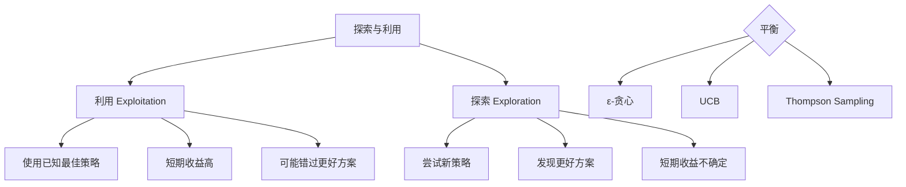

# Chapter 21: Exploration and Discovery 探索与发现

## 概述

探索与发现模式使 Agent 能够主动探索未知领域、发现新信息、学习新知识，并将其整合到现有知识体系中。这是构建能够自主学习和适应的智能系统的核心能力。

---

## 背景原理

### 探索 vs 利用的权衡



### 为什么需要探索？

- **发现新知识**: 扩展能力边界
- **适应变化**: 环境动态变化
- **创新突破**: 超越现有方案
- **验证假设**: 检验认知正确性

---

## 探索策略

### 1. ε-贪心策略 (Epsilon-Greedy)

```python
import random
from typing import List, Dict

class EpsilonGreedyExplorer:
    """ε-贪心探索器"""
    
    def __init__(self, epsilon: float = 0.1, decay: float = 0.995):
        self.epsilon = epsilon
        self.decay = decay
        self.experiences: Dict[str, Dict] = {}
    
    def select_action(self, actions: List[str]) -> str:
        """选择行动"""
        if random.random() < self.epsilon:
            # 探索：随机选择
            return random.choice(actions)
        else:
            # 利用：选择最佳已知
            return self._get_best_action(actions)
    
    def _get_best_action(self, actions: List[str]) -> str:
        """获取当前最佳行动"""
        best_action = None
        best_score = float('-inf')
        
        for action in actions:
            exp = self.experiences.get(action, {"total": 0, "success": 0})
            if exp["total"] == 0:
                score = 0.5  # 默认值
            else:
                score = exp["success"] / exp["total"]
            
            if score > best_score:
                best_score = score
                best_action = action
        
        return best_action or random.choice(actions)
    
    def update(self, action: str, success: bool):
        """更新经验"""
        if action not in self.experiences:
            self.experiences[action] = {"total": 0, "success": 0}
        
        self.experiences[action]["total"] += 1
        if success:
            self.experiences[action]["success"] += 1
        
        # 衰减探索率
        self.epsilon *= self.decay
```

### 2. 置信上界 (UCB)

```python
import math

class UCBExplorer:
    """UCB 探索器"""
    
    def __init__(self, c: float = 2.0):
        self.c = c  # 探索参数
        self.counts: Dict[str, int] = {}
        self.values: Dict[str, float] = {}
        self.total_count = 0
    
    def select_action(self, actions: List[str]) -> str:
        """使用 UCB 选择行动"""
        self.total_count += 1
        
        best_action = None
        best_ucb = float('-inf')
        
        for action in actions:
            if action not in self.counts:
                # 未尝试过的优先
                return action
            
            # 计算 UCB
            avg_reward = self.values[action]
            exploration = math.sqrt(
                (self.c * math.log(self.total_count)) / self.counts[action]
            )
            ucb = avg_reward + exploration
            
            if ucb > best_ucb:
                best_ucb = ucb
                best_action = action
        
        return best_action
    
    def update(self, action: str, reward: float):
        """更新估计值"""
        self.counts[action] = self.counts.get(action, 0) + 1
        
        # 增量更新平均值
        n = self.counts[action]
        old_value = self.values.get(action, 0)
        self.values[action] = ((n - 1) * old_value + reward) / n
```

### 3. 基于好奇心的探索

```python
class CuriosityDrivenExplorer:
    """好奇心驱动的探索器"""
    
    def __init__(self, model):
        self.model = model
        self.known_states = set()
        self.state_predictions = {}
    
    def compute_curiosity(self, state) -> float:
        """计算状态的好奇心（预测误差）"""
        state_key = self._hash_state(state)
        
        if state_key not in self.known_states:
            # 全新状态，高好奇心
            return 1.0
        
        # 预测下一个状态
        predicted = self.model.predict(state)
        actual = self._get_actual_next_state(state)
        
        # 好奇心 = 预测误差
        error = self._compute_prediction_error(predicted, actual)
        return error
    
    def select_action(self, state, available_actions: List[str]) -> str:
        """选择能最大化好奇心的行动"""
        best_action = None
        max_curiosity = float('-inf')
        
        for action in available_actions:
            next_state = self._simulate_action(state, action)
            curiosity = self.compute_curiosity(next_state)
            
            if curiosity > max_curiosity:
                max_curiosity = curiosity
                best_action = action
        
        return best_action
```

---

## 知识发现

### 1. 主题发现

```python
from sklearn.feature_extraction.text import TfidfVectorizer
from sklearn.cluster import DBSCAN

class TopicDiscoverer:
    """主题发现器"""
    
    def __init__(self):
        self.vectorizer = TfidfVectorizer(max_features=1000)
        self.clusterer = DBSCAN(eps=0.5, min_samples=5)
        self.topics = []
    
    def discover_topics(self, documents: List[str]) -> List[Dict]:
        """从文档中发现主题"""
        # 向量化
        vectors = self.vectorizer.fit_transform(documents)
        
        # 聚类
        clusters = self.clusterer.fit_predict(vectors)
        
        # 提取每个主题的关键词
        topics = []
        for cluster_id in set(clusters):
            if cluster_id == -1:  # 噪声
                continue
            
            cluster_docs = [documents[i] for i, c in enumerate(clusters) if c == cluster_id]
            keywords = self._extract_keywords(cluster_docs)
            
            topics.append({
                "id": cluster_id,
                "keywords": keywords,
                "document_count": len(cluster_docs),
                "sample_documents": cluster_docs[:3]
            })
        
        return topics
    
    def _extract_keywords(self, documents: List[str], top_n: int = 5) -> List[str]:
        """提取关键词"""
        tfidf = self.vectorizer.transform(documents)
        
        # 计算平均 TF-IDF
        mean_scores = tfidf.mean(axis=0).A1
        
        # 获取最高分的特征
        top_indices = mean_scores.argsort()[-top_n:][::-1]
        feature_names = self.vectorizer.get_feature_names_out()
        
        return [feature_names[i] for i in top_indices]
```

### 2. 模式识别

```python
class PatternDiscoverer:
    """模式发现器"""
    
    def __init__(self, llm):
        self.llm = llm
        self.patterns = []
    
    def discover_patterns(self, data_points: List[Dict]) -> List[Dict]:
        """从数据中发现模式"""
        # 将数据转换为文本描述
        descriptions = [self._describe_point(p) for p in data_points]
        
        # 使用 LLM 发现模式
        prompt = f"""
        Analyze the following data points and identify patterns or trends:
        
        Data points:
        {chr(10).join(f"{i+1}. {desc}" for i, desc in enumerate(descriptions[:20]))}
        
        Identify:
        1. Common patterns
        2. Anomalies or outliers
        3. Correlations
        4. Potential causal relationships
        
        Patterns discovered:"""
        
        response = self.llm.predict(prompt)
        
        # 解析响应
        patterns = self._parse_patterns(response)
        
        return patterns
    
    def validate_pattern(self, pattern: Dict, test_data: List[Dict]) -> float:
        """验证模式在新数据上的准确性"""
        matches = 0
        
        for data in test_data:
            if self._pattern_matches(pattern, data):
                matches += 1
        
        return matches / len(test_data) if test_data else 0
```

---

## Web 探索

```python
import aiohttp
from bs4 import BeautifulSoup
from urllib.parse import urljoin, urlparse

class WebExplorer:
    """Web 探索器"""
    
    def __init__(self, max_depth: int = 2, max_pages: int = 10):
        self.max_depth = max_depth
        self.max_pages = max_pages
        self.visited = set()
        self.discovered = []
    
    async def explore(self, start_url: str, topic: str) -> List[Dict]:
        """从起始 URL 探索相关页面"""
        queue = [(start_url, 0)]
        
        async with aiohttp.ClientSession() as session:
            while queue and len(self.visited) < self.max_pages:
                url, depth = queue.pop(0)
                
                if url in self.visited or depth > self.max_depth:
                    continue
                
                self.visited.add(url)
                
                try:
                    content = await self._fetch(session, url)
                    relevance = self._assess_relevance(content, topic)
                    
                    if relevance > 0.5:
                        self.discovered.append({
                            "url": url,
                            "relevance": relevance,
                            "summary": self._summarize(content)
                        })
                        
                        # 发现新链接
                        if depth < self.max_depth:
                            links = self._extract_links(content, url)
                            for link in links:
                                if link not in self.visited:
                                    queue.append((link, depth + 1))
                
                except Exception as e:
                    print(f"Error exploring {url}: {e}")
        
        return sorted(self.discovered, key=lambda x: x["relevance"], reverse=True)
    
    async def _fetch(self, session: aiohttp.ClientSession, url: str) -> str:
        """获取页面内容"""
        async with session.get(url, timeout=10) as response:
            return await response.text()
    
    def _assess_relevance(self, content: str, topic: str) -> float:
        """评估内容与主题的相关性"""
        text = BeautifulSoup(content, 'html.parser').get_text().lower()
        topic_words = set(topic.lower().split())
        
        matches = sum(1 for word in topic_words if word in text)
        return matches / len(topic_words) if topic_words else 0
    
    def _extract_links(self, content: str, base_url: str) -> List[str]:
        """提取页面中的链接"""
        soup = BeautifulSoup(content, 'html.parser')
        links = []
        
        for a in soup.find_all('a', href=True):
            href = a['href']
            full_url = urljoin(base_url, href)
            
            # 只保留同域链接
            if urlparse(full_url).netloc == urlparse(base_url).netloc:
                links.append(full_url)
        
        return links[:5]  # 限制每页提取的链接数
```

---

## 完整探索 Agent

```python
from src.utils.model_loader import model_loader

class ExplorationAgent:
    """
    具备探索能力的 Agent
    """
    
    def __init__(self, model_id: str = None):
        self.llm = model_loader.load_llm(model_id)
        self.explorer = EpsilonGreedyExplorer(epsilon=0.2)
        self.web_explorer = WebExplorer()
        self.topic_discoverer = TopicDiscoverer()
        self.knowledge_base = {}
    
    async def explore_topic(self, topic: str, depth: int = 3) -> Dict:
        """
        主动探索某个主题
        
        Args:
            topic: 探索主题
            depth: 探索深度
        """
        findings = {
            "topic": topic,
            "subtopics": [],
            "sources": [],
            "insights": []
        }
        
        # 1. 分解主题为子主题
        subtopics = await self._decompose_topic(topic)
        
        # 2. 探索每个子主题
        for subtopic in subtopics[:depth]:
            # 选择探索策略
            action = self.explorer.select_action([
                "web_search", 
                "knowledge_query", 
                "llm_reasoning"
            ])
            
            if action == "web_search":
                result = await self._web_explore(subtopic)
            elif action == "knowledge_query":
                result = self._query_knowledge(subtopic)
            else:
                result = await self._llm_explore(subtopic)
            
            # 更新探索经验
            success = len(result.get("content", "")) > 100
            self.explorer.update(action, success)
            
            findings["subtopics"].append({
                "name": subtopic,
                "method": action,
                "result": result
            })
        
        # 3. 发现模式和关联
        insights = await self._discover_insights(findings["subtopics"])
        findings["insights"] = insights
        
        # 4. 更新知识库
        self._update_knowledge_base(findings)
        
        return findings
    
    async def _decompose_topic(self, topic: str) -> List[str]:
        """分解主题为子主题"""
        prompt = f"""
        Break down the topic '{topic}' into 5-7 subtopics for exploration.
        Each subtopic should be specific and researchable.
        
        Subtopics:"""
        
        response = self.llm.predict(prompt)
        return [line.strip("- ") for line in response.split("\n") if line.strip()]
    
    async def _web_explore(self, subtopic: str) -> Dict:
        """通过网络探索"""
        # 搜索相关页面
        search_url = f"https://en.wikipedia.org/wiki/{subtopic.replace(' ', '_')}"
        
        try:
            results = await self.web_explorer.explore(search_url, subtopic)
            
            return {
                "content": "\n".join([r["summary"] for r in results[:3]]),
                "sources": [r["url"] for r in results],
                "method": "web"
            }
        except:
            return {"content": "", "sources": [], "method": "web"}
    
    def _query_knowledge(self, subtopic: str) -> Dict:
        """查询现有知识库"""
        relevant = []
        
        for key, value in self.knowledge_base.items():
            if subtopic.lower() in key.lower() or subtopic.lower() in str(value).lower():
                relevant.append(value)
        
        return {
            "content": "\n".join(str(r) for r in relevant[:3]),
            "sources": ["knowledge_base"],
            "method": "knowledge"
        }
    
    async def _llm_explore(self, subtopic: str) -> Dict:
        """通过 LLM 推理探索"""
        prompt = f"""
        Provide a comprehensive overview of '{subtopic}'.
        Include:
        1. Definition and key concepts
        2. Current state and developments
        3. Important relationships and dependencies
        4. Open questions or challenges
        
        Overview:"""
        
        response = self.llm.predict(prompt)
        
        return {
            "content": response,
            "sources": ["llm_reasoning"],
            "method": "reasoning"
        }
    
    async def _discover_insights(self, subtopic_results: List[Dict]) -> List[str]:
        """从子主题结果中发现洞察"""
        # 收集所有内容
        all_content = "\n".join([
            r["result"].get("content", "") 
            for r in subtopic_results
        ])
        
        prompt = f"""
        Based on the following information about various subtopics:
        
        {all_content[:2000]}
        
        Identify:
        1. Key insights and patterns
        2. Surprising connections
        3. Knowledge gaps that need further exploration
        
        Insights:"""
        
        response = self.llm.predict(prompt)
        return [line.strip("- ") for line in response.split("\n") if line.strip()]
    
    def _update_knowledge_base(self, findings: Dict):
        """更新知识库"""
        topic = findings["topic"]
        self.knowledge_base[topic] = findings
        
        # 提取实体关系
        for subtopic_info in findings["subtopics"]:
            subtopic = subtopic_info["name"]
            self.knowledge_base[f"{topic}.{subtopic}"] = subtopic_info["result"]

# 使用示例
async def main():
    agent = ExplorationAgent()
    
    # 探索一个主题
    findings = await agent.explore_topic("量子计算", depth=3)
    
    print(f"Explored topic: {findings['topic']}")
    print(f"\nSubtopics explored:")
    for st in findings["subtopics"]:
        print(f"  - {st['name']} (via {st['method']})")
    
    print(f"\nKey insights:")
    for insight in findings["insights"][:5]:
        print(f"  - {insight}")

if __name__ == "__main__":
    import asyncio
    asyncio.run(main())
```

---

## 运行示例

```bash
python src/agents/patterns/exploration.py
```

---

## 参考资源

- [Multi-Armed Bandit](https://en.wikipedia.org/wiki/Multi-armed_bandit)
- [Exploration-Exploitation Dilemma](https://www.toptal.com/data-science/reinforcement-learning-python-tutorial)
- [Active Learning](https://en.wikipedia.org/wiki/Active_learning_(machine_learning))
- [Curiosity-Driven Exploration](https://pathak22.github.io/noreward-rl/)
- [Web Crawling Techniques](https://scrapy.org/)
