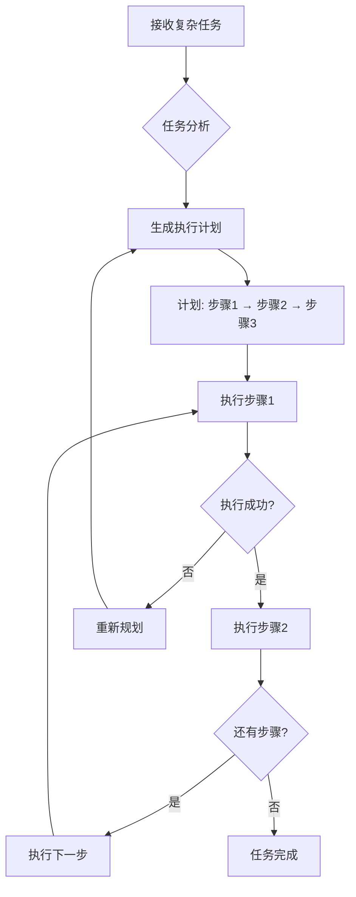
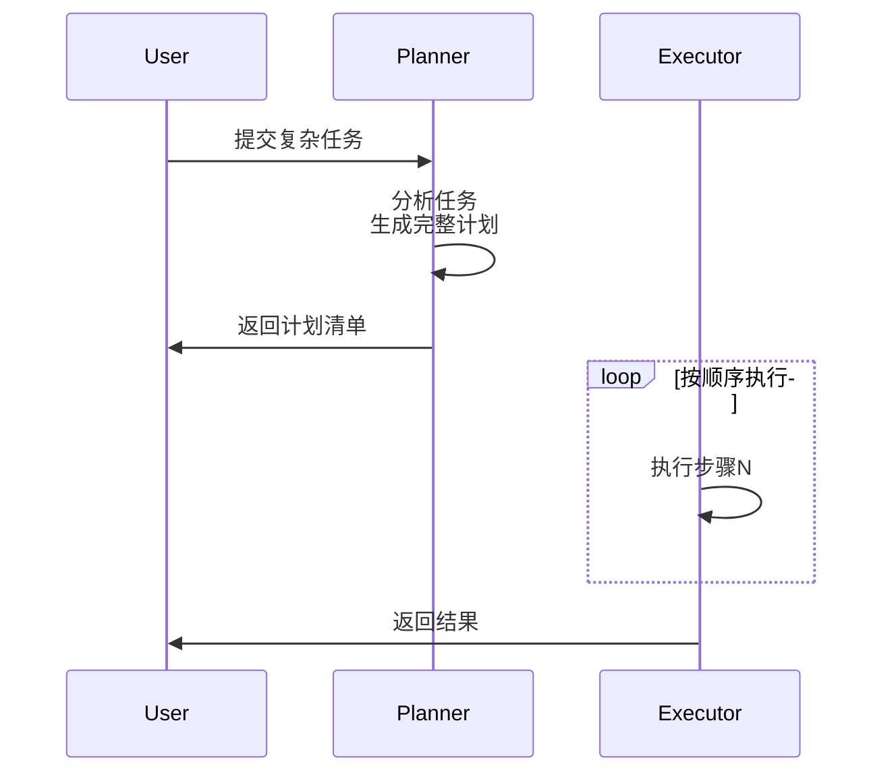
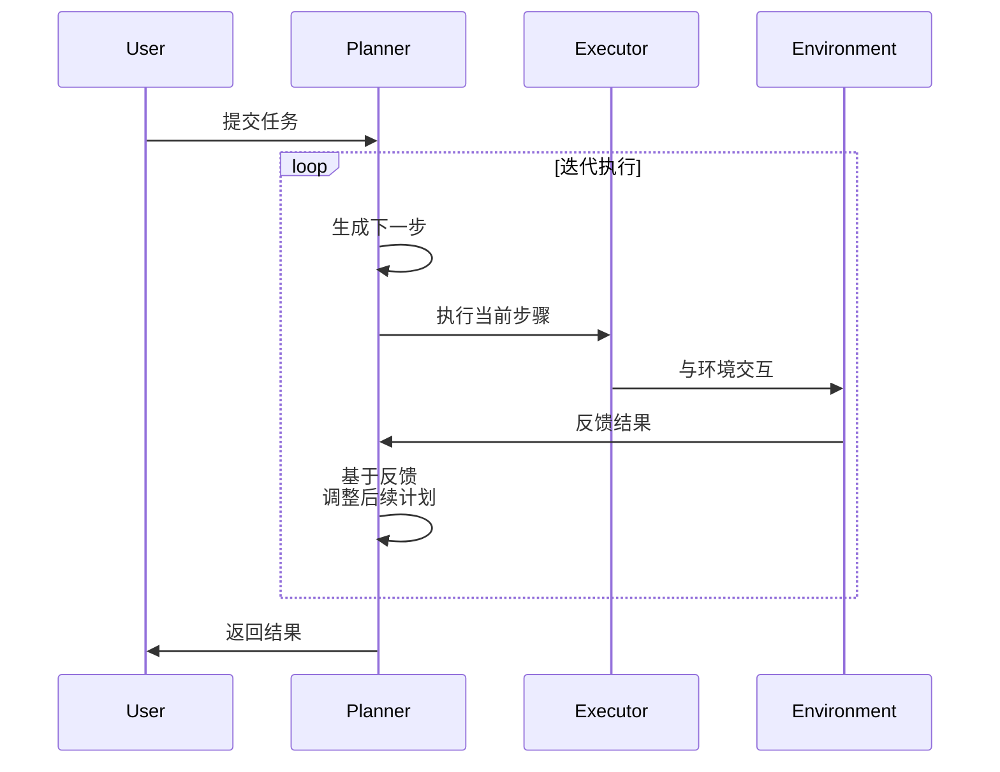
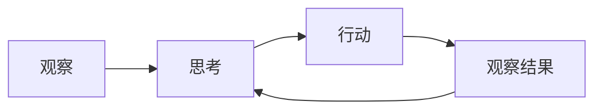
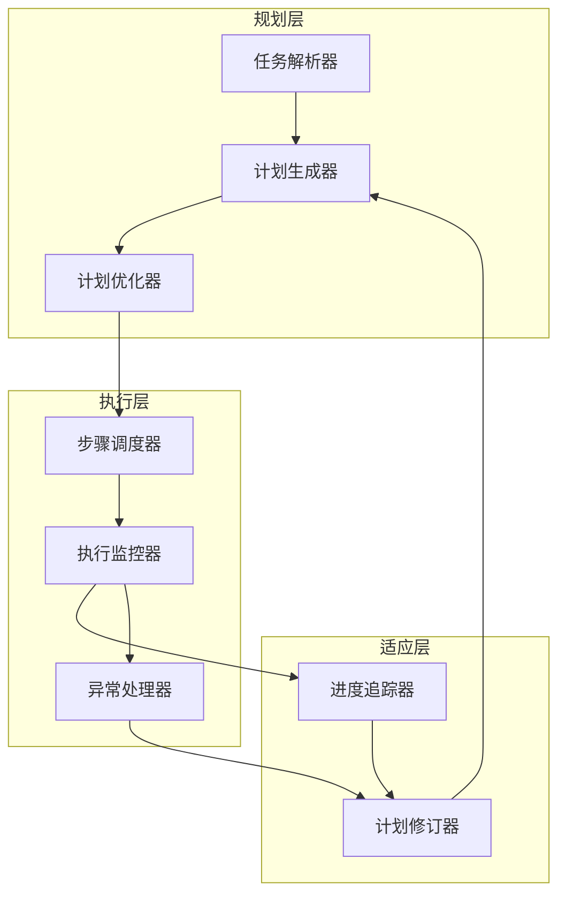
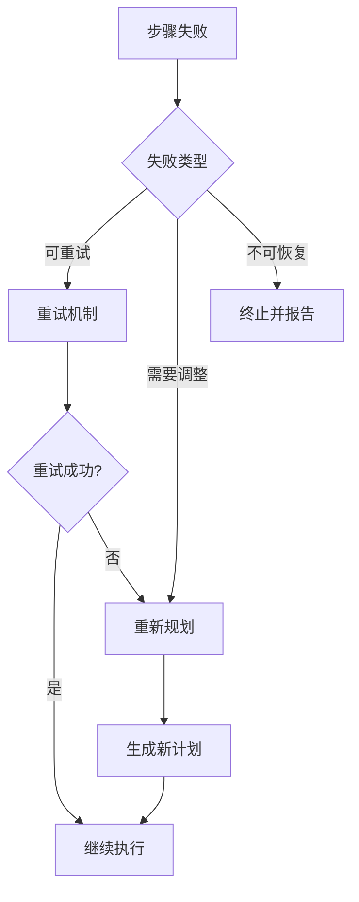

# Chapter 6: Planning 规划模式

## 概述

规划模式使 Agent 能够将复杂任务分解为可执行的步骤序列。通过推理和计划创建，Agent 可以系统地处理多步骤任务，而不是盲目地一步步执行。

---

## 背景原理

### 为什么需要规划？

大语言模型在单次生成中容易：
- **迷失方向**：在复杂任务中忘记初始目标
- **遗漏步骤**：跳过关键的中继步骤
- **重复工作**：无法跟踪已完成和待完成的任务

**人类解决问题的方式**：
> 面对"策划一场婚礼"这样的复杂任务，人类会：
> 1. 列出所有子任务（场地、餐饮、宾客名单...）
> 2. 确定依赖关系（先定场地才能发请柬）
> 3. 分配资源和时间
> 4. 执行并监控进度

规划模式让 Agent 模拟这种人类思维过程。

---

## 工作流程



---

## 规划类型

### 1. 静态规划 (Static Planning)

预先定义所有步骤，一次性生成完整计划。



**适用场景**：
- 任务目标明确
- 步骤可预测
- 环境稳定

### 2. 动态规划 (Dynamic Planning)

根据执行反馈实时调整计划。



**适用场景**：
- 环境动态变化
- 需要探索未知
- 容错要求高

### 3. ReAct 规划 (Reasoning + Acting)

将推理和行动交织进行，边想边做。



**核心循环**：
1. **Thought**: 分析当前状态，决定下一步
2. **Action**: 执行具体操作
3. **Observation**: 观察执行结果
4. **Repeat**: 循环直到完成

---

## 架构组件



| 组件 | 功能 |
|------|------|
| 任务解析器 | 理解目标，提取约束条件 |
| 计划生成器 | 生成可行的步骤序列 |
| 计划优化器 | 优化计划效率，消除冗余 |
| 步骤调度器 | 按优先级执行步骤 |
| 执行监控器 | 跟踪执行状态 |
| 异常处理器 | 处理执行失败 |
| 进度追踪器 | 记录已完成/待完成 |
| 计划修订器 | 基于反馈调整计划 |

---

## LangChain 实现

### 基础规划链

```python
from langchain_core.prompts import ChatPromptTemplate
from langchain_core.output_parsers import StrOutputParser

# 规划提示词
planning_prompt = ChatPromptTemplate.from_template("""
You are a task planner. Break down the following task into numbered steps.

Task: {task}

Requirements:
1. Each step should be atomic and actionable
2. Consider dependencies between steps
3. Include estimated complexity for each step
4. Identify potential risks

Output format:
Plan:
1. [Step 1] - Complexity: Low/Medium/High
2. [Step 2] - Complexity: Low/Medium/High
...

Dependencies:
- Step X depends on Step Y

Risk Mitigation:
- [Potential risk] -> [Mitigation strategy]
""")

planning_chain = planning_prompt | llm | StrOutputParser()

# 执行
plan = planning_chain.invoke({"task": "Build a website"})
```

### 结构化计划输出

```python
from pydantic import BaseModel, Field
from typing import List

class PlanStep(BaseModel):
    step_number: int = Field(description="步骤序号")
    description: str = Field(description="步骤描述")
    dependencies: List[int] = Field(default=[], description="依赖的步骤")
    complexity: str = Field(description="复杂度: Low/Medium/High")
    estimated_time: str = Field(description="预估时间")

class TaskPlan(BaseModel):
    goal: str = Field(description="任务目标")
    steps: List[PlanStep] = Field(description="步骤列表")
    overall_strategy: str = Field(description="整体策略")

# 使用结构化输出
structured_planner = llm.with_structured_output(TaskPlan)
```

### ReAct Agent 实现

```python
from langchain.agents import create_react_agent, AgentExecutor
from langchain import hub

# 获取 ReAct 提示词模板
react_prompt = hub.pull("hwchase17/react")

# 创建 ReAct Agent
agent = create_react_agent(llm, tools, react_prompt)
agent_executor = AgentExecutor(
    agent=agent, 
    tools=tools,
    verbose=True,
    handle_parsing_errors=True
)

# 执行
result = agent_executor.invoke({
    "input": "Find the current weather in Beijing and suggest appropriate clothing"
})
```

---

## Google ADK 实现

### 使用 LoopAgent 实现迭代规划

```python
from google.adk.agents import LoopAgent, LlmAgent
from google.adk.tools import google_search

# 任务执行 Agent
task_executor = LlmAgent(
    name="TaskExecutor",
    model="gemini-2.0-flash",
    instruction="""
    Execute the given task step and report:
    1. What was accomplished
    2. Any issues encountered
    3. Next steps needed
    """,
    tools=[google_search]
)

# 规划评估 Agent
plan_evaluator = LlmAgent(
    name="PlanEvaluator",
    model="gemini-2.0-flash",
    instruction="""
    Review the execution result and decide:
    - COMPLETE: Task is finished
    - CONTINUE: More steps needed
    - REPLAN: Current approach needs adjustment
    
    Provide reasoning for your decision.
    """
)

# 循环执行直到完成
loop_agent = LoopAgent(
    name="PlanningLoop",
    sub_agents=[task_executor, plan_evaluator],
    max_iterations=10
)
```

### SequentialAgent 实现静态规划

```python
from google.adk.agents import SequentialAgent, LlmAgent

# 定义专业规划步骤
step1_analyst = LlmAgent(
    name="RequirementAnalyst",
    model="gemini-2.0-flash",
    instruction="Analyze requirements and identify key components."
)

step2_designer = LlmAgent(
    name="SolutionDesigner", 
    model="gemini-2.0-flash",
    instruction="Design solution architecture based on requirements."
)

step3_planner = LlmAgent(
    name="ImplementationPlanner",
    model="gemini-2.0-flash", 
    instruction="Create detailed implementation plan."
)

# 顺序执行
planning_pipeline = SequentialAgent(
    name="PlanningPipeline",
    sub_agents=[step1_analyst, step2_designer, step3_planner]
)
```

---

## 最佳实践

### 1. 计划粒度控制

```mermaid
flowchart LR
    A[太粗] --> B[适当粒度] --> C[太细]
    A -->|示例: "Build app"| D[不可执行]
    B -->|示例: "Design DB schema"| E[可执行]
    C -->|示例: "Open IDE"| F[过度规划]
```

**建议**：
- 每个步骤应在 15-30 分钟内可完成
- 避免嵌套超过 3 层的子计划
- 使用动词开头（设计、实现、测试）

### 2. 依赖管理

```python
# 依赖图示例
dependencies = {
    "deploy": ["test", "build"],
    "test": ["build"],
    "build": ["design"],
    "design": []
}

# 拓扑排序确定执行顺序
def topological_sort(deps):
    """返回正确的执行顺序"""
    # 实现拓扑排序算法
    pass
```

### 3. 错误恢复策略



---

## 适用场景

| 场景 | 规划类型 | 说明 |
|------|----------|------|
| 软件开发 | 静态+动态 | 先设计架构，再迭代开发 |
| 数据分析 | ReAct | 边探索数据边调整分析方向 |
| 客户服务 | 动态 | 根据客户反馈调整处理流程 |
| 内容创作 | 静态 | 大纲→草稿→修改→发布 |
| 科学研究 | ReAct | 假设→实验→观察→新假设 |

---

## 完整示例

```python
from src.utils.model_loader import model_loader
from langchain_core.prompts import ChatPromptTemplate
from langchain_core.output_parsers import JsonOutputParser

class PlanningAgent:
    """
    实现规划模式的 Agent
    能够分解复杂任务并系统执行
    """
    
    def __init__(self, model_id: str = None):
        self.llm = model_loader.load_llm(model_id)
        self.plan = []
        self.completed_steps = []
        
    def create_plan(self, task: str) -> list:
        """为任务生成执行计划"""
        prompt = ChatPromptTemplate.from_template("""
        Create a step-by-step plan for: {task}
        
        Return as JSON:
        {{
            "steps": [
                {{"id": 1, "action": "...", "depends_on": []}},
                {{"id": 2, "action": "...", "depends_on": [1]}}
            ]
        }}
        """)
        
        chain = prompt | self.llm | JsonOutputParser()
        result = chain.invoke({"task": task})
        self.plan = result["steps"]
        return self.plan
    
    def execute_plan(self) -> str:
        """执行计划并返回结果"""
        for step in self.plan:
            # 检查依赖是否完成
            deps_satisfied = all(
                d in self.completed_steps 
                for d in step.get("depends_on", [])
            )
            
            if not deps_satisfied:
                continue
                
            # 执行步骤
            result = self._execute_step(step)
            
            if result["success"]:
                self.completed_steps.append(step["id"])
            else:
                # 处理失败
                return self._handle_failure(step, result)
        
        return "Plan executed successfully"
    
    def _execute_step(self, step: dict) -> dict:
        """执行单个步骤"""
        # 具体执行逻辑
        pass
    
    def _handle_failure(self, step: dict, result: dict) -> str:
        """处理步骤执行失败"""
        # 重新规划或报告错误
        pass

# 使用示例
if __name__ == "__main__":
    agent = PlanningAgent()
    
    # 创建计划
    task = "Organize a team building event for 50 people"
    plan = agent.create_plan(task)
    print(f"Generated plan with {len(plan)} steps")
    
    # 执行计划
    result = agent.execute_plan()
    print(result)
```

---

## 运行示例

```bash
python src/agents/patterns/planning.py
```

---

## 参考资源

- [LangChain Agent Documentation](https://python.langchain.com/docs/modules/agents/)
- [ReAct Paper](https://arxiv.org/abs/2210.03629)
- [Google ADK Planning Guide](https://google.github.io/adk-docs/)
- [Plan-and-Execute Pattern](https://langchain-ai.github.io/langgraph/tutorials/plan-and-execute/plan-and-execute/)
