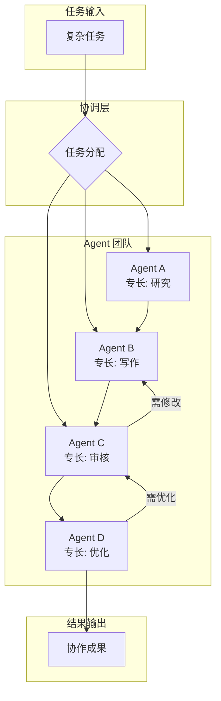
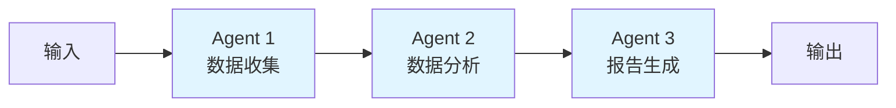
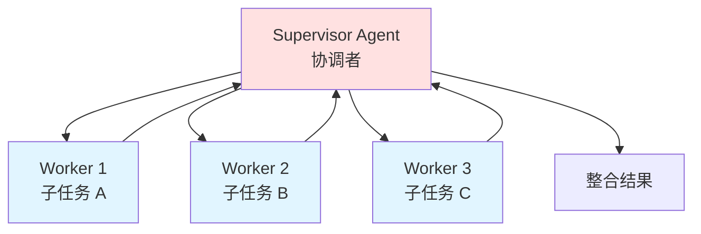
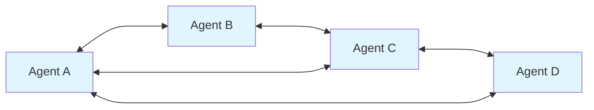
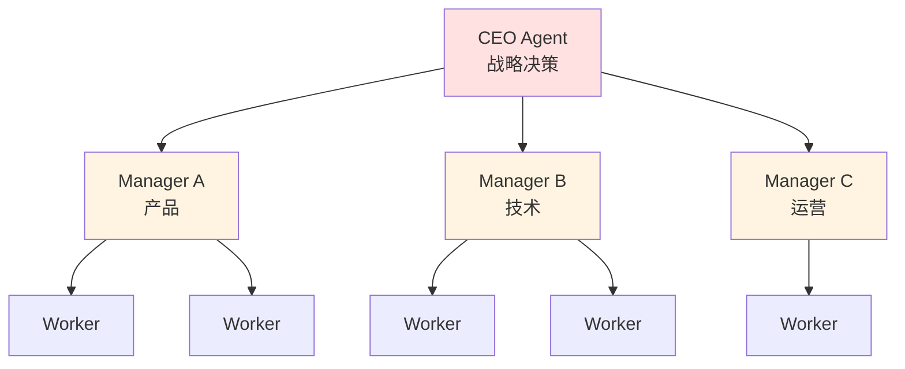
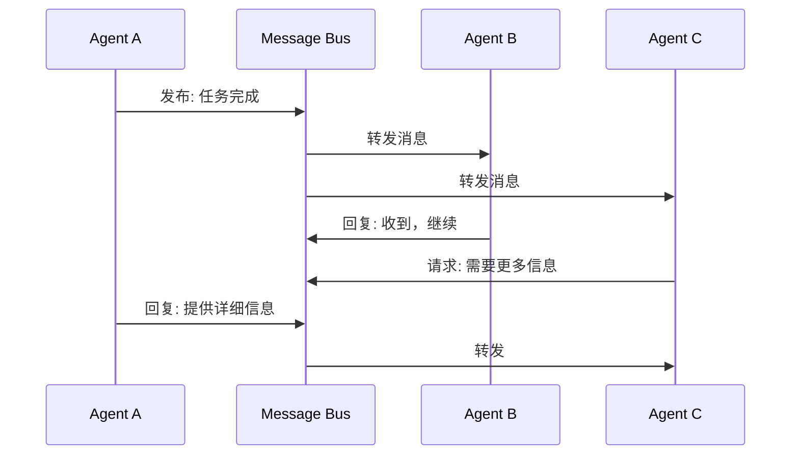
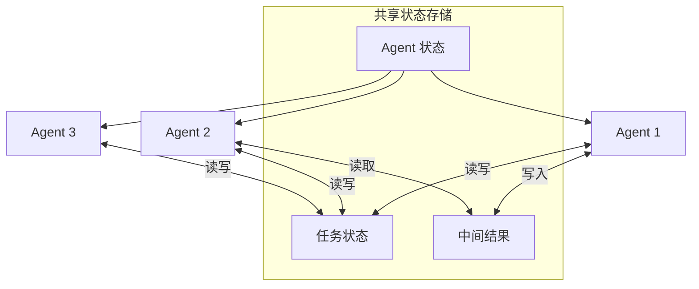
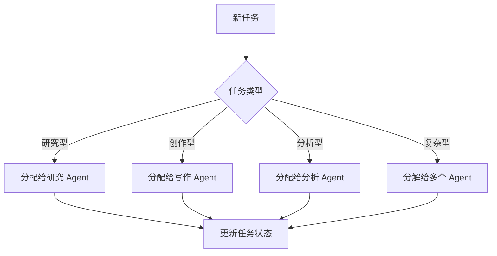
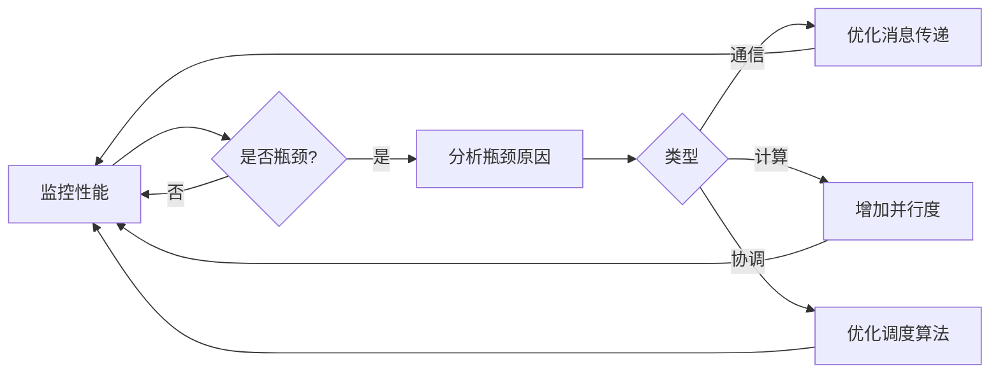

# Chapter 7: Multi-Agent Collaboration 多智能体协作模式

## 概述

多智能体协作模式通过多个专业化的 Agent 协同工作来解决复杂问题。每个 Agent 有特定的角色和专长，通过协作产生超越单个 Agent 的能力，模拟人类团队协作的效果。

---

## 背景原理

### 为什么需要多 Agent？

**单一 Agent 的局限**：
- **知识过载**：一个 Agent 难以精通所有领域
- **上下文窗口限制**：处理过多信息容易迷失
- **单点故障**：出错影响整个系统
- **缺乏专业化**：无法针对不同任务优化

**人类团队协作的启示**：
> 一家成功的公司需要：
> - 产品经理（需求分析）
> - 设计师（UI/UX）
> - 开发工程师（实现）
> - 测试工程师（质量保证）
> 
> 每个人专注自己的专业，通过协作完成复杂产品。

多 Agent 系统模拟这种分工协作模式。

---

## 工作流程



---

## 协作架构

### 1. 顺序流水线 (Sequential Pipeline)



**特点**：
- 数据单向流动
- 每个 Agent 完成后传递给下一个
- 适合有明确依赖关系的任务

**示例**：内容创作流水线
```
选题 Agent → 大纲 Agent → 写作 Agent → 编辑 Agent → 发布 Agent
```

### 2. 主管-工人 (Supervisor-Workers)



**特点**：
- 中央协调器分配任务
- Worker 并行执行
- 适合可分解的独立子任务

**示例**：软件开发团队
```
项目经理 (Supervisor)
├── 前端开发 (Worker)
├── 后端开发 (Worker)
├── 测试工程师 (Worker)
└── DevOps (Worker)
```

### 3. 去中心化网络 (Decentralized Network)



**特点**：
- Agent 之间直接通信
- 无中央协调器
- 适合需要频繁协商的场景

### 4. 层级结构 (Hierarchical)



**特点**：
- 多层管理结构
- 适合大规模复杂系统
- 责任逐级分解

---

## 通信机制

### Agent 间消息传递



### 共享状态管理



---

## 实现方案

### LangGraph 多 Agent 实现

```python
from langgraph.graph import StateGraph, END
from typing import TypedDict, List, Annotated
import operator

class MultiAgentState(TypedDict):
    """共享状态定义"""
    messages: List[str]
    current_agent: str
    task_status: dict
    final_output: str

def create_research_agent():
    """创建研究 Agent"""
    def research(state: MultiAgentState):
        # 执行研究任务
        return {"messages": ["Research completed"]}
    return research

def create_writer_agent():
    """创建写作 Agent"""
    def write(state: MultiAgentState):
        # 基于研究结果写作
        return {"messages": ["Article written"]}
    return write

def create_editor_agent():
    """创建编辑 Agent"""
    def edit(state: MultiAgentState):
        # 审核和编辑内容
        if "quality_check_passed":
            return {"final_output": "Final article"}
        else:
            return {"messages": ["Needs revision"]}
    return edit

# 构建工作流
workflow = StateGraph(MultiAgentState)

# 添加节点
workflow.add_node("researcher", create_research_agent())
workflow.add_node("writer", create_writer_agent())
workflow.add_node("editor", create_editor_agent())

# 定义边
workflow.set_entry_point("researcher")
workflow.add_edge("researcher", "writer")
workflow.add_edge("writer", "editor")

# 条件边：如果需要修改，返回 writer
workflow.add_conditional_edges(
    "editor",
    lambda state: END if state.get("final_output") else "writer"
)

# 编译
app = workflow.compile()

# 执行
result = app.invoke({"messages": ["Write about AI trends"]})
```

### CrewAI 实现

```python
from crewai import Agent, Task, Crew, Process
from langchain_openai import ChatOpenAI

# 定义专业 Agent
researcher = Agent(
    role='研究专家',
    goal='收集和分析最新信息',
    backstory='你是一位经验丰富的研究专家，擅长从各种来源收集和整理信息。',
    verbose=True,
    allow_delegation=False,
    llm=ChatOpenAI(model="gpt-4", temperature=0.7)
)

writer = Agent(
    role='内容创作者',
    goal='创作高质量的内容',
    backstory='你是一位专业的内容创作者，擅长将复杂信息转化为易懂的文章。',
    verbose=True,
    allow_delegation=False,
    llm=ChatOpenAI(model="gpt-4", temperature=0.7)
)

editor = Agent(
    role='编辑',
    goal='确保内容质量',
    backstory='你是一位资深编辑，擅长提升文章质量和准确性。',
    verbose=True,
    allow_delegation=False,
    llm=ChatOpenAI(model="gpt-4", temperature=0.3)
)

# 定义任务
task_research = Task(
    description='研究2024年AI领域的最新发展趋势',
    agent=researcher,
    expected_output='一份详细的研究报告'
)

task_write = Task(
    description='基于研究结果撰写一篇通俗易懂的文章',
    agent=writer,
    expected_output='一篇完整的文章',
    context=[task_research]
)

task_edit = Task(
    description='审核和优化文章内容',
    agent=editor,
    expected_output='最终编辑好的文章',
    context=[task_write]
)

# 创建 Crew
crew = Crew(
    agents=[researcher, writer, editor],
    tasks=[task_research, task_write, task_edit],
    process=Process.sequential,  # 顺序执行
    verbose=True
)

# 运行
result = crew.kickoff()
print(result)
```

### Google ADK 实现

```python
from google.adk.agents import SequentialAgent, ParallelAgent, LlmAgent
from google.adk.tools import google_search

# 定义专业 Agent
research_agent = LlmAgent(
    name="Researcher",
    model="gemini-2.0-flash",
    instruction="""
    You are a research specialist. Your job is to:
    1. Search for relevant information
    2. Analyze and summarize findings
    3. Present structured research results
    """,
    tools=[google_search]
)

writer_agent = LlmAgent(
    name="Writer",
    model="gemini-2.0-flash",
    instruction="""
    You are a content writer. Your job is to:
    1. Read research results
    2. Create engaging content
    3. Structure it for readability
    """
)

reviewer_agent = LlmAgent(
    name="Reviewer",
    model="gemini-2.0-flash",
    instruction="""
    You are a content reviewer. Your job is to:
    1. Check content quality and accuracy
    2. Provide constructive feedback
    3. Approve or request revisions
    """
)

# 顺序执行团队
content_team = SequentialAgent(
    name="ContentCreationTeam",
    sub_agents=[research_agent, writer_agent, reviewer_agent]
)

# 并行执行团队（独立任务）
parallel_team = ParallelAgent(
    name="ParallelAnalysisTeam",
    sub_agents=[
        LlmAgent(name="TechnicalAnalyst", model="gemini-2.0-flash"),
        LlmAgent(name="MarketAnalyst", model="gemini-2.0-flash"),
        LlmAgent(name="RiskAnalyst", model="gemini-2.0-flash")
    ]
)
```

---

## 最佳实践

### 1. Agent 角色设计

```python
# 好的角色定义
GOOD_AGENT = {
    "role": "数据分析师",
    "goal": "从原始数据中提取有价值的洞察",
    "backstory": "你有5年数据分析经验，擅长使用统计学方法发现数据模式",
    "constraints": ["不使用个人意见", "基于数据说话"]
}

# 差的角色定义
BAD_AGENT = {
    "role": "助手",
    "goal": "帮助用户",
    "backstory": "你是一个有帮助的AI"
}
```

### 2. 任务分配策略



### 3. 冲突解决机制

```python
class ConflictResolver:
    """解决 Agent 之间的冲突"""
    
    def resolve(self, agent_opinions: dict) -> str:
        """
        冲突解决策略：
        1. 投票制：多数 Agent 的意见胜出
        2. 权威制：特定 Agent 的意见优先
        3. 仲裁制：引入第三方 Agent 仲裁
        4. 合并制：综合各方意见
        """
        if self.strategy == "voting":
            return self._voting_resolve(agent_opinions)
        elif self.strategy == "authority":
            return self._authority_resolve(agent_opinions)
        elif self.strategy == "arbitration":
            return self._arbitration_resolve(agent_opinions)
        else:
            return self._merge_resolve(agent_opinions)
```

### 4. 性能优化



---

## 适用场景

| 场景 | 架构类型 | 说明 |
|------|----------|------|
| 内容创作团队 | 顺序流水线 | 研究→写作→编辑→发布 |
| 客服系统 | 主管-工人 | 路由 Agent 分配给专业客服 |
| 代码审查 | 去中心化 | 多个 Reviewer 并行审查 |
| 企业决策 | 层级结构 | 各部门逐级汇报整合 |
| 游戏 AI | 去中心化 | NPC 之间自主交互 |

---

## 完整示例

```python
from src.utils.model_loader import model_loader

class ResearchTeam:
    """
    多 Agent 研究团队示例
    包含：研究员、分析师、撰稿人
    """
    
    def __init__(self):
        llm = model_loader.load_llm()
        self.agents = self._create_agents(llm)
        
    def _create_agents(self, llm):
        """创建 Agent 团队"""
        return {
            "researcher": {
                "role": "研究专家",
                "system_prompt": "你是一个研究专家，擅长收集和整理信息。",
                "llm": llm
            },
            "analyst": {
                "role": "数据分析师", 
                "system_prompt": "你是一个数据分析师，擅长发现数据中的模式。",
                "llm": llm
            },
            "writer": {
                "role": "技术撰稿人",
                "system_prompt": "你是一个技术撰稿人，擅长将复杂概念转化为易懂的文字。",
                "llm": llm
            }
        }
    
    def research_topic(self, topic: str) -> str:
        """协作研究主题"""
        # 1. 研究员收集信息
        research_data = self._run_agent(
            "researcher", 
            f"收集关于'{topic}'的最新信息"
        )
        
        # 2. 分析师分析数据
        analysis = self._run_agent(
            "analyst",
            f"分析以下研究数据：\n{research_data}"
        )
        
        # 3. 撰稿人撰写报告
        report = self._run_agent(
            "writer",
            f"基于以下分析撰写报告：\n{analysis}"
        )
        
        return report
    
    def _run_agent(self, agent_name: str, task: str) -> str:
        """运行单个 Agent"""
        agent = self.agents[agent_name]
        # 实际执行逻辑
        return f"[{agent['role']}] 完成: {task[:50]}..."

# 使用
if __name__ == "__main__":
    team = ResearchTeam()
    report = team.research_topic("多模态AI发展趋势")
    print(report)
```

---

## 运行示例

```bash
python src/agents/patterns/multi_agent.py
```

---

## 参考资源

- [LangGraph Multi-Agent](https://langchain-ai.github.io/langgraph/tutorials/multi_agent/)
- [CrewAI Documentation](https://docs.crewai.com/)
- [Google ADK Agents](https://google.github.io/adk-docs/agents/)
- [AutoGen Multi-Agent](https://microsoft.github.io/autogen/)
- [Multi-Agent Reinforcement Learning](https://www.marl-book.com/)
