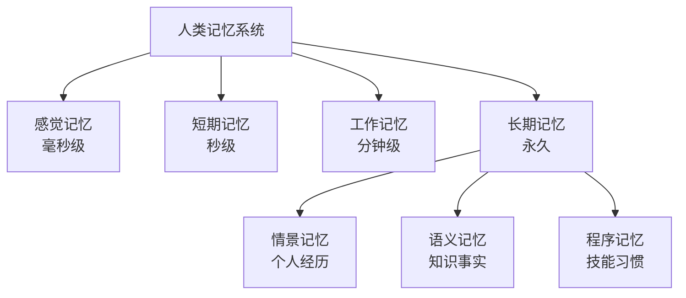
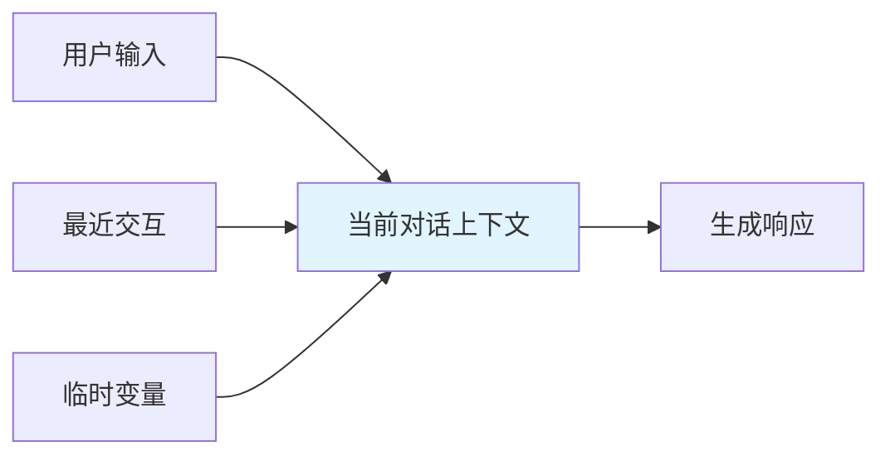
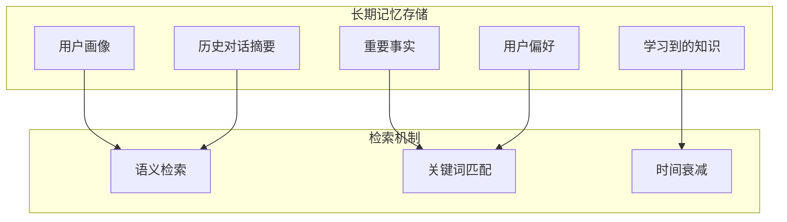
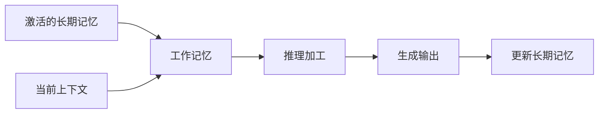
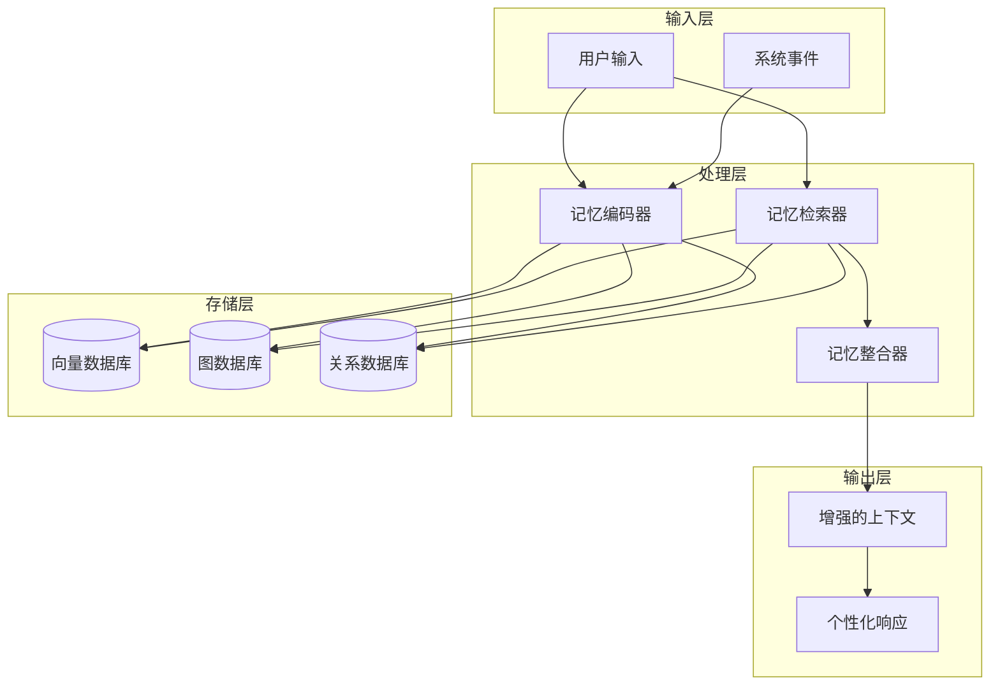
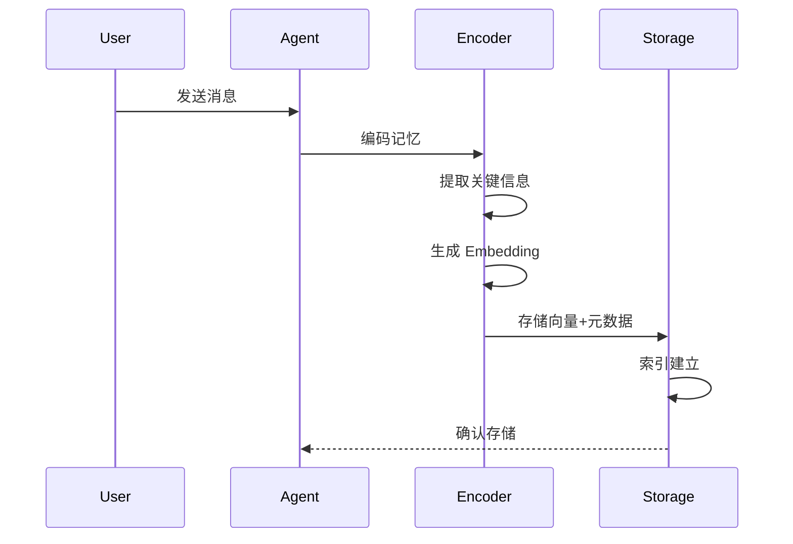
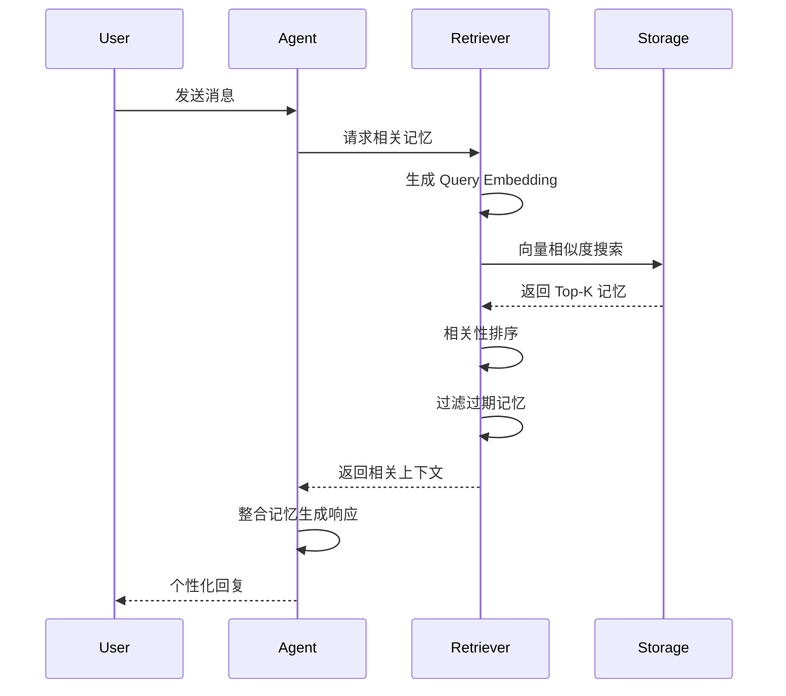
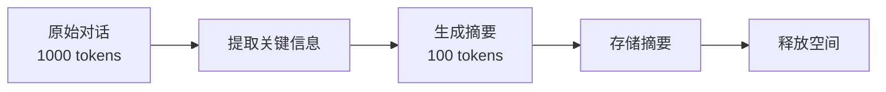
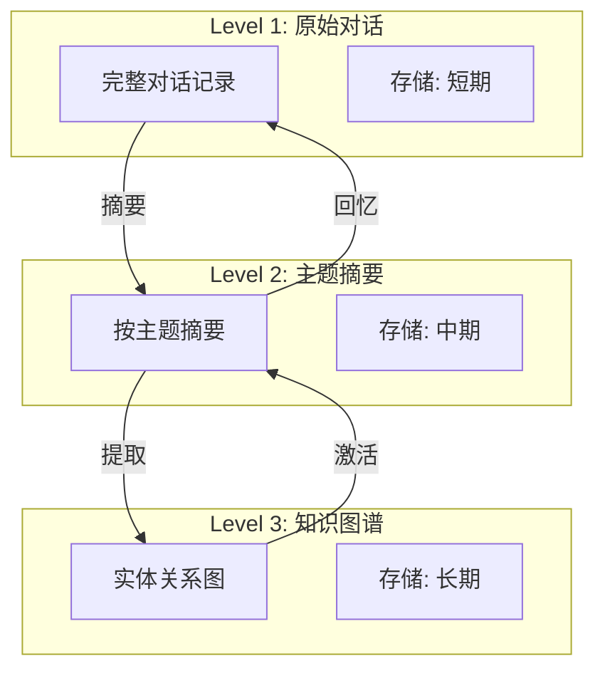
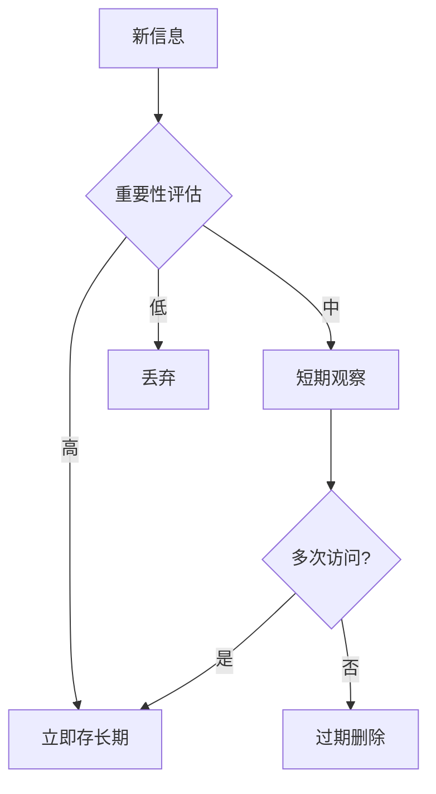

# Chapter 8: Memory Management 记忆管理

## 概述

记忆管理使 Agent 能够记住之前的交互、用户偏好、重要信息和上下文，从而提供个性化、连贯的服务体验。这是构建真正"智能"Agent 的核心能力。

---

## 背景原理

### 为什么需要记忆？

**无记忆的 Agent 的问题**：
- 每次对话都像第一次
- 无法理解指代（"刚才提到的那个方案"）
- 重复询问相同信息（"你叫什么名字？"）
- 无法学习用户偏好

**人类记忆的层次**：



Agent 记忆系统模拟这种分层结构。

---

## 记忆类型

### 1. 短期记忆 (Short-term Memory)



**特点**：
- 存在于单次会话中
- 容量有限（受限于上下文窗口）
- 包含最近 N 轮对话

**使用场景**：
- 保持对话连贯性
- 理解指代和省略
- 维护当前任务状态

### 2. 长期记忆 (Long-term Memory)



**分类**：
- **语义记忆**：事实性知识（用户是程序员）
- **情景记忆**：具体事件（上次讨论过微服务）
- **程序记忆**：操作习惯（喜欢详细解释）

### 3. 工作记忆 (Working Memory)



**作用**：
- 整合短期和长期信息
- 支持复杂推理
- 临时存储中间结果

---

## 记忆架构



### 核心组件

| 组件 | 功能 | 技术 |
|------|------|------|
| 编码器 | 将信息转换为记忆表示 | Embedding, LLM 摘要 |
| 存储器 | 持久化存储记忆 | Vector DB, Graph DB |
| 检索器 | 根据上下文检索相关记忆 | 语义搜索, RAG |
| 整合器 | 合并、更新记忆 | 冲突解决, 去重 |
| 遗忘机制 | 清理过期/不相关记忆 | TTL, 重要性评分 |

---

## 记忆操作流程

### 存储流程



### 检索流程



---

## 实现方案

### 基础记忆实现

```python
from typing import List, Dict, Any
from datetime import datetime
import json

class Memory:
    """单个记忆单元"""
    
    def __init__(self, content: str, memory_type: str, 
                 importance: float = 1.0, metadata: dict = None):
        self.content = content
        self.memory_type = memory_type  # 'short_term', 'long_term', 'episodic'
        self.importance = importance  # 0-1
        self.created_at = datetime.now()
        self.last_accessed = datetime.now()
        self.access_count = 0
        self.metadata = metadata or {}
    
    def access(self):
        """访问记忆时更新"""
        self.last_accessed = datetime.now()
        self.access_count += 1

class SimpleMemoryManager:
    """简单内存记忆管理器"""
    
    def __init__(self, max_short_term: int = 10):
        self.short_term: List[Memory] = []
        self.long_term: List[Memory] = []
        self.max_short_term = max_short_term
    
    def add_memory(self, content: str, memory_type: str = "short_term", 
                   importance: float = 1.0):
        """添加记忆"""
        memory = Memory(content, memory_type, importance)
        
        if memory_type == "short_term":
            self.short_term.append(memory)
            # 超出容量时，将旧的移至长期记忆
            if len(self.short_term) > self.max_short_term:
                old_memory = self.short_term.pop(0)
                if old_memory.importance > 0.5:
                    self._consolidate_to_long_term(old_memory)
        else:
            self.long_term.append(memory)
    
    def _consolidate_to_long_term(self, memory: Memory):
        """将短期记忆巩固为长期记忆"""
        memory.memory_type = "long_term"
        self.long_term.append(memory)
    
    def retrieve_relevant(self, query: str, top_k: int = 5) -> List[Memory]:
        """检索相关记忆（简单关键词匹配）"""
        all_memories = self.short_term + self.long_term
        
        # 简单相关性评分
        scored = []
        for mem in all_memories:
            score = self._calculate_relevance(query, mem)
            scored.append((score, mem))
        
        # 按分数排序
        scored.sort(key=lambda x: x[0], reverse=True)
        
        # 更新访问信息
        for _, mem in scored[:top_k]:
            mem.access()
        
        return [mem for _, mem in scored[:top_k]]
    
    def _calculate_relevance(self, query: str, memory: Memory) -> float:
        """计算相关性分数"""
        # 简单实现：关键词重叠
        query_words = set(query.lower().split())
        content_words = set(memory.content.lower().split())
        overlap = len(query_words & content_words)
        
        # 考虑重要性、时效性
        time_decay = self._time_decay(memory.created_at)
        importance_boost = memory.importance
        
        return overlap * importance_boost * time_decay
    
    def _time_decay(self, created_at: datetime) -> float:
        """时间衰减因子"""
        days_old = (datetime.now() - created_at).days
        return max(0.1, 1.0 - (days_old / 30))  # 30天后衰减到0.1
    
    def get_context(self, query: str = "") -> str:
        """获取用于增强上下文的记忆"""
        # 短期记忆全部包含
        context_parts = [f"Recent: {m.content}" for m in self.short_term[-3:]]
        
        # 长期记忆中检索相关
        if query:
            relevant = self.retrieve_relevant(query, top_k=3)
            context_parts.extend([f"Relevant: {m.content}" for m in relevant])
        
        return "\n".join(context_parts)
```

### 向量数据库记忆

```python
from langchain.embeddings import OpenAIEmbeddings
from langchain.vectorstores import Chroma
from langchain.schema import Document

class VectorMemoryManager:
    """基于向量数据库的记忆管理"""
    
    def __init__(self, persist_directory: str = "./memory_db"):
        self.embeddings = OpenAIEmbeddings()
        self.vectorstore = Chroma(
            persist_directory=persist_directory,
            embedding_function=self.embeddings
        )
        self.session_memory = []  # 当前会话记忆
    
    def add_interaction(self, user_input: str, agent_response: str, 
                       summary: str = None):
        """存储一次交互"""
        # 生成摘要（如果没有提供）
        if not summary:
            summary = self._summarize(user_input, agent_response)
        
        # 创建文档
        doc = Document(
            page_content=summary,
            metadata={
                "user_input": user_input,
                "agent_response": agent_response,
                "timestamp": datetime.now().isoformat(),
                "type": "conversation"
            }
        )
        
        # 存入向量库
        self.vectorstore.add_documents([doc])
        
        # 同时保留在会话记忆中
        self.session_memory.append({
            "user": user_input,
            "agent": agent_response,
            "summary": summary
        })
    
    def retrieve_memories(self, query: str, k: int = 5) -> List[Document]:
        """语义检索相关记忆"""
        results = self.vectorstore.similarity_search(query, k=k)
        return results
    
    def get_enriched_context(self, current_input: str) -> str:
        """获取增强的上下文"""
        context_parts = []
        
        # 1. 最近对话（短期记忆）
        if self.session_memory:
            recent = self.session_memory[-3:]
            context_parts.append("## Recent Conversation")
            for turn in recent:
                context_parts.append(f"User: {turn['user']}")
                context_parts.append(f"Agent: {turn['agent']}")
        
        # 2. 检索相关历史（长期记忆）
        relevant = self.retrieve_memories(current_input, k=3)
        if relevant:
            context_parts.append("## Relevant Past Information")
            for doc in relevant:
                context_parts.append(f"- {doc.page_content}")
        
        return "\n".join(context_parts)
    
    def _summarize(self, user_input: str, agent_response: str) -> str:
        """生成对话摘要"""
        # 可以使用 LLM 生成更好的摘要
        return f"User asked about: {user_input[:50]}... Agent provided response."
```

### LangChain 集成记忆

```python
from langchain.memory import (
    ConversationBufferMemory,
    ConversationBufferWindowMemory,
    ConversationSummaryMemory,
    VectorStoreRetrieverMemory
)
from langchain.chains import ConversationChain

# 1. 缓冲区记忆 - 保存完整对话
buffer_memory = ConversationBufferMemory()

# 2. 窗口记忆 - 只保留最近 K 轮
window_memory = ConversationBufferWindowMemory(k=5)

# 3. 摘要记忆 - LLM 自动摘要
summary_memory = ConversationSummaryMemory(
    llm=llm,
    max_token_limit=1000
)

# 4. 向量检索记忆
vector_memory = VectorStoreRetrieverMemory(
    retriever=vectorstore.as_retriever()
)

# 使用记忆创建对话链
conversation = ConversationChain(
    llm=llm,
    memory=buffer_memory,
    verbose=True
)

# 对话会自动保存到记忆中
response1 = conversation.predict(input="Hi, I'm Bob")
response2 = conversation.predict(input="What's my name?")  # 会回答 "Bob"
```

---

## 高级记忆技术

### 1. 记忆摘要与压缩



```python
class SummarizingMemory:
    """自动摘要记忆"""
    
    def __init__(self, llm, max_buffer_size: int = 6):
        self.llm = llm
        self.buffer = []
        self.summary = ""
        self.max_buffer_size = max_buffer_size
    
    def add_message(self, role: str, content: str):
        """添加消息"""
        self.buffer.append({"role": role, "content": content})
        
        # 缓冲区满时进行摘要
        if len(self.buffer) >= self.max_buffer_size:
            self._summarize_buffer()
    
    def _summarize_buffer(self):
        """将缓冲区内容摘要到长期记忆中"""
        conversation = "\n".join([
            f"{m['role']}: {m['content']}" 
            for m in self.buffer
        ])
        
        prompt = f"""Summarize the following conversation concisely:
        
        {conversation}
        
        Summary:"""
        
        new_summary = self.llm.predict(prompt)
        
        # 合并到现有摘要
        if self.summary:
            self.summary = f"{self.summary}\n{new_summary}"
        else:
            self.summary = new_summary
        
        # 清空缓冲区
        self.buffer = []
    
    def get_context(self) -> str:
        """获取当前上下文"""
        parts = []
        if self.summary:
            parts.append(f"Previous summary:\n{self.summary}")
        if self.buffer:
            recent = "\n".join([
                f"{m['role']}: {m['content']}" 
                for m in self.buffer
            ])
            parts.append(f"Recent conversation:\n{recent}")
        return "\n\n".join(parts)
```

### 2. 分层记忆架构



### 3. 个性化用户画像

```python
class UserProfile:
    """用户画像管理"""
    
    def __init__(self, user_id: str):
        self.user_id = user_id
        self.facts = {}  # 事实性信息
        self.preferences = {}  # 偏好设置
        self.interaction_history = []  # 交互历史
        self.behavior_patterns = {}  # 行为模式
    
    def extract_facts(self, conversation: str):
        """从对话中提取用户事实"""
        # 使用 LLM 提取结构化信息
        extraction_prompt = f"""
        Extract key facts about the user from this conversation.
        Format: JSON with keys like "occupation", "interests", "location", etc.
        
        Conversation: {conversation}
        """
        # LLM 提取并更新 facts
        pass
    
    def update_preferences(self, feedback: dict):
        """根据反馈更新偏好"""
        for key, value in feedback.items():
            self.preferences[key] = {
                "value": value,
                "confidence": self._calculate_confidence(key, value),
                "updated_at": datetime.now()
            }
    
    def get_personalized_context(self) -> str:
        """获取个性化上下文"""
        context = []
        
        if self.facts:
            context.append("User Facts:")
            for k, v in self.facts.items():
                context.append(f"- {k}: {v}")
        
        if self.preferences:
            context.append("User Preferences:")
            for k, v in self.preferences.items():
                if v["confidence"] > 0.7:  # 只使用高置信度的偏好
                    context.append(f"- {k}: {v['value']}")
        
        return "\n".join(context)
```

---

## 最佳实践

### 1. 记忆分层策略



### 2. 隐私与遗忘

```python
class PrivacyAwareMemory:
    """隐私感知记忆"""
    
    SENSITIVE_PATTERNS = [
        r"\b\d{16,}\b",  # 信用卡号
        r"\b\d{3}-\d{2}-\d{4}\b",  # SSN
        r"password[:\s]*\S+",  # 密码
    ]
    
    def store(self, content: str, sensitivity: str = "auto"):
        """存储时检测敏感信息"""
        if sensitivity == "auto":
            sensitivity = self._detect_sensitivity(content)
        
        if sensitivity == "high":
            # 不存储或加密存储
            self._store_encrypted(content)
        elif sensitivity == "medium":
            # 存储但标记限制访问
            self._store_with_restrictions(content)
        else:
            # 正常存储
            self._store_normal(content)
    
    def forget_user_data(self, user_id: str):
        """用户请求删除数据"""
        # GDPR 合规删除
        self._delete_all_user_memories(user_id)
        self._delete_user_profile(user_id)
        self._log_deletion(user_id)
```

### 3. 记忆评估指标

| 指标 | 说明 | 目标值 |
|------|------|--------|
| 检索准确率 | 检索到的记忆与查询的相关性 | >80% |
| 上下文命中率 | 有用记忆被成功使用的比例 | >60% |
| 存储效率 | 单位信息量的存储成本 | 最小化 |
| 遗忘准确率 | 正确识别过期信息 | >90% |

---

## 适用场景

| 场景 | 记忆策略 | 说明 |
|------|----------|------|
| 客服机器人 | 用户画像 + 对话历史 | 识别用户，避免重复询问 |
| 个人助理 | 完整记忆架构 | 学习用户习惯，提供个性化服务 |
| 教育辅导 | 学习进度记忆 | 跟踪学生掌握程度 |
| 游戏NPC | 事件记忆 | 记住玩家行为，影响剧情 |
| 医疗咨询 | 隐私保护记忆 | 安全存储病史信息 |

---

## 完整示例

```python
from src.utils.model_loader import model_loader

class MemoryEnhancedAgent:
    """
    增强记忆 Agent 示例
    结合短期和长期记忆
    """
    
    def __init__(self, model_id: str = None):
        self.llm = model_loader.load_llm(model_id)
        self.memory = SimpleMemoryManager(max_short_term=5)
        self.user_profile = {}
    
    def chat(self, user_input: str, user_id: str = "default") -> str:
        """带记忆的对话"""
        # 1. 检索相关记忆
        memories = self.memory.retrieve_relevant(user_input, top_k=3)
        memory_context = "\n".join([m.content for m in memories])
        
        # 2. 获取用户画像
        profile = self.user_profile.get(user_id, {})
        profile_context = json.dumps(profile, ensure_ascii=False) if profile else ""
        
        # 3. 构建增强提示
        prompt = f"""You are a helpful assistant with memory.

User Profile: {profile_context}

Relevant Memories:
{memory_context}

User: {user_input}
Assistant:"""
        
        # 4. 生成响应
        response = self.llm.invoke(prompt)
        
        # 5. 存储交互
        self.memory.add_memory(
            f"User: {user_input} | Agent: {response}",
            memory_type="short_term",
            importance=self._calculate_importance(user_input)
        )
        
        # 6. 更新用户画像（定期）
        self._update_profile_if_needed(user_id, user_input, response)
        
        return response
    
    def _calculate_importance(self, text: str) -> float:
        """计算信息重要性"""
        # 简单启发式：包含个人信息的重要性高
        indicators = ["我是", "我喜欢", "我讨厌", "我的工作", "我的地址"]
        for indicator in indicators:
            if indicator in text:
                return 0.8
        return 0.5
    
    def _update_profile_if_needed(self, user_id: str, user_input: str, response: str):
        """定期更新用户画像"""
        # 实际实现中可以每隔 N 次对话更新一次
        pass

# 使用示例
if __name__ == "__main__":
    agent = MemoryEnhancedAgent()
    
    # 第一轮
    print(agent.chat("我叫张三，是一名程序员"))
    
    # 第二轮 - Agent 应该记得用户名字
    print(agent.chat("你知道我叫什么吗？"))
```

---

## 运行示例

```bash
python src/agents/patterns/memory.py
```

---

## 参考资源

- [LangChain Memory](https://python.langchain.com/docs/modules/memory/)
- [Vector Databases for Memory](https://www.pinecone.io/learn/vector-database/)
- [Memory in LLM Agents](https://arxiv.org/abs/2312.03689)
- [Long-term Memory in AI](https://deepmind.google/discover/blog/who-wins-the-room-and-do-they-have-a-dog-an-adventure-in-semantic-memory/)
- [MemGPT: Towards LLMs as Operating Systems](https://arxiv.org/abs/2310.08560)
