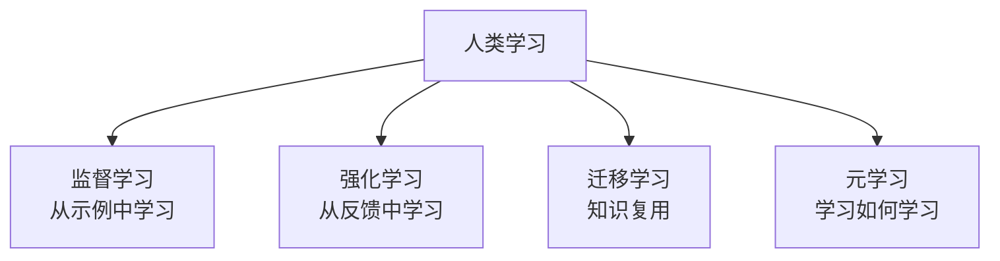
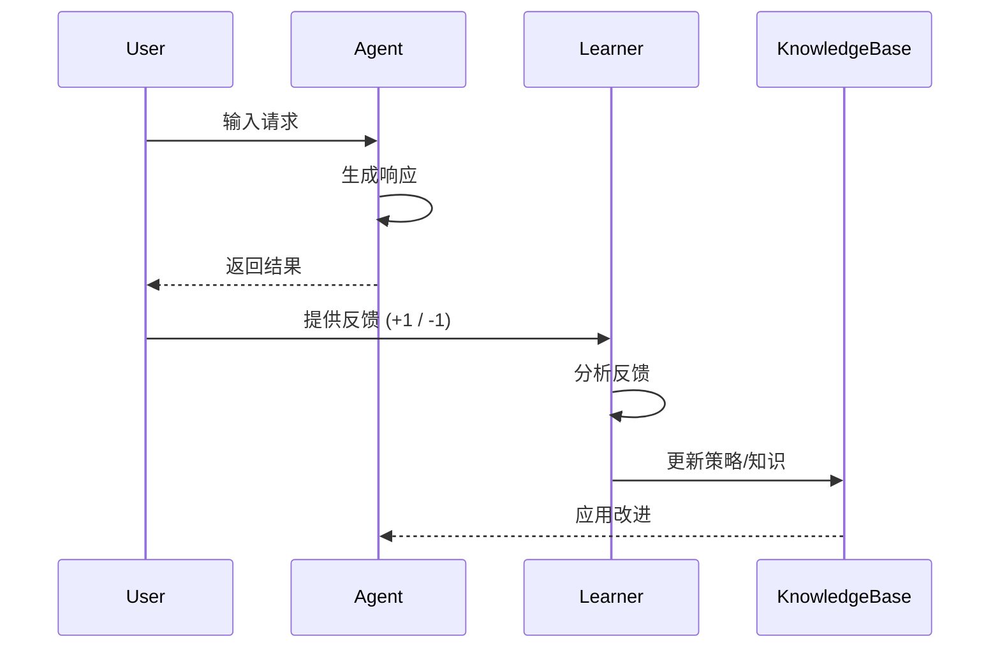
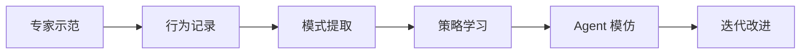
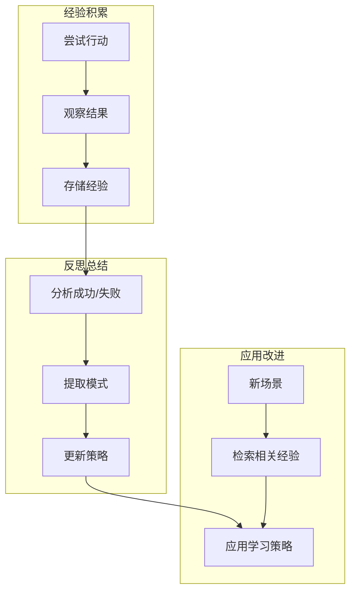
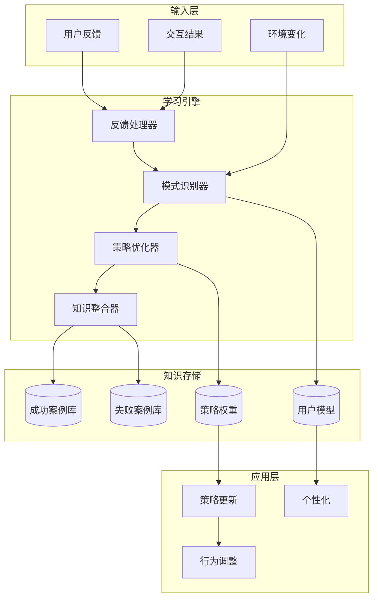
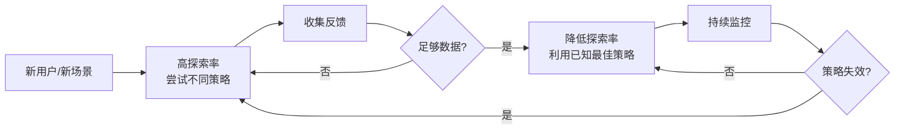

# Chapter 9: Learning and Adaptation 学习与适应

## 概述

学习与适应模式使 Agent 能够从交互中积累经验、改进策略、适应用户需求变化。这是构建能够持续进化的智能系统的核心能力。

---

## 背景原理

### 为什么 Agent 需要学习？

**静态 Agent 的局限**：
- 重复使用相同的错误方法
- 无法理解用户的特殊偏好
- 无法适应新环境或新任务
- 每次交互都是从头开始

**人类学习的类型**：



Agent 学习系统模拟这些学习机制。

---

## 学习范式

### 1. 从反馈中学习 (Learning from Feedback)



**显式反馈**：
- 用户直接评分（👍 / 👎）
- 用户纠正错误
- 多选偏好选择

**隐式反馈**：
-  dwell time（停留时间）
- 是否采纳建议
- 重复询问次数
- 放弃率

### 2. 从示范中学习 (Learning from Demonstration)



**应用**：
- 客服对话脚本学习
- 代码审查模式学习
- 写作风格学习

### 3. 从经验中学习 (Learning from Experience)



---

## 学习架构



---

## 实现方案

### 基础反馈学习

```python
from typing import Dict, List, Any
from datetime import datetime
import json

class FeedbackLearner:
    """基于反馈的学习器"""
    
    def __init__(self):
        self.feedback_history = []
        self.strategy_scores = {}  # 策略评分
        self.pattern_success = {}  # 模式成功率
    
    def record_interaction(self, 
                         context: dict, 
                         action: str, 
                         result: str,
                         user_feedback: int = None):
        """记录一次交互"""
        interaction = {
            "timestamp": datetime.now(),
            "context": context,
            "action": action,
            "result": result,
            "user_feedback": user_feedback,  # +1, 0, -1
            "implicit_score": None  # 隐式评分
        }
        self.feedback_history.append(interaction)
        
        # 计算隐式反馈
        if user_feedback is None:
            interaction["implicit_score"] = self._calculate_implicit_score(interaction)
    
    def _calculate_implicit_score(self, interaction: dict) -> float:
        """基于交互特征计算隐式评分"""
        score = 0.0
        
        # 响应长度适中（不太短也不太长）
        result_len = len(interaction["result"])
        if 100 < result_len < 500:
            score += 0.3
        
        # 用户没有立即重试（间接表示满意）
        # 这需要与下一次交互对比
        
        return score
    
    def learn_from_feedback(self):
        """从反馈中学习"""
        for interaction in self.feedback_history:
            feedback = interaction["user_feedback"] or interaction["implicit_score"]
            
            if feedback is None:
                continue
            
            # 更新策略评分
            action = interaction["action"]
            if action not in self.strategy_scores:
                self.strategy_scores[action] = []
            self.strategy_scores[action].append(feedback)
        
        # 计算平均评分
        self.average_scores = {
            action: sum(scores) / len(scores)
            for action, scores in self.strategy_scores.items()
        }
    
    def get_best_strategy(self, context: dict) -> str:
        """获取当前最佳策略"""
        if not self.average_scores:
            return "default_strategy"
        
        # 返回评分最高的策略
        return max(self.average_scores, key=self.average_scores.get)
    
    def get_personalized_prompt(self, user_id: str) -> str:
        """生成个性化提示词"""
        # 分析用户历史偏好
        user_interactions = [
            i for i in self.feedback_history 
            if i["context"].get("user_id") == user_id
        ]
        
        if not user_interactions:
            return ""
        
        # 提取用户偏好模式
        preferences = self._extract_preferences(user_interactions)
        
        return f"User preferences: {preferences}"
    
    def _extract_preferences(self, interactions: List[dict]) -> dict:
        """从交互中提取用户偏好"""
        # 简单示例：分析用户喜欢的响应风格
        positive_interactions = [
            i for i in interactions 
            if (i["user_feedback"] or 0) > 0
        ]
        
        # 分析共同特征
        preferences = {
            "preferred_style": self._analyze_style(positive_interactions),
            "topic_interests": self._extract_topics(positive_interactions)
        }
        
        return preferences
```

### 案例库学习 (Case-Based Learning)

```python
class CaseBasedLearner:
    """基于案例的学习"""
    
    def __init__(self, embedding_model):
        self.case_library = []
        self.embedding_model = embedding_model
    
    def add_case(self, problem: str, solution: str, outcome: str, rating: float):
        """添加成功案例"""
        case = {
            "problem": problem,
            "solution": solution,
            "outcome": outcome,
            "rating": rating,
            "embedding": self.embedding_model.embed(problem),
            "timestamp": datetime.now(),
            "usage_count": 0
        }
        self.case_library.append(case)
    
    def retrieve_similar_cases(self, new_problem: str, top_k: int = 3) -> List[dict]:
        """检索相似案例"""
        problem_embedding = self.embedding_model.embed(new_problem)
        
        # 计算相似度
        scored_cases = []
        for case in self.case_library:
            similarity = self._cosine_similarity(
                problem_embedding, 
                case["embedding"]
            )
            # 综合考虑相似度和评分
            score = similarity * case["rating"]
            scored_cases.append((score, case))
        
        # 排序并返回 top_k
        scored_cases.sort(reverse=True, key=lambda x: x[0])
        
        top_cases = [case for _, case in scored_cases[:top_k]]
        
        # 更新使用计数
        for case in top_cases:
            case["usage_count"] += 1
        
        return top_cases
    
    def adapt_solution(self, new_problem: str, similar_cases: List[dict]) -> str:
        """基于相似案例调整解决方案"""
        if not similar_cases:
            return None
        
        # 获取最佳案例
        best_case = max(similar_cases, key=lambda x: x["rating"])
        
        # 构建调整提示
        adaptation_prompt = f"""
        Original problem: {best_case['problem']}
        Original solution: {best_case['solution']}
        
        New problem: {new_problem}
        
        Adapt the solution for the new problem while maintaining the core approach.
        """
        
        # 使用 LLM 调整方案
        adapted_solution = self.llm.generate(adaptation_prompt)
        
        return adapted_solution
```

### 强化学习式学习

```python
class RLStyleLearner:
    """强化学习风格的学习器"""
    
    def __init__(self, actions: List[str]):
        self.actions = actions
        self.q_table = {}  # Q值表: {(state, action): value}
        self.learning_rate = 0.1
        self.discount_factor = 0.9
        self.exploration_rate = 0.2
    
    def get_state(self, context: dict) -> str:
        """将上下文转换为状态表示"""
        # 简化的状态提取
        return f"{context.get('task_type')}_{context.get('complexity')}"
    
    def select_action(self, state: str) -> str:
        """选择动作（epsilon-greedy）"""
        import random
        
        if random.random() < self.exploration_rate:
            # 探索：随机选择
            return random.choice(self.actions)
        else:
            # 利用：选择 Q 值最高的
            q_values = {
                action: self.q_table.get((state, action), 0)
                for action in self.actions
            }
            return max(q_values, key=q_values.get)
    
    def update(self, state: str, action: str, reward: float, next_state: str):
        """更新 Q 值"""
        # 当前 Q 值
        current_q = self.q_table.get((state, action), 0)
        
        # 下一状态的最大 Q 值
        next_q_values = [
            self.q_table.get((next_state, a), 0)
            for a in self.actions
        ]
        max_next_q = max(next_q_values) if next_q_values else 0
        
        # Q-learning 更新公式
        new_q = current_q + self.learning_rate * (
            reward + self.discount_factor * max_next_q - current_q
        )
        
        self.q_table[(state, action)] = new_q
    
    def learn_from_episode(self, episode: List[dict]):
        """从一轮交互中学习"""
        for i, step in enumerate(episode):
            state = step["state"]
            action = step["action"]
            reward = step["reward"]
            next_state = episode[i + 1]["state"] if i + 1 < len(episode) else state
            
            self.update(state, action, reward, next_state)
```

---

## LangChain 集成

```python
from langchain.callbacks.base import BaseCallbackHandler

class LearningCallback(BaseCallbackHandler):
    """学习回调处理器"""
    
    def __init__(self, learner):
        self.learner = learner
        self.current_interaction = {}
    
    def on_llm_start(self, serialized, prompts, **kwargs):
        """记录输入"""
        self.current_interaction["input"] = prompts
    
    def on_llm_end(self, response, **kwargs):
        """记录输出"""
        self.current_interaction["output"] = response.generations[0][0].text
    
    def record_feedback(self, feedback: int):
        """记录用户反馈"""
        self.learner.record_interaction(
            context=self.current_interaction.get("context", {}),
            action=self.current_interaction["input"],
            result=self.current_interaction["output"],
            user_feedback=feedback
        )

# 使用
learner = FeedbackLearner()
callback = LearningCallback(learner)

llm = ChatOpenAI(callbacks=[callback])
response = llm.predict("User query")

# 用户反馈后
callback.record_feedback(feedback=1)  # 正面反馈
```

---

## 最佳实践

### 1. 探索与利用平衡



```python
class AdaptiveExploration:
    """自适应探索率"""
    
    def __init__(self, initial_rate=0.3, min_rate=0.05):
        self.exploration_rate = initial_rate
        self.min_rate = min_rate
        self.interaction_count = 0
        self.success_rate_history = []
    
    def update_exploration_rate(self, recent_success_rate: float):
        """根据成功率调整探索率"""
        self.success_rate_history.append(recent_success_rate)
        
        # 成功率高时降低探索
        if recent_success_rate > 0.8:
            self.exploration_rate *= 0.95
        # 成功率低时增加探索
        elif recent_success_rate < 0.5:
            self.exploration_rate = min(0.5, self.exploration_rate * 1.1)
        
        self.exploration_rate = max(self.min_rate, self.exploration_rate)
```

### 2. 冷启动处理

```python
class ColdStartHandler:
    """处理新用户冷启动"""
    
    def __init__(self):
        self.general_strategies = {}  # 通用策略
        self.user_clusters = {}  # 用户群体模型
    
    def get_initial_strategy(self, user_profile: dict) -> str:
        """为新用户选择初始策略"""
        # 1. 基于用户画像匹配相似用户群体
        similar_cluster = self._find_similar_cluster(user_profile)
        
        if similar_cluster:
            # 使用该群体的成功策略
            return similar_cluster["preferred_strategy"]
        else:
            # 使用通用策略
            return self._get_general_strategy(user_profile.get("task_type"))
    
    def _find_similar_cluster(self, user_profile: dict) -> dict:
        """找到相似的用户群体"""
        # 基于人口统计、行为特征匹配
        pass
```

---

## 适用场景

| 场景 | 学习方式 | 说明 |
|------|----------|------|
| 客服优化 | 反馈学习 | 学习用户满意的回复方式 |
| 推荐系统 | 强化学习 | 优化推荐点击率和转化率 |
| 写作助手 | 案例学习 | 学习用户喜欢的写作风格 |
| 代码生成 | 示范学习 | 从用户修改中学习偏好 |
| 对话系统 | 混合学习 | 综合多种反馈优化对话 |

---

## 完整示例

```python
from src.utils.model_loader import model_loader

class LearningAgent:
    """
    具备学习能力的 Agent
    能够从交互中持续改进
    """
    
    def __init__(self, model_id: str = None):
        self.llm = model_loader.load_llm(model_id)
        self.learner = FeedbackLearner()
        self.case_learner = CaseBasedLearner(embedding_model=None)
        self.exploration = AdaptiveExploration()
    
    def process(self, user_input: str, user_id: str = "default") -> str:
        """处理用户输入（带学习）"""
        # 1. 确定策略（探索 vs 利用）
        if random.random() < self.exploration.exploration_rate:
            strategy = random.choice(["detailed", "concise", "structured"])
        else:
            strategy = self.learner.get_best_strategy({"user_id": user_id})
        
        # 2. 检索相似案例
        similar_cases = self.case_learner.retrieve_similar_cases(user_input)
        
        # 3. 生成响应
        if similar_cases:
            response = self.case_learner.adapt_solution(user_input, similar_cases)
        else:
            response = self._generate_with_strategy(user_input, strategy)
        
        # 4. 记录交互（等待后续反馈）
        self.current_interaction = {
            "user_input": user_input,
            "response": response,
            "strategy": strategy,
            "user_id": user_id
        }
        
        return response
    
    def receive_feedback(self, feedback: int):
        """接收用户反馈"""
        if not self.current_interaction:
            return
        
        # 记录反馈
        self.learner.record_interaction(
            context={
                "user_id": self.current_interaction["user_id"],
                "strategy": self.current_interaction["strategy"]
            },
            action=self.current_interaction["strategy"],
            result=self.current_interaction["response"],
            user_feedback=feedback
        )
        
        # 如果反馈好，加入案例库
        if feedback > 0:
            self.case_learner.add_case(
                problem=self.current_interaction["user_input"],
                solution=self.current_interaction["response"],
                outcome="success",
                rating=feedback
            )
        
        # 更新探索率
        self.learner.learn_from_feedback()
        recent_success = self._calculate_recent_success_rate()
        self.exploration.update_exploration_rate(recent_success)
    
    def _generate_with_strategy(self, user_input: str, strategy: str) -> str:
        """使用指定策略生成响应"""
        strategy_prompts = {
            "detailed": "Provide a comprehensive and detailed response:",
            "concise": "Provide a brief and to-the-point response:",
            "structured": "Provide a well-structured response with bullet points:"
        }
        
        prompt = f"{strategy_prompts.get(strategy, '')}\n\nUser: {user_input}"
        return self.llm.invoke(prompt)

# 使用示例
if __name__ == "__main__":
    agent = LearningAgent()
    
    # 模拟交互
    response = agent.process("Explain machine learning")
    print(f"Agent: {response}")
    
    # 用户反馈
    user_rating = 1  # 或 -1
    agent.receive_feedback(user_rating)
```

---

## 运行示例

```bash
python src/agents/patterns/learning.py
```

---

## 参考资源

- [LangChain Agent Learning](https://python.langchain.com/docs/modules/agents/agent_types/)
- [Reinforcement Learning from Human Feedback](https://arxiv.org/abs/1706.03741)
- [In-Context Learning](https://arxiv.org/abs/2301.00234)
- [LLM Self-Improvement](https://arxiv.org/abs/2210.11610)
- [Adaptive Agents](https://www.nature.com/articles/s41586-023-06735-9)
