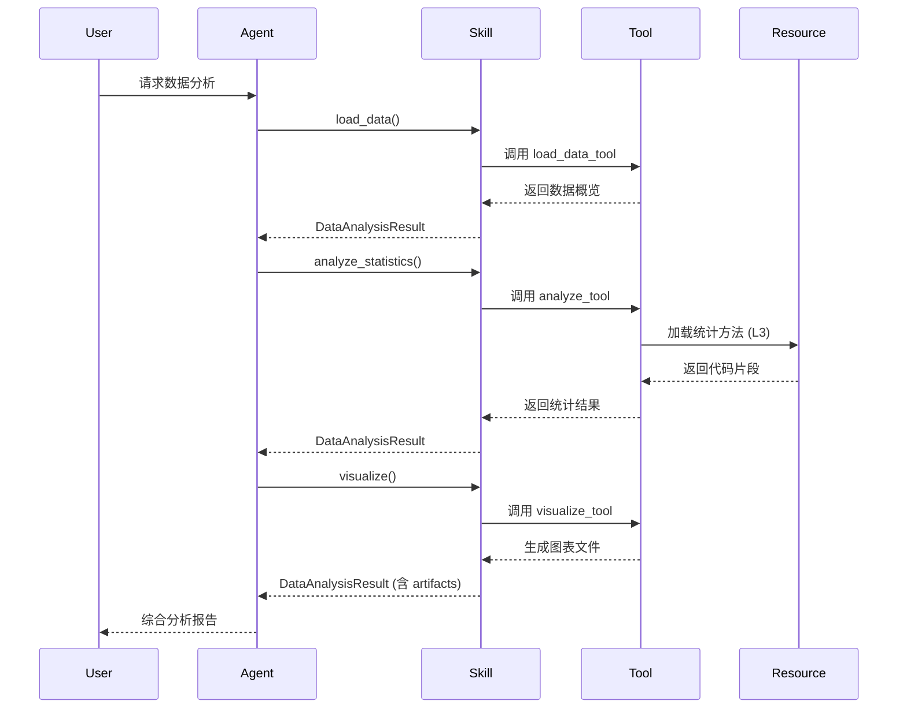

# Skills 架构设计与扩展指南

本文档详细介绍 Skills 系统的架构设计、核心组件、扩展机制和最佳实践。

## 目录

- [架构概览](#架构概览)
- [核心组件](#核心组件)
- [数据流](#数据流)
- [扩展机制](#扩展机制)
- [性能优化](#性能优化)
- [安全设计](#安全设计)
- [测试策略](#测试策略)
- [部署指南](#部署指南)

---

## 架构概览

### 系统架构图

```
┌─────────────────────────────────────────────────────────────────────────┐
│                           Application Layer                              │
│  ┌─────────────┐  ┌─────────────┐  ┌─────────────┐  ┌─────────────────┐ │
│  │ Direct Use  │  │   Agent     │  │  Pipeline   │  │  Multi-Agent    │ │
│  │   (直接)     │  │ Integration│  │  Execution  │  │  Orchestration  │ │
│  └──────┬──────┘  └──────┬──────┘  └──────┬──────┘  └────────┬────────┘ │
└─────────┼────────────────┼────────────────┼──────────────────┼──────────┘
          │                │                │                  │
          └────────────────┴────────────────┴──────────────────┘
                                     │
                              ┌──────▼──────┐
                              │  Skill API  │
                              │  (统一接口)  │
                              └──────┬──────┘
                                     │
┌────────────────────────────────────┼────────────────────────────────────┐
│                           Skill Layer                                  │
│  ┌─────────────────────────────────┼────────────────────────────────┐  │
│  │                           Skill Registry                          │  │
│  │  ┌──────────────┐ ┌──────────────┐ ┌──────────────┐              │  │
│  │  │ data_analysis│ │   custom_1   │ │   custom_2   │  ...         │  │
│  │  └──────┬───────┘ └──────┬───────┘ └──────┬───────┘              │  │
│  └─────────┼────────────────┼────────────────┼──────────────────────┘  │
└────────────┼────────────────┼────────────────┼─────────────────────────┘
             │                │                │
             ▼                ▼                ▼
┌────────────────────────────────────────────────────────────────────────┐
│                           Tool Layer                                    │
│  ┌─────────────┐  ┌─────────────┐  ┌─────────────┐  ┌────────────────┐ │
│  │  load_data  │  │  clean_data │  │  analyze_*  │  │  visualize_*   │ │
│  │  (数据加载)  │  │  (数据清洗)  │  │  (统计分析)  │  │   (可视化)     │ │
│  └─────────────┘  └─────────────┘  └─────────────┘  └────────────────┘ │
└────────────────────────────────────────────────────────────────────────┘
                                     │
┌────────────────────────────────────┼────────────────────────────────────┐
│                           Backend Layer                                │
│  ┌─────────────────────────────────┼────────────────────────────────┐  │
│  │                    LangChain Integration                          │  │
│  │  ┌──────────┐ ┌──────────┐ ┌──────────┐ ┌─────────────────────┐  │  │
│  │  │ChatOllama│ │ChatOpenAI│ │  Tools   │ │  Agent Executor     │  │  │
│  │  │(Ollama)  │ │(vLLM)    │ │          │ │                     │  │  │
│  │  └──────────┘ └──────────┘ └──────────┘ └─────────────────────┘  │  │
│  └───────────────────────────────────────────────────────────────────┘  │
└─────────────────────────────────────────────────────────────────────────┘
```

### 与 Google ADK 架构对比

```
Google ADK 原生架构:              本项目适配架构:
┌─────────────────────┐          ┌─────────────────────┐
│    ADK Agent        │          │  LangChain Agent    │
├─────────────────────┤          ├─────────────────────┤
│   SkillToolset      │          │  Tool Calling Agent │
│   (技能集合)         │    →     │  (工具调用代理)      │
├─────────────────────┤          ├─────────────────────┤
│  ┌─────┐ ┌─────┐   │          │  ┌─────┐ ┌─────┐   │
│  │Skill│ │Skill│   │          │  │Tool │ │Tool │   │
│  │ L1  │ │ L2  │   │          │  │(L1) │ │(L1) │   │
│  └─────┘ └─────┘   │          │  └─────┘ └─────┘   │
├─────────────────────┤          ├─────────────────────┤
│  L3 Resources       │          │  L3 Resources       │
│  (references/)      │          │  (references/)      │
└─────────────────────┘          └─────────────────────┘
       │                                  │
       ▼                                  ▼
┌─────────────────────┐          ┌─────────────────────┐
│  Google/Gemini API  │          │  Ollama / vLLM      │
└─────────────────────┘          └─────────────────────┘
```

### 核心设计原则

1. **渐进式披露** - 按 L1/L2/L3 分层加载，最小化上下文占用
2. **多后端兼容** - 同时支持 Ollama 和 vLLM，无缝切换
3. **模块化设计** - Skill 可独立使用，也可组合使用
4. **标准化接口** - 遵循 Google ADK Skill 规范
5. **可观测性** - 完整的执行日志和追踪

---

## 核心组件

### 1. Skill 基类

```python
# src/skills/base.py (建议创建)

from abc import ABC, abstractmethod
from typing import List, Dict, Any, Optional
from dataclasses import dataclass, field
from langchain_core.tools import StructuredTool


@dataclass
class SkillResult:
    """Skill 执行结果基类"""
    success: bool
    summary: str
    data: Dict[str, Any] = field(default_factory=dict)
    metadata: Dict[str, Any] = field(default_factory=dict)
    error_message: Optional[str] = None
    execution_time_ms: Optional[int] = None


class BaseSkill(ABC):
    """
    Skill 抽象基类
    
    所有 Skill 必须继承此类并实现以下方法：
    - get_tools(): 返回 LangChain Tools 列表
    - execute(): 执行 Skill 核心逻辑
    
    Attributes:
        name: Skill 名称
        version: 版本号
        description: 功能描述
        metadata: 元数据字典
    """
    
    name: str = ""
    version: str = "1.0.0"
    description: str = ""
    
    def __init__(self, config: Optional[Dict] = None):
        """
        初始化 Skill
        
        Args:
            config: Skill 配置字典
        """
        self.config = config or {}
        self.context: Dict[str, Any] = {}
        self._metadata = self._load_metadata()
    
    def _load_metadata(self) -> Dict[str, Any]:
        """从 SKILL.md 加载元数据 (L1)"""
        # 解析 SKILL.md frontmatter
        # 返回元数据字典
        pass
    
    def _load_instructions(self) -> str:
        """从 SKILL.md 加载指令 (L2)"""
        # 解析 SKILL.md body
        # 返回 Markdown 内容
        pass
    
    @abstractmethod
    def get_tools(self) -> List[StructuredTool]:
        """
        获取 LangChain Tools
        
        Returns:
            List[StructuredTool]: 工具列表
        """
        pass
    
    @abstractmethod
    def execute(self, **kwargs) -> SkillResult:
        """
        执行 Skill 核心逻辑
        
        Args:
            **kwargs: 执行参数
            
        Returns:
            SkillResult: 执行结果
        """
        pass
    
    def get_capabilities(self) -> List[str]:
        """获取 Skill 能力列表"""
        return self._metadata.get("capabilities", [])
    
    def get_required_tools(self) -> List[str]:
        """获取依赖的工具列表"""
        return self._metadata.get("adk_additional_tools", [])
```

### 2. Skill Registry

```python
# src/skills/registry.py (建议创建)

from typing import Dict, Type, Optional
import importlib


class SkillRegistry:
    """
    Skill 注册中心
    
    管理所有可用的 Skills，支持动态发现和加载。
    """
    
    _instance = None
    _skills: Dict[str, Type[BaseSkill]] = {}
    
    def __new__(cls):
        if cls._instance is None:
            cls._instance = super().__new__(cls)
        return cls._instance
    
    def register(self, name: str, skill_class: Type[BaseSkill]):
        """
        注册 Skill
        
        Args:
            name: Skill 名称
            skill_class: Skill 类
        """
        self._skills[name] = skill_class
    
    def get(self, name: str) -> Optional[Type[BaseSkill]]:
        """
        获取 Skill 类
        
        Args:
            name: Skill 名称
            
        Returns:
            Skill 类或 None
        """
        return self._skills.get(name)
    
    def list_skills(self) -> Dict[str, str]:
        """
        列出所有已注册 Skills
        
        Returns:
            Dict[str, str]: {name: description}
        """
        return {
            name: skill_class.description 
            for name, skill_class in self._skills.items()
        }
    
    def auto_discover(self, package_path: str = "src.skills"):
        """
        自动发现 Skills
        
        扫描指定包路径下的所有 Skill 模块。
        
        Args:
            package_path: 包路径
        """
        import pkgutil
        import importlib
        
        package = importlib.import_module(package_path)
        
        for _, name, is_pkg in pkgutil.iter_modules(package.__path__):
            if is_pkg:  # 是包（Skill 目录）
                try:
                    module = importlib.import_module(f"{package_path}.{name}")
                    skill_class = getattr(module, f"{name.title().replace('_', '')}Skill", None)
                    if skill_class:
                        self.register(name, skill_class)
                except Exception as e:
                    logger.warning(f"Failed to load skill {name}: {e}")


# 全局注册中心
skill_registry = SkillRegistry()
```

### 3. Skill Loader

```python
# src/skills/loader.py (建议创建)

import yaml
from pathlib import Path
from typing import Dict, Any


class SkillLoader:
    """
    Skill 加载器
    
    负责从文件系统加载 Skill 的各个层级（L1/L2/L3）。
    """
    
    def __init__(self, skill_path: str):
        """
        初始化加载器
        
        Args:
            skill_path: Skill 目录路径
        """
        self.skill_path = Path(skill_path)
        self.skill_md_path = self.skill_path / "SKILL.md"
    
    def load_l1_metadata(self) -> Dict[str, Any]:
        """
        加载 L1 - 元数据
        
        Returns:
            Dict: 元数据字典
        """
        if not self.skill_md_path.exists():
            raise FileNotFoundError(f"SKILL.md not found: {self.skill_md_path}")
        
        content = self.skill_md_path.read_text(encoding="utf-8")
        
        # 解析 frontmatter
        if content.startswith("---"):
            _, frontmatter, _ = content.split("---", 2)
            return yaml.safe_load(frontmatter)
        
        return {}
    
    def load_l2_instructions(self) -> str:
        """
        加载 L2 - 指令
        
        Returns:
            str: Markdown 格式的指令内容
        """
        content = self.skill_md_path.read_text(encoding="utf-8")
        
        # 去除 frontmatter
        if content.startswith("---"):
            _, _, body = content.split("---", 2)
            return body.strip()
        
        return content
    
    def load_l3_resource(self, resource_name: str) -> str:
        """
        加载 L3 - 资源
        
        Args:
            resource_name: 资源名称（相对于 references/ 或 assets/）
            
        Returns:
            str: 资源内容
        """
        # 先尝试 references/
        resource_path = self.skill_path / "references" / resource_name
        if resource_path.exists():
            return resource_path.read_text(encoding="utf-8")
        
        # 再尝试 assets/
        resource_path = self.skill_path / "assets" / resource_name
        if resource_path.exists():
            # 对于二进制文件，返回路径
            return str(resource_path)
        
        raise FileNotFoundError(f"Resource not found: {resource_name}")
    
    def load_l3_references(self) -> Dict[str, str]:
        """
        加载所有 L3 references
        
        Returns:
            Dict[str, str]: {filename: content}
        """
        references_dir = self.skill_path / "references"
        if not references_dir.exists():
            return {}
        
        return {
            f.name: f.read_text(encoding="utf-8")
            for f in references_dir.iterdir()
            if f.is_file()
        }
```

### 4. Tool Factory

```python
# src/skills/tool_factory.py (建议创建)

from typing import Callable, Type
from langchain_core.tools import StructuredTool
from pydantic import BaseModel, create_model


class ToolFactory:
    """
    工具工厂
    
    从函数自动生成 LangChain Tools。
    """
    
    @staticmethod
    def create_tool(
        func: Callable,
        name: str = None,
        description: str = None,
        return_direct: bool = False
    ) -> StructuredTool:
        """
        从函数创建 Tool
        
        Args:
            func: 函数
            name: 工具名称（默认使用函数名）
            description: 工具描述（默认使用函数 docstring）
            return_direct: 是否直接返回结果
            
        Returns:
            StructuredTool: LangChain Tool
        """
        return StructuredTool.from_function(
            func=func,
            name=name or func.__name__,
            description=description or func.__doc__ or "",
            return_direct=return_direct
        )
    
    @staticmethod
    def create_tools_from_class(
        cls: Type,
        method_prefix: str = "tool_",
        exclude: list = None
    ) -> list:
        """
        从类方法批量创建 Tools
        
        Args:
            cls: 类
            method_prefix: 方法名前缀
            exclude: 排除的方法名
            
        Returns:
            list: Tool 列表
        """
        exclude = exclude or []
        tools = []
        
        for name in dir(cls):
            if name.startswith(method_prefix) and name not in exclude:
                method = getattr(cls, name)
                if callable(method):
                    tool_name = name[len(method_prefix):]
                    tool = ToolFactory.create_tool(
                        func=method,
                        name=tool_name
                    )
                    tools.append(tool)
        
        return tools
```

---

## 数据流

### Skill 调用流程

```
用户请求
    │
    ▼
┌─────────────────┐
│ 1. 解析意图      │
│   (理解用户需求)  │
└────────┬────────┘
         │
         ▼
┌─────────────────┐
│ 2. 匹配 Skill    │
│   (L1 Metadata)  │
│   - 名称匹配     │
│   - 描述匹配     │
└────────┬────────┘
         │
         ▼
┌─────────────────┐
│ 3. 加载 Skill    │
│   (L2 Instructions)
│   - 读取 SKILL.md│
│   - 解析使用说明 │
└────────┬────────┘
         │
         ▼
┌─────────────────┐
│ 4. 参数验证      │
│   (Pydantic)     │
│   - 类型检查     │
│   - 约束验证     │
└────────┬────────┘
         │
         ▼
┌─────────────────┐
│ 5. 执行 Skill    │
│   (核心逻辑)     │
│   - 调用 Tools   │
│   - 处理数据     │
└────────┬────────┘
         │
         ▼
┌─────────────────┐
│ 6. 加载资源      │
│   (L3 Resources) │
│   - 按需加载     │
│   - 代码片段     │
└────────┬────────┘
         │
         ▼
┌─────────────────┐
│ 7. 返回结果      │
│   (SkillResult)  │
│   - 结构化数据   │
│   - 执行日志     │
└─────────────────┘
```

### Tool 调用序列图



---

## 扩展机制

### 1. 创建新 Skill 模板

```python
# src/skills/{skill_name}/{skill_name}_skill.py

from typing import List, Dict, Any, Optional
from dataclasses import dataclass, field
from langchain_core.tools import StructuredTool
from pydantic import BaseModel, Field
from loguru import logger

from src.skills.base import BaseSkill, SkillResult


@dataclass
class {SkillName}Result(SkillResult):
    """{SkillName} 执行结果"""
    custom_field: str = ""


class {SkillName}Input(BaseModel):
    """输入参数模式"""
    param1: str = Field(..., description="参数1说明")
    param2: int = Field(default=0, description="参数2说明")


class {SkillName}Skill(BaseSkill):
    """
    {SkillName} Skill
    
    功能描述...
    
    Example:
        skill = {SkillName}Skill()
        result = skill.process(param1="value")
    """
    
    name = "{skill_name}"
    version = "1.0.0"
    description = "功能描述"
    
    def __init__(self, config: Optional[Dict] = None):
        super().__init__(config)
        self.context: Dict[str, Any] = {}
        logger.info(f"[{self.name}] initialized")
    
    def _log(self, message: str):
        """记录执行日志"""
        self.context.setdefault("execution_log", []).append(message)
        logger.info(message)
    
    def process(self, param1: str, param2: int = 0) -> {SkillName}Result:
        """
        核心处理逻辑
        
        Args:
            param1: 参数1
            param2: 参数2
            
        Returns:
            {SkillName}Result: 处理结果
        """
        self._log(f"Processing: param1={param1}, param2={param2}")
        
        try:
            # 实现核心逻辑
            result_data = {"key": "value"}
            
            return {SkillName}Result(
                success=True,
                summary="处理成功",
                data=result_data,
                custom_field="custom_value"
            )
            
        except Exception as e:
            logger.error(f"Processing failed: {e}")
            return {SkillName}Result(
                success=False,
                summary="",
                error_message=str(e)
            )
    
    def get_tools(self) -> List[StructuredTool]:
        """获取 LangChain Tools"""
        return [
            StructuredTool.from_function(
                func=self._tool_process,
                name=f"{self.name}_process",
                description="处理功能描述",
                args_schema={SkillName}Input,
            )
        ]
    
    def _tool_process(self, **kwargs) -> str:
        """Tool 包装器"""
        import json
        result = self.process(**kwargs)
        return json.dumps({
            "success": result.success,
            "summary": result.summary,
            "data": result.data,
            "error": result.error_message
        }, ensure_ascii=False)


# 便捷函数
def process_with_{skill_name}(param1: str, param2: int = 0) -> {SkillName}Result:
    """便捷函数"""
    skill = {SkillName}Skill()
    return skill.process(param1, param2)
```

### 2. Skill 组合

```python
# 组合多个 Skills

class CombinedSkill(BaseSkill):
    """组合 Skill"""
    
    def __init__(self):
        self.data_skill = DataAnalysisSkill()
        self.viz_skill = VisualizationSkill()
        self.report_skill = ReportGenerationSkill()
    
    def comprehensive_analysis(self, file_path: str) -> SkillResult:
        """综合分析流程"""
        
        # 1. 数据分析
        data_result = self.data_skill.analyze(file_path, "综合分析")
        
        # 2. 生成可视化
        viz_result = self.viz_skill.create_dashboard(file_path)
        
        # 3. 生成报告
        report_result = self.report_skill.generate(
            data=data_result.data,
            charts=viz_result.artifacts
        )
        
        return SkillResult(
            success=True,
            summary="综合分析完成",
            data={
                "analysis": data_result.data,
                "charts": viz_result.artifacts,
                "report": report_result.data
            }
        )
```

### 3. Skill 插件系统

```python
# 支持动态加载 Skill 插件

class SkillPluginManager:
    """Skill 插件管理器"""
    
    def __init__(self, plugin_dir: str):
        self.plugin_dir = Path(plugin_dir)
        self.loaded_plugins: Dict[str, BaseSkill] = {}
    
    def load_plugin(self, plugin_name: str) -> BaseSkill:
        """加载插件"""
        import importlib.util
        
        plugin_path = self.plugin_dir / f"{plugin_name}.py"
        
        spec = importlib.util.spec_from_file_location(
            plugin_name, 
            plugin_path
        )
        module = importlib.util.module_from_spec(spec)
        spec.loader.exec_module(module)
        
        skill_class = getattr(module, f"{plugin_name.title()}Skill")
        skill = skill_class()
        
        self.loaded_plugins[plugin_name] = skill
        return skill
    
    def unload_plugin(self, plugin_name: str):
        """卸载插件"""
        if plugin_name in self.loaded_plugins:
            del self.loaded_plugins[plugin_name]
```

---

## 性能优化

### 1. 延迟加载

```python
class OptimizedSkill(BaseSkill):
    """优化版 Skill"""
    
    def __init__(self):
        self._heavy_model = None
        self._cache = {}
    
    @property
    def heavy_model(self):
        """延迟加载重资源"""
        if self._heavy_model is None:
            self._heavy_model = self._load_heavy_model()
        return self._heavy_model
    
    def _load_heavy_model(self):
        """加载重资源"""
        # 加载大型模型、数据库连接等
        pass
```

### 2. 结果缓存

```python
from functools import lru_cache
import hashlib

class CachedSkill(BaseSkill):
    """带缓存的 Skill"""
    
    def __init__(self):
        self._cache = {}
    
    def _get_cache_key(self, **kwargs) -> str:
        """生成缓存键"""
        param_str = json.dumps(kwargs, sort_keys=True)
        return hashlib.md5(param_str.encode()).hexdigest()
    
    def process(self, **kwargs) -> SkillResult:
        """带缓存的处理"""
        cache_key = self._get_cache_key(**kwargs)
        
        if cache_key in self._cache:
            logger.info("Cache hit")
            return self._cache[cache_key]
        
        result = self._do_process(**kwargs)
        self._cache[cache_key] = result
        return result
    
    @lru_cache(maxsize=128)
    def expensive_operation(self, param: str) -> str:
        """使用 functools.lru_cache"""
        return self._compute(param)
```

### 3. 异步执行

```python
import asyncio
from typing import AsyncIterator

class AsyncSkill(BaseSkill):
    """异步 Skill"""
    
    async def process_async(self, **kwargs) -> SkillResult:
        """异步处理"""
        # 异步执行
        result = await self._async_operation(**kwargs)
        return result
    
    async def process_batch_async(
        self, 
        items: List[Dict]
    ) -> AsyncIterator[SkillResult]:
        """批量异步处理"""
        
        semaphore = asyncio.Semaphore(10)  # 限制并发数
        
        async def process_one(item):
            async with semaphore:
                return await self.process_async(**item)
        
        tasks = [process_one(item) for item in items]
        for completed in asyncio.as_completed(tasks):
            result = await completed
            yield result
```

### 4. 资源池

```python
from contextlib import contextmanager

class PooledSkill(BaseSkill):
    """使用资源池的 Skill"""
    
    def __init__(self, pool_size: int = 5):
        self.pool_size = pool_size
        self._pool = []
    
    @contextmanager
    def _acquire_resource(self):
        """获取资源"""
        resource = self._get_from_pool()
        try:
            yield resource
        finally:
            self._return_to_pool(resource)
    
    def process(self, **kwargs) -> SkillResult:
        """使用资源池处理"""
        with self._acquire_resource() as resource:
            result = resource.process(**kwargs)
            return result
```

---

## 安全设计

### 1. 输入验证

```python
from pydantic import BaseModel, Field, validator
import re

class SecureInput(BaseModel):
    """安全输入模式"""
    
    file_path: str = Field(..., description="文件路径")
    query: str = Field(..., description="查询字符串")
    
    @validator('file_path')
    def validate_path(cls, v):
        """验证路径安全"""
        # 禁止路径遍历
        if '..' in v or v.startswith('/'):
            raise ValueError("Invalid file path: path traversal detected")
        
        # 限制文件类型
        allowed = {'.csv', '.json', '.txt'}
        ext = Path(v).suffix
        if ext not in allowed:
            raise ValueError(f"Unsupported file type: {ext}")
        
        return v
    
    @validator('query')
    def validate_query(cls, v):
        """验证查询安全"""
        # 禁止危险字符
        dangerous = [';', '--', '/*', '*/', 'xp_']
        for d in dangerous:
            if d in v:
                raise ValueError(f"Dangerous character detected: {d}")
        
        return v
```

### 2. 沙箱执行

```python
import subprocess
import tempfile
import os

class SandboxSkill(BaseSkill):
    """沙箱执行 Skill"""
    
    def execute_in_sandbox(self, code: str, timeout: int = 30) -> str:
        """
        在沙箱中执行代码
        
        Args:
            code: 要执行的代码
            timeout: 超时时间（秒）
            
        Returns:
            str: 执行结果
        """
        with tempfile.TemporaryDirectory() as tmpdir:
            # 写入代码文件
            code_file = Path(tmpdir) / "script.py"
            code_file.write_text(code)
            
            # 使用 Docker 或受限环境执行
            result = subprocess.run(
                ["python", str(code_file)],
                capture_output=True,
                text=True,
                timeout=timeout,
                cwd=tmpdir,
                # 限制资源使用
                preexec_fn=self._limit_resources
            )
            
            return result.stdout if result.returncode == 0 else result.stderr
    
    def _limit_resources(self):
        """限制资源使用（Linux）"""
        import resource
        # 限制 CPU 时间
        resource.setrlimit(resource.RLIMIT_CPU, (30, 30))
        # 限制内存
        resource.setrlimit(resource.RLIMIT_AS, (512 * 1024 * 1024, 512 * 1024 * 1024))
```

### 3. 权限控制

```python
from enum import Enum

class Permission(Enum):
    """权限枚举"""
    READ = "read"
    WRITE = "write"
    EXECUTE = "execute"
    ADMIN = "admin"


class RBACSkill(BaseSkill):
    """基于角色的访问控制 Skill"""
    
    def __init__(self, user_role: str):
        self.user_role = user_role
        self.permissions = self._get_permissions(user_role)
    
    def _get_permissions(self, role: str) -> List[Permission]:
        """获取角色权限"""
        role_permissions = {
            "admin": [Permission.READ, Permission.WRITE, Permission.EXECUTE, Permission.ADMIN],
            "analyst": [Permission.READ, Permission.EXECUTE],
            "viewer": [Permission.READ],
        }
        return role_permissions.get(role, [])
    
    def check_permission(self, permission: Permission):
        """检查权限"""
        if permission not in self.permissions:
            raise PermissionError(f"Permission denied: {permission.value}")
    
    def write_file(self, path: str, content: str):
        """写文件（需 WRITE 权限）"""
        self.check_permission(Permission.WRITE)
        # 执行写操作
```

### 4. 审计日志

```python
from datetime import datetime
import json

class AuditedSkill(BaseSkill):
    """带审计日志的 Skill"""
    
    def __init__(self):
        self.audit_log = []
    
    def _log_audit(
        self,
        action: str,
        user: str,
        params: Dict,
        result: str
    ):
        """记录审计日志"""
        entry = {
            "timestamp": datetime.now().isoformat(),
            "action": action,
            "user": user,
            "params": params,
            "result": result
        }
        self.audit_log.append(entry)
        
        # 持久化到文件或数据库
        with open("audit.log", "a") as f:
            f.write(json.dumps(entry) + "\n")
    
    def process(self, user: str, **kwargs) -> SkillResult:
        """带审计的处理"""
        result = self._do_process(**kwargs)
        
        self._log_audit(
            action="process",
            user=user,
            params=kwargs,
            result="success" if result.success else "failed"
        )
        
        return result
```

---

## 测试策略

### 1. 单元测试

```python
# tests/test_data_analysis_skill.py

import pytest
from src.skills.data_analysis import DataAnalysisSkill


class TestDataAnalysisSkill:
    """DataAnalysisSkill 单元测试"""
    
    @pytest.fixture
    def skill(self):
        return DataAnalysisSkill(output_dir="./test_output")
    
    @pytest.fixture
    def sample_csv(self, tmp_path):
        """创建测试 CSV"""
        csv_path = tmp_path / "test.csv"
        csv_path.write_text("col1,col2\n1,2\n3,4\n5,6")
        return str(csv_path)
    
    def test_load_data_success(self, skill, sample_csv):
        """测试成功加载数据"""
        result = skill.load_data(sample_csv)
        
        assert result.success is True
        assert result.statistics["rows"] == 3
        assert result.statistics["columns"] == 2
    
    def test_load_data_file_not_found(self, skill):
        """测试文件不存在"""
        result = skill.load_data("nonexistent.csv")
        
        assert result.success is False
        assert "not found" in result.error_message.lower()
    
    def test_visualize_success(self, skill, sample_csv):
        """测试可视化成功"""
        result = skill.visualize(
            sample_csv,
            chart_type="line",
            x_column="col1",
            y_column="col2",
            title="Test Chart"
        )
        
        assert result.success is True
        assert len(result.artifacts) == 1
        assert result.artifacts[0]["type"] == "chart"
    
    def test_get_tools(self, skill):
        """测试获取 Tools"""
        tools = skill.get_tools()
        
        assert len(tools) == 4
        tool_names = [t.name for t in tools]
        assert "load_data" in tool_names
        assert "clean_data" in tool_names
```

### 2. 集成测试

```python
# tests/integration/test_skill_integration.py

import pytest
from src.skills.data_analysis import get_data_tools
from src.utils.model_loader import model_loader
from langchain.agents import create_tool_calling_agent, AgentExecutor


class TestSkillIntegration:
    """Skill 集成测试"""
    
    @pytest.fixture
    def agent(self):
        """创建测试 Agent"""
        llm = model_loader.load_llm()
        tools = get_data_tools()
        
        from langchain_core.prompts import ChatPromptTemplate
        prompt = ChatPromptTemplate.from_messages([
            ("system", "You are a data analyst."),
            ("human", "{input}"),
            ("placeholder", "{agent_scratchpad}"),
        ])
        
        agent = create_tool_calling_agent(llm, tools, prompt)
        return AgentExecutor(agent=agent, tools=tools, max_iterations=5)
    
    def test_agent_load_data(self, agent, tmp_path):
        """测试 Agent 加载数据"""
        csv_path = tmp_path / "test.csv"
        csv_path.write_text("a,b\n1,2\n3,4")
        
        response = agent.invoke({
            "input": f"Load {csv_path} and tell me how many rows"
        })
        
        assert "2" in response["output"] or "two" in response["output"].lower()
```

### 3. 性能测试

```python
# tests/performance/test_skill_performance.py

import pytest
import time
from src.skills.data_analysis import DataAnalysisSkill


class TestSkillPerformance:
    """Skill 性能测试"""
    
    def test_load_data_performance(self, tmp_path):
        """测试大数据加载性能"""
        # 创建大文件
        csv_path = tmp_path / "large.csv"
        with open(csv_path, "w") as f:
            f.write("col1,col2\n")
            for i in range(100000):
                f.write(f"{i},{i*2}\n")
        
        skill = DataAnalysisSkill()
        
        start = time.time()
        result = skill.load_data(str(csv_path))
        elapsed = time.time() - start
        
        assert result.success is True
        assert elapsed < 5.0  # 应在 5 秒内完成
    
    def test_concurrent_processing(self):
        """测试并发处理"""
        import concurrent.futures
        
        skill = DataAnalysisSkill()
        
        def process(i):
            return skill.analyze_statistics(
                "examples/skills_demo/sample_sales_data.csv"
            )
        
        start = time.time()
        with concurrent.futures.ThreadPoolExecutor(max_workers=5) as executor:
            results = list(executor.map(process, range(10)))
        elapsed = time.time() - start
        
        assert all(r.success for r in results)
        assert elapsed < 10.0
```

---

## 部署指南

### 1. Docker 部署

```dockerfile
# Dockerfile

FROM python:3.11-slim

WORKDIR /app

# 安装依赖
COPY requirements.txt .
RUN pip install --no-cache-dir -r requirements.txt

# 复制代码
COPY src/ ./src/
COPY examples/ ./examples/
COPY configs/ ./configs/

# 创建输出目录
RUN mkdir -p /app/output

# 环境变量
ENV PYTHONPATH=/app
ENV KMP_DUPLICATE_LIB_OK=TRUE

EXPOSE 8000

CMD ["python", "examples/skills_demo/test_skill_simple.py"]
```

### 2. Kubernetes 部署

```yaml
# k8s-deployment.yaml

apiVersion: apps/v1
kind: Deployment
metadata:
  name: skills-service
spec:
  replicas: 3
  selector:
    matchLabels:
      app: skills-service
  template:
    metadata:
      labels:
        app: skills-service
    spec:
      containers:
      - name: skills
        image: skills-service:latest
        ports:
        - containerPort: 8000
        resources:
          requests:
            memory: "512Mi"
            cpu: "500m"
          limits:
            memory: "2Gi"
            cpu: "2000m"
        volumeMounts:
        - name: output-volume
          mountPath: /app/output
      volumes:
      - name: output-volume
        persistentVolumeClaim:
          claimName: skills-output-pvc
```

### 3. 监控和告警

```python
# monitoring/metrics.py

from prometheus_client import Counter, Histogram, Gauge

# 指标定义
skill_execution_count = Counter(
    'skill_execution_total',
    'Total skill executions',
    ['skill_name', 'status']
)

skill_execution_duration = Histogram(
    'skill_execution_duration_seconds',
    'Skill execution duration',
    ['skill_name']
)

active_skills = Gauge(
    'active_skills',
    'Number of active skills'
)


class MonitoredSkill(BaseSkill):
    """带监控的 Skill"""
    
    def execute(self, **kwargs) -> SkillResult:
        import time
        
        start = time.time()
        
        try:
            result = self._do_execute(**kwargs)
            skill_execution_count.labels(
                skill_name=self.name,
                status="success"
            ).inc()
            return result
            
        except Exception as e:
            skill_execution_count.labels(
                skill_name=self.name,
                status="error"
            ).inc()
            raise
            
        finally:
            skill_execution_duration.labels(
                skill_name=self.name
            ).observe(time.time() - start)
```

---

## 总结

### 关键设计决策

1. **三层架构** - L1/L2/L3 渐进式披露，平衡功能和性能
2. **多后端兼容** - 同时支持 Ollama 和 vLLM，提高灵活性
3. **标准化接口** - 遵循 Google ADK 规范，确保可移植性
4. **模块化设计** - Skill 可独立使用，也可组合使用
5. **完整可观测性** - 日志、指标、审计全覆盖

### 扩展建议

1. **添加更多 Skills** - 代码审查、文档生成、测试生成等
2. **Skill 市场** - 建立内部 Skill 共享机制
3. **AutoML 集成** - 自动模型选择和调优
4. **多模态支持** - 图像、音频数据分析
5. **联邦学习** - 跨组织数据协作分析

---

*文档版本: 1.0.0*
*最后更新: 2026-03-29*
